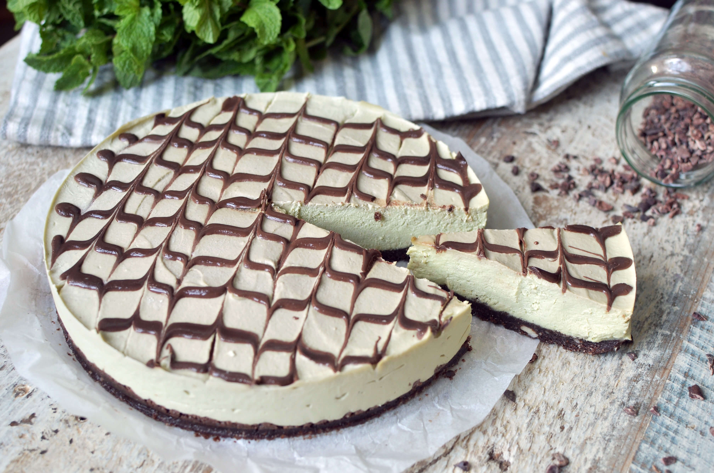
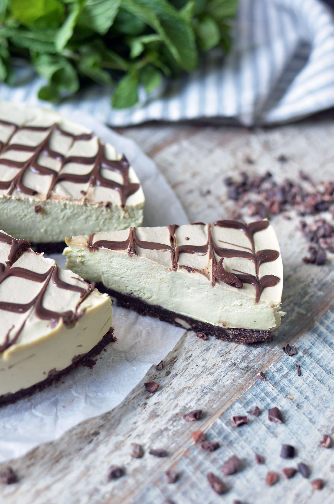
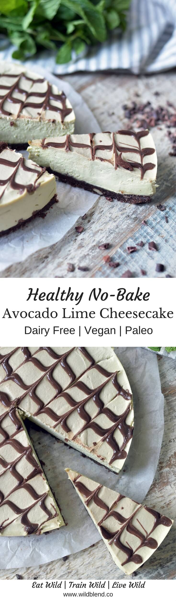
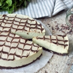

Avocados are my secret weapon. They are versatile yet often fly under the kitchen radar. Everyone can easily add it to their arsenal of Paleo and vegan friendly ingredients. I love the **nutty** flavour, **healthy fats** and **creamy** texture and literally eat them almost with every meal. So it's no surprise that my latest obsession is an Avocado Lime Cheesecake. You must try this one; it's a winner—I guarantee you'll love it.

This recipe best comes together with a high-speed food processor or blender (I used a Vitamix). Be sure to blend until the consistency of the cheesecake cream is super **silky** and **creamy**. You want to make sure there is no cashew chunks left. If you're working with a weaker device, turn it on and off, and blend multiple times until it reaches the desired consistency.

The benefits of avocado are endless. I could probably sing songs about it (if I could sing lol). All joking aside, avocados are really good for our lady parts. They are also incredibly **nutritious** and contain more **potassium** than a banana. Avocados are loaded with **fiber** and heart-healthy monounsaturated fatty acids (the good kind of fat). To sum it up, you can never eat enough avocados because they make EVERYTHING taste GREAT!

\[thrive\_leads id='1525'\]

This cheesecake may sound quite exotic but I can guarantee you once you try it, you'll be blown away by it's creaminess and richness. It's also:

- Paleo
- Vegan
- dairy-free
- loaded with healthy fast
- gluten-free
- no bake
- creamy

If you love avocados, you might also like to try my [Dark Chocolate Avocado Truffles](https://www.wildblend.co/dark-chocolate-avocado-truffles/).

[Print](http://localhost:10003/avocado-lime-cheesecake/print/1256/)

## No-Bake Avocado Lime Cheesecake

Made with raw cashews and buttery avocado, this vegan no-bake cheesecake is a real crowd please even for non-vegans.

- **Author:** Zoe
- **Prep Time:** 20 mins
- **Cook Time:** 6 hours chill
- **Total Time:** 6 hours + 20 mins
- **Yield:** 8 slices 1x

### Ingredients

Scale 1x2x3x

**For the base**

- ½ cup Medjool dates (pitted and soaked)
- 2 cups raw almonds (250g)
- 2 T cacao powder

**For the filling**

- 1½ avocados (pitted and peeled)
- 2 cups raw cashews (soaked overnight in water)
- ¼ cup cold pressed coconut oil
- Juice of 1 lime
- 3 T maple syrup
- ½ cup full-fat coconut cream

### Instructions

1. For the base: Add all base ingredients to a blender and blend until a sticky “cookie dough” forms.
2. Press the dough into a round 8-inch baking dish lined with parchment paper. Set aside.
3. For the filling: Add all filling ingredients to a blender and blend until smooth and creamy.
4. Pour the mixture on top of the base.
5. Place in freezer overnight for at least 6 hours.
6. Thaw for 30 minutes before serving.

### Notes

**Note:** I usually try and soak cashews in filtered water overnight. If you’re running short of time, you can speed up the process by soaking them in boiling water for 30-60 minutes.

**Tip**: Once frozen, decorate your cheesecake with shredded coconut or chocolate shavings!

### Did you make this recipe?

Share a photo and tag us — we can't wait to see what you've made!

