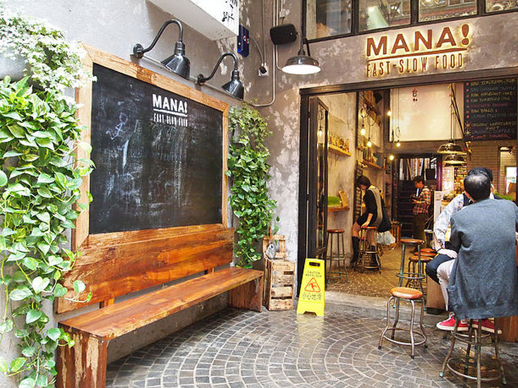
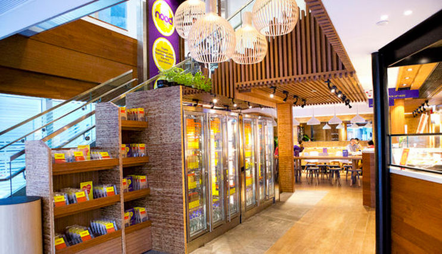
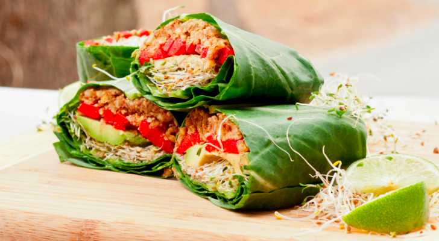
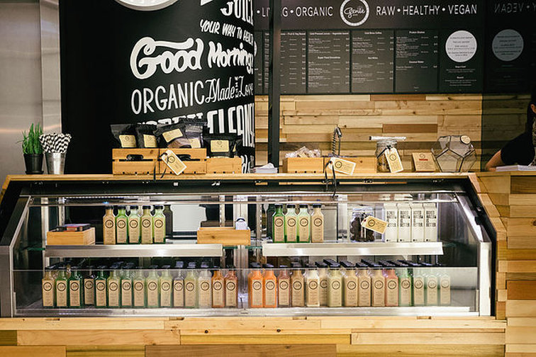

I really felt spoiled for choices. It's never been easier for me to find healthy eats while travelling than during the week I spent in Honk Kong. The city and especially the island are mind-boggling. My mind was flabbergasted by the towering skyscrapers above me while my foodie sensors were constantly tempted by the sheer endless range of raw desserts, cold pressed juice joints and epic salad buffets. Being a foodie tourist is my favourite form of tourism. It was hard to keep this list brief seeing as the organic slow-food movement has taken HK by storm.

## 1) MANA! Fast Slow Food & Mana Raw!

MANA!’s motto is ‘Eat like it matters’ which encapsulates pretty much everything I love about eating real foods. They specialise in organic, vegan and raw food, with many gluten-free options. I was immediately hooked by the calm, earthy atmosphere of the place and fell in love with the environmentally friendly interior (energy-saving lights, water-saving toilet). The salad selection is delicious, offering many choices such as pumpkin, walnuts and kale, quinoa and beetroot or mixed grilled vegetables. However, MANA!'s signature dish are the flatbreads, which are baked in the in-house brick-oven and filled with a variety of different goodies. You should definitely try MANA!'s healthy raw desserts as they are absolutely divine. The coconut cheesecake was hands down the best raw coconut cheesecake I've ever tried. It's soooo freaking delicious, I would go back just for the cake –it's worth it!

Address: G/F, 92 Wellington Street, Central, Hong Kong [http://www.mana.hk/](http://www.mana.hk/)

## 2) Nood Food

Nood Food is another health joint on Hong Kong island that focuses on wholesome take away food, superfood smoothies and an overall holistic experience. They also have their own juice cleanse line, which can be ordered in store or online. Our favourite was the extensive healthy salad buffet offering three different types of kale salad. Oh, yes! Big shoutout goes to the amazing rocket coffee blended with coconut oil instead of milk, which fuelled us for a full day of sightseeing (I always miss my bulletproof coffee on the road). We also really appreciated the tap where we could fill up our water bottles with delicious structured water before we continued our hike to the Peak.

Address: 2/f Kinwick Centre, 32 Hollywood Road, Central, Hong Kong [http://www.allnood.com/](https://www.allnood.com/)

## 3) Anything but Salads

ABS is a small little joint in the upcoming hipster area around Tai Ping Shan in HK. The friendly team carefully curate a selection of functional superfood snacks on top of their delicious to create heir homemade of carefully curated health food staples plus their own delicious creations such as Spirulina carefully selected homemade creations such as spirulina honey, chai spiced kombucha and raw cordyceps mushroom chocolate. Owner Calista's vision is to provide nutrient-dense and synergistic wholefoods. The whole menu screams “eat me” and makes it hard to choose. When we were there ABS's menu ranged from raw burritos over raw chow mien to raw pumpkin spice pie and other raw vegan desserts in the cabinet. Of course, we had to try it all. Yum!

Address: 14 Tai Ping Shan Street, Hong Kong [http://anythingbutsalads.com/](https://anythingbutsalads.com/)

## 4) Genie Juicery

Genie is a HK based cold pressed juice company owned by Aussie gal pals Cara Grogan and Melanie White, who brought raw, vegan, fresh, organic and living juices to an already saturated juice cleanse market. However, the colour- and flavourful genies in a bottle work miracle's on your body and are ever so popular. I opted for a one day juice cleanse to detox my body after a week of hedonistic lifestyle in HK. The girls at Genie arranged a beautiful custom cleanse for me, which was fully aligned with my plans for the day. I highly recommend Genie's custom cleanse packages seeing as every body & lifestyle is different. It's a great experience!

Address: Hong Kong, 中環Shop 2096B, 8 Finance Street, Central [http://www.geniejuicery.com/](http://geniejuicery.com/)

 

\[caption id="attachment\_1296" align="alignnone" width="734"\] ad 1) Mana!\[/caption\]

\[caption id="attachment\_1295" align="alignnone" width="742"\] ad 2) Nood Food\[/caption\]

\[caption id="attachment\_1298" align="alignnone" width="728"\] ad 3) Anything but Salads\[/caption\]

\[caption id="attachment\_1293" align="alignnone" width="756"\] ad 4) Genie Juicery\[/caption\]

Do you love travelling in Asia? You might also like my Foodie Guide Shanghai.
