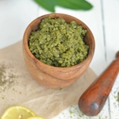

Matcha lovers rejoice, you can now polish your skin with this homemade green tea body scrub for glowing skin and better sleep. This salt-based scrub will help buff away old skin and make you feel shiny and new. Ok, let's be honest about the anti-aging effects. It won't magically make you look 16 or reduce stretch marks but you'll feel fresher and smoother nonetheless. Pinky promise!

After all, Matcha is packed with good-for-you **antioxidants**. As a matter of fact, one serving of matcha tea is the nutritional equivalent of 10 cups of regularly brewed green tea ([1](http://matchasource.com/health-benefits-of-matcha-tea/)). Talk about a miracle in a cup! Epsom salts is known to ease stress, relax the body, **relieve pain** and stop muscle cramps. Just like Matcha, it helps our bodies to **detoxify** effectively and naturally. Epsom salts is the real hero in this scrub—your muscles will feel so relieved, ready to fall asleep and **recover**.

Unlike most conventional store-bought scrubs, this recipe is **non-toxic**. It only uses natural ingredients and comes together in less than **10 minutes**. Now, what are you waiting for? Grab a handful of this Matcha green tea body scrub dampen your skin and start exfoliating in big circular motions. Enjoy!

[Print](http://localhost:10003/matcha-body-scrub/print/1310/)

## DIY Matcha Green Tea Body Scrub

This homemade Matcha Green Tea Body scrub will help buff away old skin and make you feel shiny and new.

- **Author:** Zoe
- **Prep Time:** 15 mins
- **Total Time:** 15 minutes
- **Yield:** 1 jar 1x

### Ingredients

Scale 1x2x3x

- 2 green tea bags
- 1 cup epsom salts
- 2 tsp. matcha powder
- 1/3 cup organic coconut oil (You may want to add more coconut oil based on your personal preference.)

### Instructions

1. Cut open the tea bags and empty the tea leaves into a small bowl.
2. Add the epsom salts and matcha powder and whisk to combine.
3. Stir in the coconut oil until thoroughly mixed.
4. Store in a glass jar or air-tight container.

### Did you make this recipe?

Share a photo and tag us — we can't wait to see what you've made!

