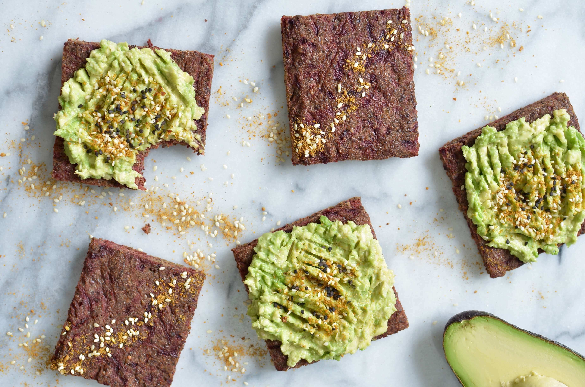
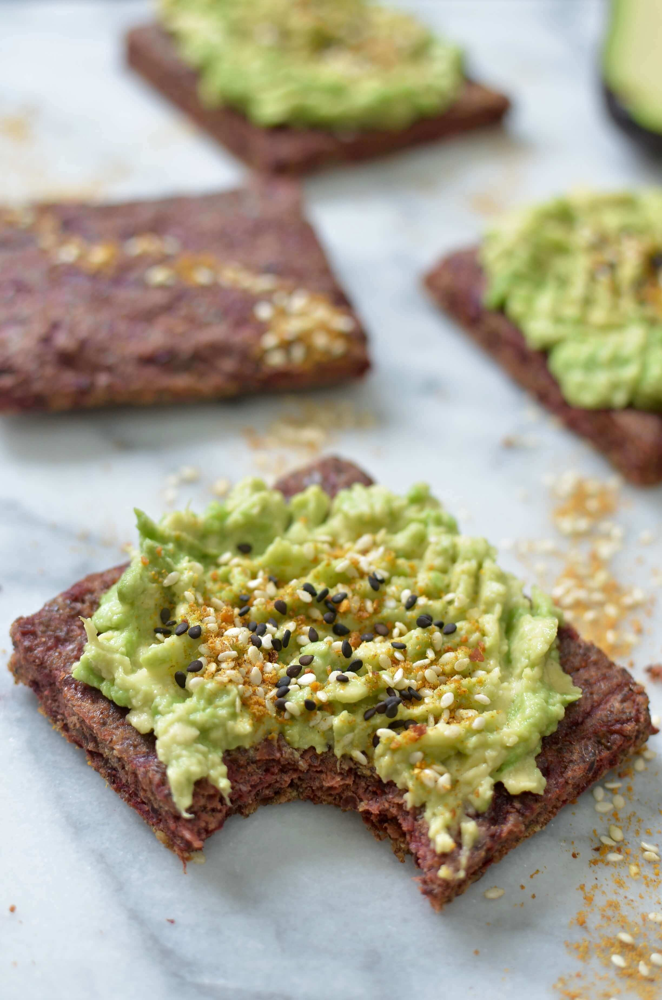
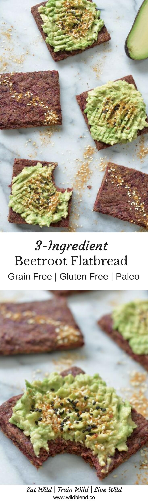

Naturally gluten-free and full of fiber-rich ingredients, this veggie-packed flatbread is a healthy, easy meal to make. You will love how effortless you can prep these flatbreads for the week ahead. They are the perfect canvas for grab-and-go work lunches, and quick and healthy snacking or sandwiches.

I used LSA for this recipe which is made from ground flax seeds, sunflower seeds and almonds. You can easily find it in Australian supermarkets and health food stores. However, if you don't have access to LSA mixes, simply use 1/2 cup of ground flax seed, 1/4 cup sunflower seed meal and 1/2 cup of almond meal instead. LSA is an easy way to add extra protein and fibre to your baked goods.

These flatbreads are best sliced once they've cooled down. I store mine in an airtight container in the fridge for up to a week. You could also make a double batch and freeze some for the week ahead. They can be toasted for a slightly more crunchy texture. I prefer mine toasted with smashed avocado and dukkah and salt.

\[thrive\_leads id='1525'\]

If you're looking for a veggie-packed low-carb alternative to gluten-free bread this flatbread is the answer! They're:

- healthy
- light
- easy to make
- Paleo
- portable
- gluten-free
- grain-free

If you like flatbread, you might also like my [Golden Cauliflower Flatbread with Turmeric](https://www.wildblend.co/cauliflower-flatbread/).

\[tasty-recipe id="1249"\]
