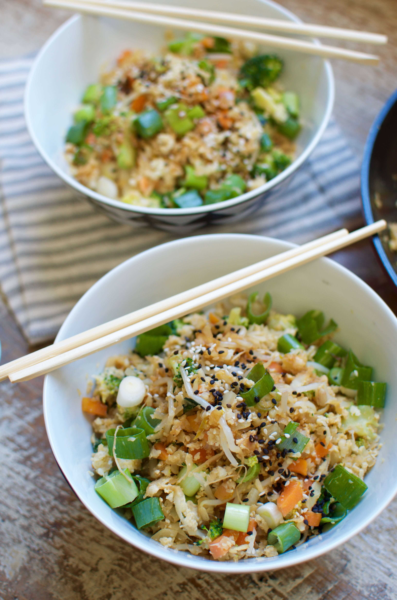

Get an extra serving of fibre-rich vegetables and cut back on calories by replacing rice with grated cauliflower. You can enjoy this Cauliflower Fried Rice with grilled chicken or prawns for an extra protein kick or eat it solo as a light and flavorful vegetarian main.

Cauliflower's is often described as quite bland, which makes it an excellent foil for all sorts of different flavours. Sesame oil, garlic, ginger, lime, and tamari give it it's tangy and salty Asian flavour in this dish. Cauliflower is rich in **vitamin C**, high in **fiber** and water, making it a great **low-calorie** vegetable to fill you up. We store all our vegetables in a [Swag Bag](https://t.cfjump.com/52650/t/14846?Url=https%3a%2f%2fwww.biome.com.au%2freduce-and-reuse%2f17236-the-swag-produce-storage-bag-individual-large.html%3fsearch_query%3dthe%2520swag%2520produce%2520bag%26fast_search%3dfs) to keep them fresh and make them last longer in the fridge.

This easy dish comes together in only 15 minutes, which makes it perfect for a quick healthy lunch or dinner. The best part, once cooked you can divide it into Tupperware containers and store it in the refrigerator for up to five days. Cauliflower fried rice is one of our Sunday meal prep favourites as it stays delicious and flavoursome in the fridge (You can even eat it cold). I like to serve it with fresh spring onions, toasted sesame seeds, fresh coriander and lime.

You can garnish with:

- roasted peanuts
- fresh chili
- toasted coconut flakes
- fried onion
- extra tamari sauce
- wedge of lime

\[thrive\_leads id='1525'\]

Cauliflower, has hands down become one of my favourite vegetables recently. I never used to like it as a kid but can now appreciate the bland flavour for its versatility in the kitchen. You can make it sweet or savouriy, roast it, bake it, steam it, grate it, and even eat it raw and it's always yummy. I hope you'll come to like this lighter version of Asian takeout as much as I do.

If you love low-carb cauliflower recipes, you might also like my [Cauliflower Turmeric Burger Buns.](https://www.wildblend.co/cauliflower-turmeric-burger-buns/)

\[tasty-recipe id="1206"\]
