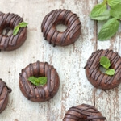

National Doughnut Day you say? Sounds like the best holiday EVER! To celebrate, I made these raw vegan Chocolate Mint Protein Donuts which are technically not real doughnuts but rather raw-nuts (lol). Even better, right? Cause they are free from gluten, wheat, dairy and refined sugar — YES basically guilt free!

I have a little bit of a love affair with donuts at the moment and have been working on an healthy donuts eBook for a while now. Fingers crossed it will be finished soon and filled with a lot of yummy donut creations that will change the way you look at conventional sugary doughnuts forever.

\[thrive_leads id='1525'\]

This recipe will help you make a healthier doughnut to enjoy with the guilt (bye bye sugar and transfat). That's right, these are:

- healthy
- guilt-free
- protein loaded
- vegan
- paleo
- no-bake

To make things easy, I created a no-fuss recipe that anyone can make (without previous donut experience). All you need is a silicone donut mould ([here](https://www.etsy.com/au/listing/201298344/8-cavity-donut-doughnut-cake-mold?gpla=1&gao=1&&utm_source=google&utm_medium=cpc&utm_campaign=shopping_au_en_au_-other-other&utm_custom1=1e9b0835-e410-4f61-9665-2b4efd67d74b&gclid=CjwKCAiA6qPRBRAkEiwAGw4SdkENEpgdGolZ1IxDMhYqesXzRgXmbo68y8nUsd2gMJghWAXtTYs5AhoCOtIQAvD_BwE)), a food processor and a freezer. The best part about these sweet little morsels of goodness is that they are loaded with protein. The added protein powder is an extra bonus that will allow you to snack on these as after-workout treat or pick-me-up when the 3pm slump kicks in.

Do you love minty fresh chocolate flavor? You might also like my [Mint Coconut Macaroons](https://www.wildblend.co/mint-coconut-macaroons/).

[Print](http://localhost:10003/chocolate-mint-protein-donuts/print/1265/)

## No-Bake Chocolate Mint Protein Donuts

These vegan Chocolate Mint Protein Donuts are gluten-free and healthy—your tummy will love them and so will you.

- **Author:** Zoe
- **Prep Time:** 15 mins
- **Cook Time:** 3 hours in freezer
- **Total Time:** 3 hours + 15 mins
- **Yield:** 6 mini donuts 1x

### Ingredients

Scale 1x2x3x

- 1 cup raw almonds
- 1/2 cup Medjool dates, pitted\*
- 1/4 cup raw cacao powder
- 1 Tbsp chocolate protein (I used [Amazonia Raw](http://www.amazonia.com.au/raw-protein-range/amazonia-raw-organic-cacao-coconut-pea-rice-protein))
- 1 Tbsp maple syrup (or honey)
- 3 drops of food grade peppermint essence
- 1/4 tsp vanilla bean powder

### Instructions

1. Add almonds to a food processor or high-speed blender and process until semi-fine (almost flour-like but there should still be a few chunky almond bits).
2. Add the dates, cacao, protein, sweetener, peppermint essence and vanilla to the almonds mixture and process everything until a sticky cookie dough forms.
3. Divide mixture into 6 ‘portions’ and firmly press into silicone donut mould.
4. Cover mould with cling wrap and place in freezer for 2-4 hours to set.
5. When set, remove from freezer, decorate with dark chocolate and store in an airtight container in the fridge.

### Notes

**Note:** I used Medjool dates for this recipe. Medjool’s are a fresh (not dried) date variety and therefore don’t need to be soaked like dried dates. Fresh dates are generally less sugary and more flavoursome. If you make this recipe using dried dates, make sure to soak them ahead of time.

I’ve experimented a lot with protein and found that most protein powders make raw treats super dry and hard. I specifically used Amazonia Raw Protein for this recipes because it does not dry-out raw treats.

### Did you make this recipe?

Share a photo and tag us — we can't wait to see what you've made!

