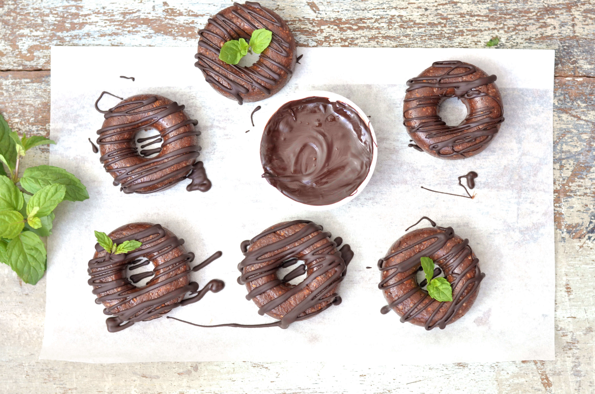
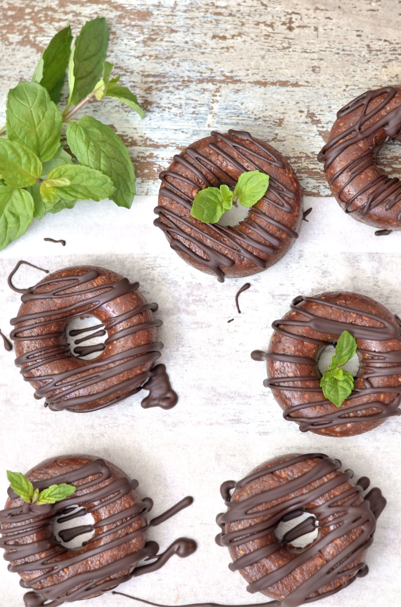
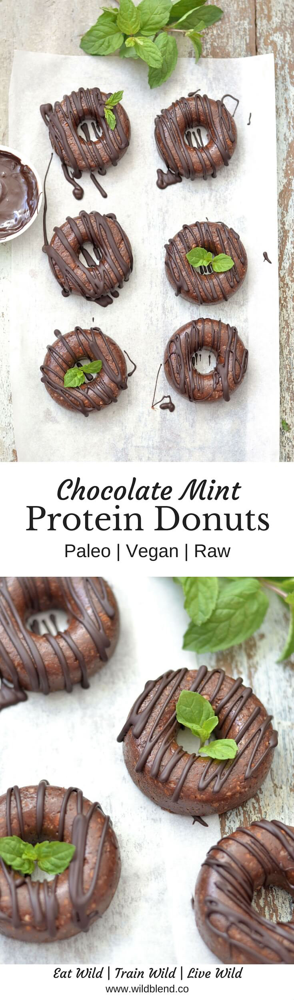

National Doughnut Day you say? Sounds like the best holiday EVER! To celebrate, I made these raw vegan Chocolate Mint Protein Donuts which are technically not real doughnuts but rather raw-nuts (lol). Even better, right? Cause they are free from gluten, wheat, dairy and refined sugar — YES basically guilt free!

I have a little bit of a love affair with donuts at the moment and have been working on an healthy donuts eBook for a while now. Fingers crossed it will be finished soon and filled with a lot of yummy donut creations that will change the way you look at conventional sugary doughnuts forever.

\[thrive\_leads id='1525'\]

This recipe will help you make a healthier doughnut to enjoy with the guilt (bye bye sugar and transfat). That's right, these are:

- healthy
- guilt-free
- protein loaded
- vegan
- paleo
- no-bake

To make things easy, I created a no-fuss recipe that anyone can make (without previous donut experience). All you need is a silicone donut mould ([here](https://www.etsy.com/au/listing/201298344/8-cavity-donut-doughnut-cake-mold?gpla=1&gao=1&&utm_source=google&utm_medium=cpc&utm_campaign=shopping_au_en_au_-other-other&utm_custom1=1e9b0835-e410-4f61-9665-2b4efd67d74b&gclid=CjwKCAiA6qPRBRAkEiwAGw4SdkENEpgdGolZ1IxDMhYqesXzRgXmbo68y8nUsd2gMJghWAXtTYs5AhoCOtIQAvD_BwE)), a food processor and a freezer. The best part about these sweet little morsels of goodness is that they are loaded with protein. The added protein powder is an extra bonus that will allow you to snack on these as after-workout treat or pick-me-up when the 3pm slump kicks in.

Do you love minty fresh chocolate flavor? You might also like my [Mint Coconut Macaroons](https://www.wildblend.co/mint-coconut-macaroons/).

\[tasty-recipe id="1265"\]
