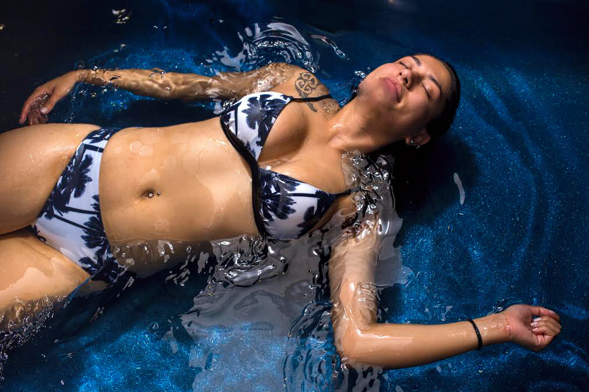
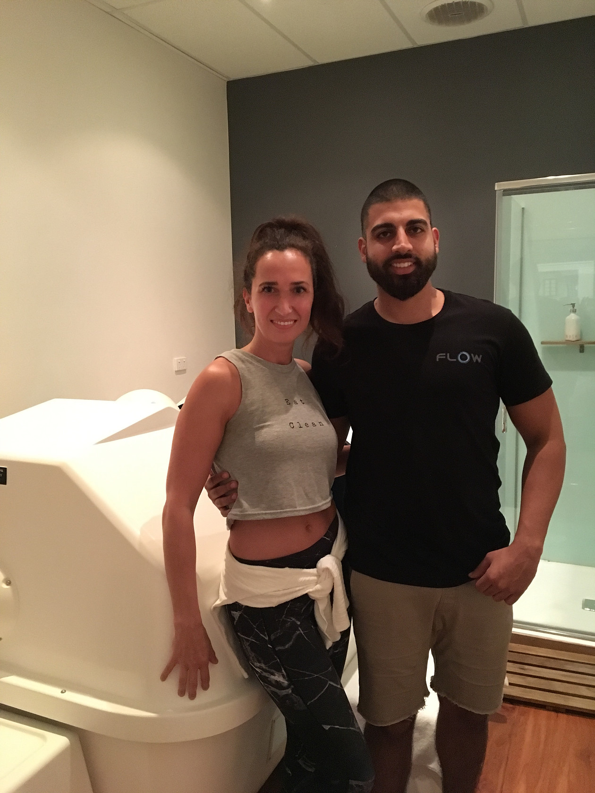
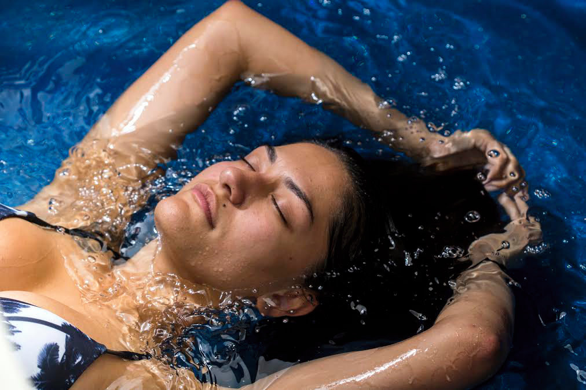

When the floatation tank capsule is closed it is completely dark, shutting you off from the rest of the world. The Epsom salts makes the water really silky and soft it almost feels like I’m wrapped in a **cocoon**. The temperature perfectly resembles my body temperature: **neither warm nor cold**. After about 15 minutes, I can’t tell whether I’m in or out of the water – it doesn’t even feel like I’m wet (sounds weird, right?). I close my eyes and allow my mind to slowly drift away.

> **This is my time. Time to tune out. Turn off. Shut down.**

## Floating—is it for me?

Floating is the perfect way to **unwind**, relax and **replenish** your body whether you’re a busy entrepreneur, mum, athlete or simply want to take some time for yourself. We're all living and working in an increasingly fast-paced and ever-changing world. Too often we forget to take breaks and actually focus on recovery and replenishing. Everyone these days is in “Go, go, go” mode and it almost feels like a sign of weakness to take a rest day.

I work in social media marketing for an online magazine and am constantly on my phone or computer. I’m always checking emails, stats, updates and messages because staying up-to-speed on the latest trends and changes is part of my job. Although most of my work day is filled with things that I enjoy doing, it's still necessary to take some time off to relax.

## Floating 101: How it feels to be inside a floatation tank

Today I had the chance to try a 60-minute float in an isolation float tank at Flow Au in Brisbane. Floating is an amazing, unique and replenishing experience that brings you back in touch with your body and soul. If you’re curious what it’s like, I’ve summarized some questions that might come to mind.

**How do you get started?** If you're a first timer, there's no need to be nervous, it's a super relaxed environment. First, you put in earplugs to keep the water and sound out. Second, you take a shower, preferably lukewarm to adjust to the water temp in the tank. Then, you dry yourself, especially your face because you don’t want any salty water to creep into your eyes when you’re in the tank. Oh and don’t forget to remove all jewellery!

**Anything else worth mentioning?** Don’t forget to use the bathroom before you drift away cause it would be a shame if you were to be distracted by your bladder during your float (lol). You also don’t want to be too hungry or too full. I didn’t eat 2 hours prior my float because I wanted to feel light and comfortable.

**Should I wear a bikini?** Nope, you’ll be completely naked in the tank because it’s more hygienic and you’ll be able to relax even more.

**Should I take my contacts out before the float?** I recommend taking your contacts out as your eyes will be closed for 60 minutes and might get dry or irritated.

**What should I do with my hair?** If you have long hair like me, I recommend wearing a ponytail or braid so you’re your hair doesn’t get entangled in the water. Rinse it and condition after the float because it might be quite dry afterwards.

**What’s the best position to float?** I find it most relaxing when I spread out like a starfish, basically like Savasana or corpse pose in yoga. But you can also cross your legs or cross your arms behind your head, if your neck needs a little support.

**What will I experience?** When I first stepped into the tank I was overwhelmed by a feeling of eeriness but as I settled, I began to relax more and more. I didn’t have a psychedelic experience or anything like that. What I did have though was a very relaxing experience that was basically like meditating in water. I felt like I was floating in space. I couldn’t tell whether my arms and legs were attached to my body. I felt like I was drifting upside down in outer space. It was amazing. I had no sense of time passing and 60 minutes were over before I knew it. But everyone has their own experiences in the float tank, and not every float is the same.

**Who benefits from floating?** I think we can all benefit from a little timeout - whether you have a busy job, want to take a break from your kids, or need to recover from a heavy workout. Take 60 minutes out of your day and dedicate this time to yourself.

**How long should I float?** I find 60 minutes almost a bit too short and have heard that 90 minutes is the ideal time for ultimate relaxation. However, if you’re a first timer 60 minutes will be perfectly fine.

**What’s so good about floating?** Firstly, magnesium is a vital mineral for our health because it’s involved with over 300 metabolic processes in our bodies. Most of us have low magnesium levels and don’t even notice. Floating isgood for you because the Epsom salts in the water will replenish your muscles and also relax you by creating a sense of weightlessness. The quiet and darkness will allow your mind to drift into a deep state of relaxation. It’s basically the purest way to escape from the hustle and bustle of today’s busy world.

Sounds awesome? Well, what are you waiting for? Go try for yourself!

Book a session at [Flow Au](https://flowau.com/) in Brisbane
