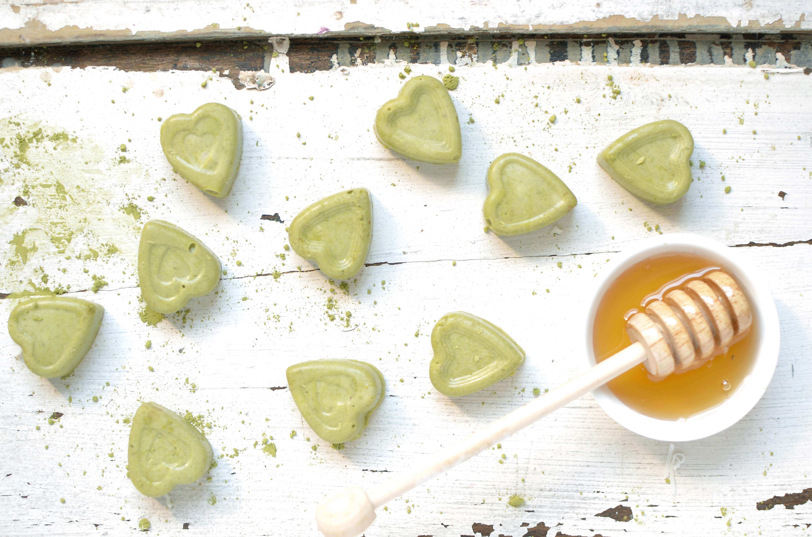
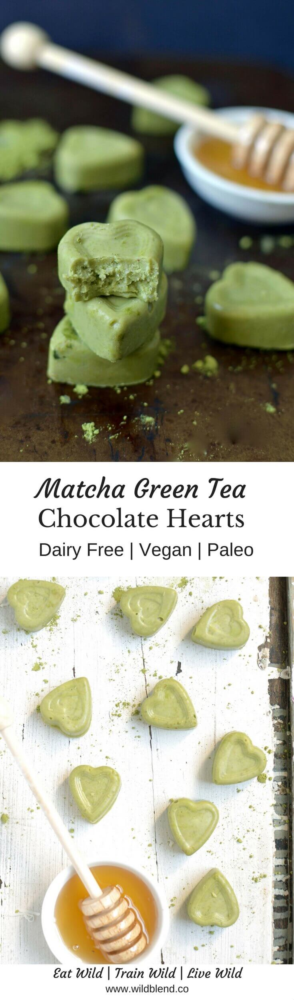
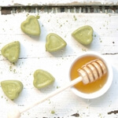

You've probably tried matcha lattes before but have you had matcha chocolate? No? That's ok because it's my first time also. Let's get into vibrant green, **superfood chocolate** bursting with 137 times the **antioxidants** of green tea!

In all honesty, I'm not a huge Matcha latte fan. Simply because I'm a coffee girl. Always have, always will be. Nothing can break the relationship that coffee and I have developed. However, a girl can learn. And a girl is open to new stuff. So, I decided to use the matcha powder I had at home to make chocolate instead.

\[thrive_leads id='1525'\]

All you need is 4 ingredients and a silicone chocolate mould—hearts, stars, circles, flowers, anything goes. It's best to use raw (pure, unheated) cacao butter for this recipe. You can find it in most health food stores, Source Bulk Foods, and online at [iherb](https://au.iherb.com/pr/Earth-Circle-Organics-Organic-Cacao-Butter-1-lb-453-4-g/76467). You probably already know that cacao tastes amazing (duh) but it's also one of the sexiest superfoods—loaded with tons of antioxidants, saturated fat (like coconut oil), and polyphenols.

If you love Matcha recipes, you might also like my [Mint Coconut Macaroons](https://www.wildblend.co/mint-coconut-macaroons/).

[Print](http://localhost:10003/matcha-green-tea-chocolate/print/1177/)

## Matcha Green Tea Chocolate Pralines

Even if you’ve never tried matcha latte before, you gotta give these vibrant green tea chocolate pralines a go!

- **Author:** Zoe
- **Prep Time:** 10 mins
- **Cook Time:** 20 mins
- **Total Time:** 30 mins
- **Yield:** 10 pralines 1x

### Ingredients

Scale 1x2x3x

- 3/4 cup (115g) raw cacao butter
- 1 tsp matcha powder (I used [this](https://justblends.com.au/products/premium-matcha-powder-70g))
- 1 tsp pure vanilla extract (alcohol free)
- 1 Tbsp rice malt syrup
- pinch of salt

### Instructions

1. Melt the cacao butter in a double boiler.
2. Turn the heat to low and add the sweetener while continually stirring with a whisk.
3. Turn off the heat and add the matcha, vanilla and salt, whisk until smooth.
4. Fill into silicone chocolate moulds and place in freezer for 20 minutes.
5. Remove from mould and store in an airtight container in the fridge.

### Notes

Tip: You can sub the rice malt syrup with honey, agave or maple.

### Did you make this recipe?

Share a photo and tag us — we can't wait to see what you've made!

