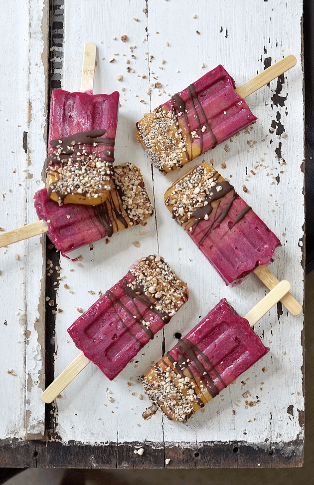
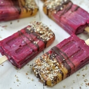

Let's be honest, it doesn't matter whether you are kid or an adult, the chilled fruity appeal of homemade popsicles is universal. Ripe mangoes (here in Queensland) are naturally sweet enough to keep these icy poles **entirely sugar free** (yay!) and freeze dried dragon fruit powder, with its vivid pink colour adds a fun splash of colour to these treats.

Tigernuts are a new superfood on the gluten free market and believe it or not, tiger nuts aren’t nuts at all. They’re tiny starchy tubers with a mildly **sweet, nutty flavor** that grow under the ground. For someone who is allergic to nuts and gluten - tiger nuts are a really good choice. They're **crunchy**, naturally sweet and have a ton of nutritional benefits.

\[thrive_leads id='1525'\]

Are you ready to cool down? Grab your summer fruit, [popsicle mould](https://t.cfjump.com/52650/t/14846?Url=https%3a%2f%2fwww.biome.com.au%2fstainless-steel-homewares%2f14325-onyx-stainless-steel-ice-block-mould-paddle-pop-748252199133.html) and blender and we are ready to create some chilled goodness. The hardest part is waiting for your pops to freeze, but trust me: These suckers are worth the wait!

[Print](http://localhost:10003/ombre-crunchsicles/print/806/)

## Mango Pitaya Ombre Crunchsicles That Melt In Your Mouth

Skip smoothie bowls and refresh with these creamy sunset-coloured frozen treats instead.

- **Author:** Zoe
- **Prep Time:** 15 mins
- **Cook Time:** 5hrs
- **Total Time:** 5 hrs 10 mins
- **Yield:** 6 1x

### Ingredients

Scale 1x2x3x

**For the popsicles**

- 2 Calypso mangoes, diced
- 4 tsp Pitaya powder, (I used [Just Blends](https://justblends.com.au/products/100-pure-freeze-dried-pitaya-powder-70g))

**For the crunch**

- 4 Tbsp diced tigernuts (I used [Terrafirma Foods](https://www.terrafirmafoods.com.au/product/180g-diced-tigernuts/))

**For the chocolate drizzle**

- 4 Tbsp coconut oil, melted
- 2 Tbsp maple syrup
- 3 Tbsp raw cacao powder

### Instructions

1. For the popsicles, place the mango into a food processor or blender and blend until smooth. You may need to scrape down the sides then blend again to get out any chunks.
2. Add 1 Tbps of mango puree to each popsicle mould.
3. For the ombré effect, add 1 tsp Pitaya powder to the remaining mango puree and stir until combined.
4. Add 1 Tbps of Pitaya-mango puree to each popsicle mould.
5. Continue to add Pitaya powder to the mango puree, one teaspoon at a time, until the moulds are full.
6. Pop the lid on and push the wooden sticks into the popsicles. Place in the freezer for 3 hours or until set.
7. For the chocolate drizzle, combine all ingredients in a small bowl. Once combined, Transfer into a pouring bottle and allow to set in the fridge.
8. Once the popsicles are fully frozen (and ready to serve), dip base of moulds in warm-ish water and slide out the mould.
9. Place on cooling rack lined with baking paper. Drizzle with chocolate and diced tigernuts. Enjoy immediately.

**Tip:** To save any leftover pops I wrap them in plastic wrap and freeze individually so they don’t stick.

### Notes

**Note:** I used these [stainless steel paddle pop ice block moulds](https://t.cfjump.com/52650/t/14846?Url=https%3a%2f%2fwww.biome.com.au%2fstainless-steel-homewares%2f14325-onyx-stainless-steel-ice-block-mould-paddle-pop-748252199133.html) from Biome Australia.

### Did you make this recipe?

Share a photo and tag us — we can't wait to see what you've made!

