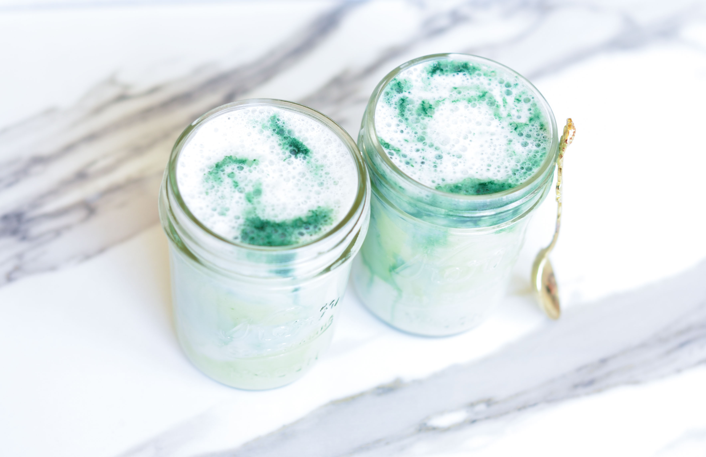
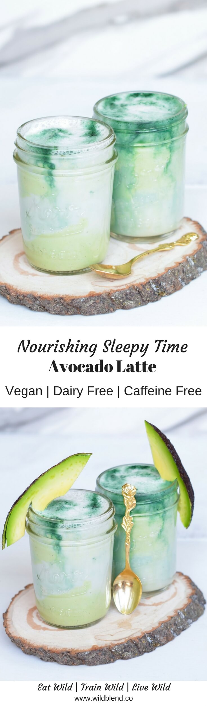

You can now have your avocado toast, avocado pancakes, and swap your morning cuppa for this creamy, caffeine-free avocado latte. Avocado everything, please!

Since turmeric, beetroot, lavender and even charcoal latte have become quite popular in café all around the world, it was about time the avo-latte hit the stage. I can proudly say, that this is quite some discovery. Once you've tried it, you'll happily add it to your arsenal of adventurous foodie obsessions.

Avocados are exceptionally **creamy** and **nourishing** and make the perfect base for this wholesome, **caffeine-free** bedtime drink. Having a satisfied belly will help you keep your blood sugar stable at night, and fall and stay asleep more easily.

\[thrive_leads id='1525'\]

Avocados hold a special place in my heart and I'm pleased to see that this small, pear-shaped fruit has taken the world by storm. The first avocado cafés have started to pop up in cities like New York and Amsterdam and I'm pretty sure it won't be long until they'll start serving avocado lattes.

Still not convinced that this is a hit? Here are some of the **benefits** you'll need to remember:

- plant-based
- vegan
- dairy-free
- Paleo
- high in friendly fats
- full of Vitamin K, C & E
- rich in Potassium

[Print](http://localhost:10003/avocado-latte/print/918/)

## Nourishing Sleepy Time Avocado Latte

Forget turmeric latte, say hello to the avo latte, a creamy and nourishing dairy-free latte that combines avocado, with almond milk and vanilla.

- **Author:** Zoe
- **Prep Time:** 10 mins
- **Total Time:** 10 minutes
- **Yield:** 1 1x

### Ingredients

Scale 1x2x3x

- 1/2 ripe avocado (pitted, peeled)
- 1 cup unsweetened almond milk
- 1–2 tsp maple syrup (or sweetener of choice)
- 1/4 extra almond milk (to froth)
- 1/4 tsp vanilla bean extract
- 2 drops chlorophyll (optional)

### Instructions

1. Warm 1 cup of almond milk, vanilla and maple syrup in a saucepan. (Do not boil!).
2. Once heated, add the warm milk and avocado to a blender and blend until smooth and creamy.
3. Strain through a nut milk bag and add to a glass.
4. Optional: Add chlorophyll drops (for colour and minty flavour)
5. Froth the remaining almond milk with a steamer and combine with your avocado latte.
6. Enjoy immediately.

### Did you make this recipe?

Share a photo and tag us — we can't wait to see what you've made!

