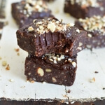

Organic black bean protein powder is a great source of plant-based protein, filling fiber, **antioxidants**, and numerous **vitamins** and minerals. I personally love its natural vanilla flavour and often mix it with only water as a post-workout protein shake.

I'm obsessed with **raw desserts** and make them more often than traditional baked desserts. They are simple to make, no need to turn the oven on and sweat in the kitchen (especially in summer here in Queensland), and the consistency is usually **rich**, **dense** and **gooey**. What's not to like, right?!

I also like to enhance my recipes with wholesome ingredients because who wouldn't want to get a dose of **protein** and **healthy fats** whilst snacking on the best brownie EVER!

\[thrive_leads id='1525'\]

I know you are going to love these brownies. They're:

- vegan
- gluten free
- protein rich
- fiber packed
- dairy free
- egg free
- soy free
- refined sugar free

Love homemade fudge? You'll also love my [Healthy Fudge Pinecones](https://www.wildblend.co/fudge-pinecones/).

[Print](http://localhost:10003/black-bean-fudge-brownies/print/1034/)

## No-Bake Black Bean Fudge Brownies

**These black bean brownies are everything you want from a brownie—moist, fudge-y, and loaded with protein while still keeping it vegan, gluten free and healthy!**

- **Author:** Zoe
- **Yield:** 6 1x

### Ingredients

Scale 1x2x3x

For the brownies

- 2 cups walnuts
- 1 cup almonds
- 1 cup Medjool dates, pitted
- 1/4 cup [Jimmy’s Black Bean](https://www.jimmyblacks.com.au/products/jimmy-blacks-organic-black-bean-powder) powder
- 1/4 cup cacao powder
- 1 Tbsp rice malt syrup

For the glaze

- 2 Tbsp coconut oil, softened
- 2 Tbsp cacao powder
- 1 Tbsp rice malt syrup
- 4 Tbsp crushed almonds, to sprinkle

### Instructions

1. Soak dates in warm water for 5 minutes to soften. Drain.
2. For the brownies, place all ingredients in a food processor and blitz until well combined.
3. Line a square baking dish with parchment paper and evenly press brownie ‘dough’ into the dish. Flatten with a spoon.
4. Place brownies in fridge to set.
5. For the glaze, place melted coconut oil in a bowl and whisk in cacao powder, and rice malt syrup until thickened.
6. Once set, remove brownies from dish, spread glaze on top and sprinkle with crushed almonds.
7. Store in fridge until ready to serve.

### Did you make this recipe?

Share a photo and tag us — we can't wait to see what you've made!

