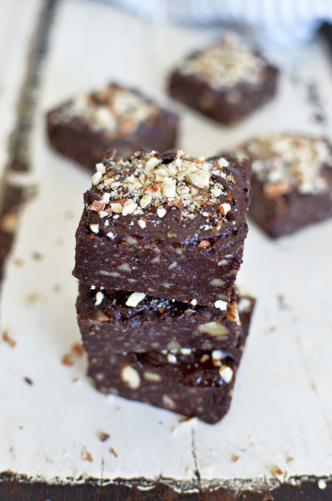
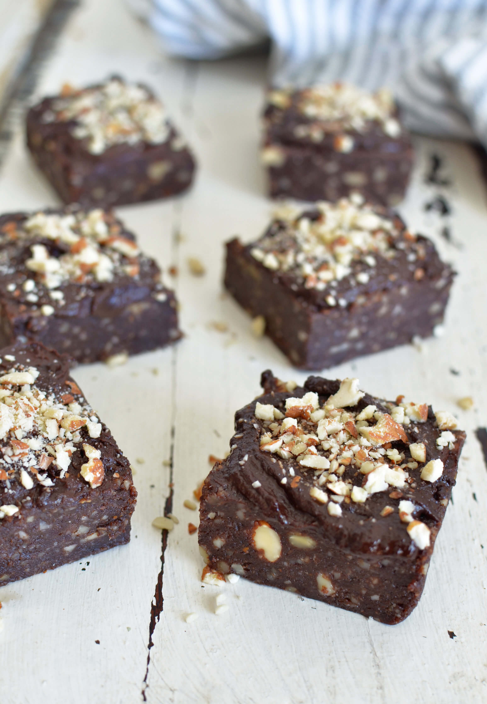
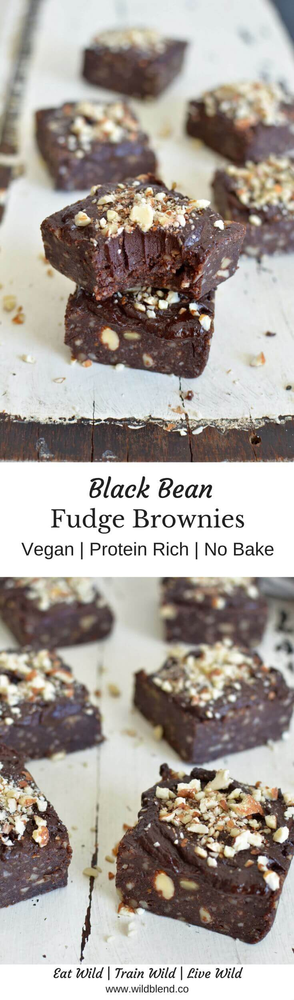

Organic black bean protein powder is a great source of plant-based protein, filling fiber, **antioxidants**, and numerous **vitamins** and minerals. I personally love its natural vanilla flavour and often mix it with only water as a post-workout protein shake.

I'm obsessed with **raw desserts** and make them more often than traditional baked desserts. They are simple to make, no need to turn the oven on and sweat in the kitchen (especially in summer here in Queensland), and the consistency is usually **rich**, **dense** and **gooey**. What's not to like, right?!

I also like to enhance my recipes with wholesome ingredients because who wouldn't want to get a dose of **protein** and **healthy fats** whilst snacking on the best brownie EVER!

\[thrive\_leads id='1525'\]

I know you are going to love these brownies. They're:

- vegan
- gluten free
- protein rich
- fiber packed
- dairy free
- egg free
- soy free
- refined sugar free

Love homemade fudge? You'll also love my [Healthy Fudge Pinecones](https://www.wildblend.co/fudge-pinecones/).

\[tasty-recipe id="1034"\]
