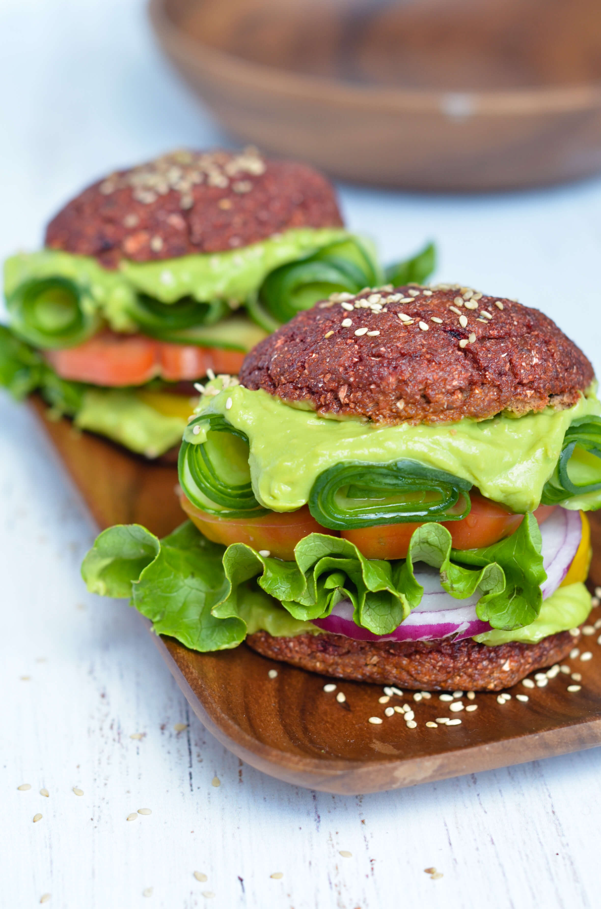
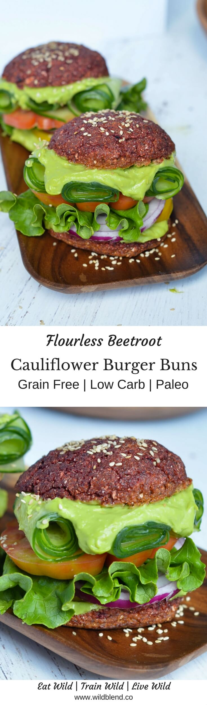

These burger buns are not just gluten-free, they're 100% Paleo-friendly. This recipe replaces traditional gluten-free flour for riced cauliflower and almond meal.  The result is a **less calorie-dense** fluffy bun that is **chock-full with fiber** and nutrients. Overall, eating less grains (even if you're not a Celiac) will definitely benefit your health. Fewer grains means fewer calories, fewer blood-sugar-spikes and **less inflammation**. Win win!

This recipe is an adaptation from one of the most popular recipes on the blog—my [Turmeric Cauliflower Buns](http://www.wildblend.co/cauliflower-turmeric-burger-buns/). The simple ingredients, and little-to-no-effort requirements make it a perfect Sunday food-prep recipe that everyone will love.

\[thrive\_leads id='1525'\]

In this new recipe, cauliflower is teamed with **vitamin C-rich** and **immunity-boosting** beet powder, which adds the beautiful bright red hue to the buns. You can find organic beetroot powder at your local health food store or online ([here](https://www.amazon.com/Starwest-Botanicals-Organic-Powder-Ounces/dp/B004DHKWYK/ref=sr_1_2_s_it?s=hpc&ie=UTF8&qid=1499624087&sr=1-2&keywords=organic+beetroot+powder)).

Here are a few reasons, why you should try these beet burgers. They're:

- vegetarian
- paleo
- packed with fiber
- loaded with veggies
- low-carb
- require next to no effort

\[tasty-recipe id="929"\]
