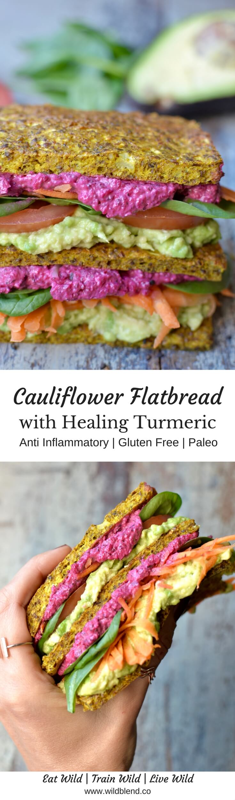

Step aside matcha -- there is a new superfood in town. Turmeric is currently taking social media by storm. The humble spice has transformed everything, from non-coffee lattes and no-bake brownies into anti-inflammatory super foods.

You'll most often find turmeric added to curries but I love adding it to both savoury as well as sweet dishes to add some hearty depth and vibrant colour. Like ginger, turmeric is a root with a bright orange, slightly bitter flesh. You can add fresh turmeric root to your juices or create potent **anti-cold** remedies with it. If you do a quick google search, you'll discover the endless list of benefits turmeric and it's active ingredient curcumin have to offer. The only downside to using it are stubborn stains (my yellow-stained tea towels are proof!). However, you can find ways to get rid those stains here.

This grain-free, **low-carb** and **veggie-packed** flatbread has become a family favourite in my house. We make it all the time, add different flavours to it and can never have enough of it stored in the freezer. It's a no-fuss recipe that you can literally whip up in a matter of 15 minutes. I haven't met a single person who isn't immediately hooked and loves the simplicity of this recipe.

\[thrive\_leads id='1525'\]

Will it hold up as a sandwich, you ask? Definitely! It's a tested no-crumb bread alternative for those who love a good sandwich but don't like store-bought Paleo breads. I personally stay away from **gluten-free** bread alternatives because they are usually on the carb-heavy side and contain a multitude of additives and ingredients my sensitive tummy can't stomach. This is a minimal ingredient solution that even the pickiest of eaters will enjoy.

If you (or your kids) don't like turmeric—fine, leave it out. It's an optional ingredient that's not really necessary for the recipe. As for other flavour additions, we love **nutritional yeast** because it adds a nutty and cheesy flavour to the bread. But feel free to be creative with flavours, the options are endless. Here are some ideas for extra add-ins:

- garlic
- chili flakes
- herbs such as rosemary, chives, or basil
- dried tomato
- olives
- pepper flakes

If you’ve never tried making bread in the past, flatbread is a great place to start—requiring just 7 ingredients, 1 bowl, and little-to-no cooking experience. If you like this recipe, you'll also like my [**Cauliflower Turmeric Burger Buns**](http://www.wildblend.co/cauliflower-turmeric-burger-buns/).

\[tasty-recipe id="946"\]
