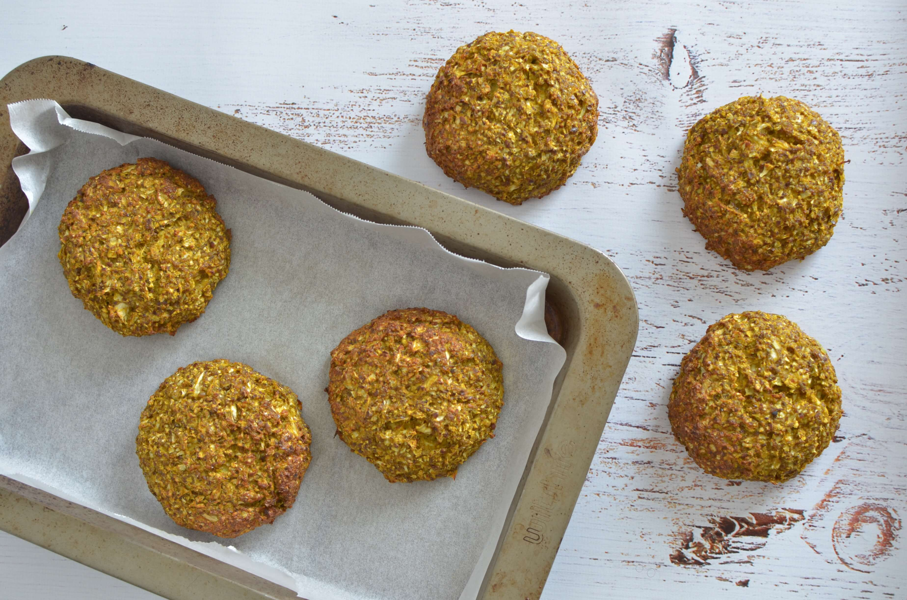
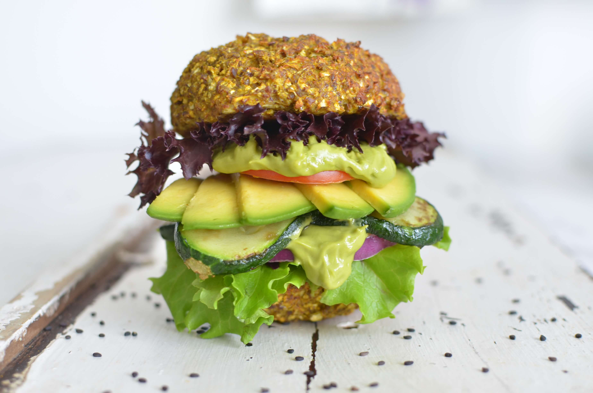
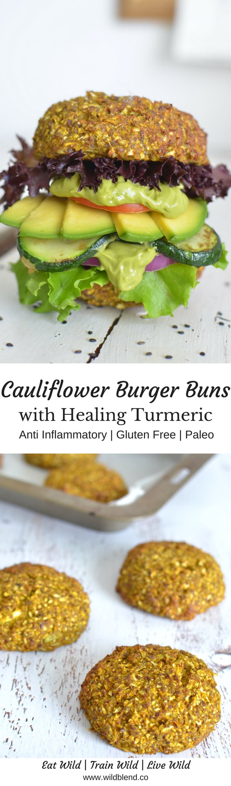
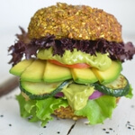

This **veggie-packed** alternative to traditional burger buns is totally **flour-free** and surprisingly light and **fluffy**. You can pack it with your favourite fillings, take it to work or enjoy it for lunch.

Cauliflower is a versatile ingredient in **gluten-free** baking and often makes an appearance in my kitchen due to its bland flavour. It turns everything in a healthy meal, adds a punch of **Vitamin-C** and **fiber**, and is teamed with anti-inflammatory and **immunity-boosting turmeric** in these buns. We store all our vegetables in a [Swag Bag](https://t.cfjump.com/52650/t/14846?Url=https%3a%2f%2fwww.biome.com.au%2freduce-and-reuse%2f17237-the-swag-produce-storage-bag-individual-small.html) to keep them fresh and make them last longer in the fridge.

The best part, you can actually pick these buns up like a real hamburger. They are thicker, sturdier and breadier than most gluten-free buns and hold together perfectly.

I love this recipe so much and I know you will too. It's:

- paleo
- gluten-free
- grain-free
- anti-inflammatory
- low-carb
- fiber-rich

With just a handful of ingredients, this recipe comes together in no time and can easily become part of your weekly food prep. As far as seasoning goes, there are no limits to your creativity. I love **turmeric** and **nutritional yeast** to add some **cheesy flavour** but you can go whatever floats your boat.

\[thrive_leads id='1525'\]

Here are a few flavor ideas:

- garlic and smoked pepper
- curry powder
- onion and mustard

If you love cauliflower recipes, you might also like my [Turmeric Cauliflower Flatbread](https://www.wildblend.co/cauliflower-flatbread/).

[Print](http://localhost:10003/cauliflower-turmeric-burger-buns/print/965/)

## Cauliflower Turmeric Burger Buns

These healthy low-carb cauliflower buns answer all your burger cravings while still keeping it deliciously gluten-free.

- **Author:** Zoe
- **Prep Time:** 15 mins
- **Cook Time:** 40 mins
- **Total Time:** 55 mins
- **Yield:** 8 buns 1x

### Ingredients

Scale 1x2x3x

- 3 cups raw riced cauliflower\*
- 4 eggs
- 1 cup LSA (mix made from ground flax seed, sunflower seeds and almonds)
- 3 t turmeric powder ( I used Golden Grind)
- 3 t nutritional yeast\*\*
- 1/8 t black pepper
- ½ t sea salt

### Instructions

1. Preheat oven to 175°C. Line a baking tray with parchment paper.
2. In a medium bowl, mix all ingredients and combine well with a spoon.
3. Transfer mixture to the lined baking tray. Form 6-8 evenly sized balls and lay onto baking sheet. Press down slightly.
4. Bake at 175°C for 35 minutes, or until golden.
5. Once baked, let cool completely (before slicing).
6. Use 2 buns to create a traditional burger or slice them in half for a sandwich-style bread.
7. Store buns in a container in the refrigerator for up to one week.

### Notes

\*Tip: Rice/grate the cauliflower using a food processor, and process cauliflower florets until very finely chopped.

\*\* Nutritional yeast cannot be substituted with activated yeast, baking powder or brewers yeast. It’s mainly added for flavour, as it adds a cheesy and nutty taste to the bread.

### Did you make this recipe?

Share a photo and tag us — we can't wait to see what you've made!

