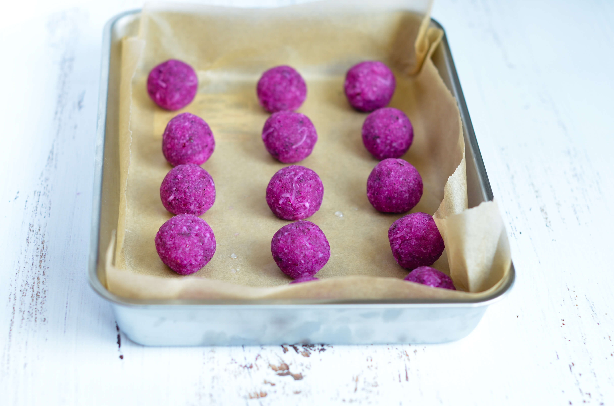
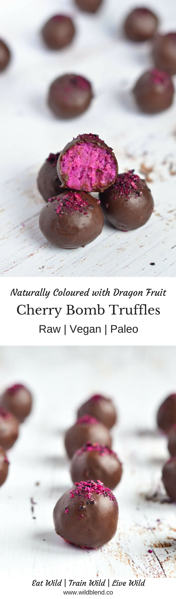

Cherry Ripe are a classic childhood treat that are chocolate-smothered on the outside and filled with moist coconut and cherry on the inside. For a healthier Paleo and Vegan friendly twist, this recipe uses fresh cherries, pink Dragon Fruit Powder (for the vibrant color), and raw dark chocolate. You only need **6-ingredients** to whip up a batch of these **better-for-you truffles** that can be stocked in your freezer (Yes, they freeze well!).

My favourite time of the year is when fresh cherries appear at the markets. And we all know when cherries and chocolate meet, magic happens! Sweet and juicy cherries pair perfectly with the bitter notes of dark chocolate.

\[thrive\_leads id='1525'\]

One of the benefits of following a whole foods lifestyle is the quality of the ingredients used in most recipes. Not only are they super delicious but also a great source of nutrients. Pink Dragon Fruit, also known as Pitaya, is known for its many health benefits. It boasts a healthy dose of **antioxidants** (cherries do too) and **essential fatty acids**. Coconuts are a delicious and nutritious source of **fiber**, vitamins, minerals, and amino acids.

These raw cherry bomb truffles are gluten-free, refined sugar-free, dairy-free and perfect to fix that 'sweet craving'!

- antioxidant-rich
- no bake
- nut free
- low sugar
- plant-based
- paleo
- vegan
- easy to make

I can't wait for you to try these. If you love homemade truffles, you might also like my [Dark Chocolate Avocado Truffles](https://www.wildblend.co/dark-chocolate-avocado-truffles/).

\[tasty-recipe id="874"\]
