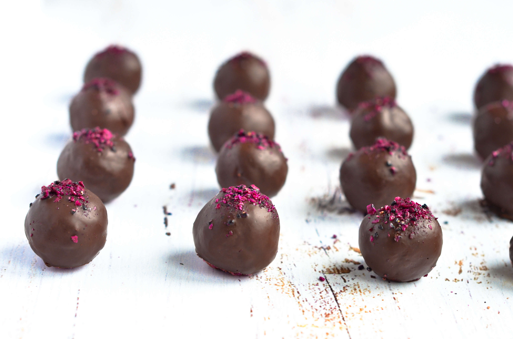

Cherry Ripe are a classic childhood treat that are chocolate-smothered on the outside and filled with moist coconut and cherry on the inside. For a healthier Paleo and Vegan friendly twist, this recipe uses fresh cherries, pink Dragon Fruit Powder (for the vibrant color), and raw dark chocolate. You only need **6-ingredients** to whip up a batch of these **better-for-you truffles** that can be stocked in your freezer (Yes, they freeze well!).

My favourite time of the year is when fresh cherries appear at the markets. And we all know when cherries and chocolate meet, magic happens! Sweet and juicy cherries pair perfectly with the bitter notes of dark chocolate.

\[thrive_leads id='1525'\]

One of the benefits of following a whole foods lifestyle is the quality of the ingredients used in most recipes. Not only are they super delicious but also a great source of nutrients. Pink Dragon Fruit, also known as Pitaya, is known for its many health benefits. It boasts a healthy dose of **antioxidants** (cherries do too) and **essential fatty acids**. Coconuts are a delicious and nutritious source of **fiber**, vitamins, minerals, and amino acids.

These raw cherry bomb truffles are gluten-free, refined sugar-free, dairy-free and perfect to fix that 'sweet craving'!

- antioxidant-rich
- no bake
- nut free
- low sugar
- plant-based
- paleo
- vegan
- easy to make

I can't wait for you to try these. If you love homemade truffles, you might also like my [Dark Chocolate Avocado Truffles](https://www.wildblend.co/dark-chocolate-avocado-truffles/).

[Print](http://localhost:10003/cherry-bomb-truffles/print/874/)

## Dark Chocolate Cherry Bomb Truffles

If you love Cherry Ripe candy these better-for-you cherry bomb truffles packed with dark chocolate and fresh cherries will definitely hit the spot.

- **Author:** Zoe
- **Prep Time:** 20 mins
- **Cook Time:** chill for 30 mins
- **Total Time:** 50 mins
- **Yield:** 18 1x

### Ingredients

Scale 1x2x3x

**For the truffles**

- 2½ cups desiccated coconut, unsweetened
- 2 Tbsp coconut oil, melted
- ¼ cup maple syrup
- ¼ cup fresh cherries, pitted
- 2 Tbsp pitaya powder (I used [Just Blends](https://justblends.com.au/products/100-pure-freeze-dried-pitaya-powder-70g))
- 1/2 tsp lime juice

**For the chocolate coating**

- ½ cup melted coconut oil
- 3/4 cup raw cacao powder
- 1/4 cup maple syrup

### Instructions

1. Add cherries, maple syrup, coconut oil, and lime juice to a food processor or high-speed blender and process until smooth.
2. Add desiccated coconut and pitaya powder and process again until well combined.
3. Roll the mixture into small balls using your hands and set them on a lined cookie sheet.
4. Place in the freezer for 1/2 hour or until they are firm.
5. For the chocolate coating, whisk the ingredients together in a bowl until smooth.
6. Remove the truffles from the freezer and insert a skewer through the middle (don’t poke through them).
7. One by one dip them into the chocolate coating and place in the fridge to set.
8. Dust with pitaya powder (optional).

### Notes

**Tip:** You can double coat your truffles with leftover chocolate once the first layer has dried.

### Did you make this recipe?

Share a photo and tag us — we can't wait to see what you've made!

