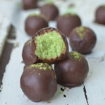

With Easter looming around the corner I've been looking for healthy, clean-eating alternatives to sugar-laden chocolate bunnies and pralines. Even organic chocolate eggs promoted at my local health food store are not up to my standard of a guilt-free treat.

Don't get me wrong, I LOVE chocolate but I don't want the corn syrup, lecithin, Soy and milk solid it usually comes with. So, these Avocado Coconut truffles coated in raw chocolate are my healthy Easter basket alternative.

\[thrive_leads id='1525'\]

Each ingredient in these no-bake truffles bring their own set of **nutritional benefits**. Raw cacao packs 40 times the **antioxidants** of blueberries and is the highest plant-based source of iron. Avocado provides a dose of **healthy fats**, while coconut nourishes you with energy to get you through the day.

I know you'll fall in love with this simple recipe, just like I did. It ticks all the boxes:

- lunch box friendly
- nut free
- friendly fats
- minimal ingredients
- paleo
- vegan
- YUMMY

I can't wait for you to try these. If you love homemade truffles, you might also like my [Cherry Bomb Truffles](https://www.wildblend.co/cherry-bomb-truffles/).

[Print](http://localhost:10003/dark-chocolate-avocado-truffles/print/980/)

## Dark Chocolate Avocado Truffles

These easy Avocado Coconut Truffles boast a healthy dose of friendly fats from avocado and coconut with a boost of anti-oxidant rich dark chocolate.

- **Author:** Zoe
- **Yield:** 12 1x

### Ingredients

Scale 1x2x3x

**For the truffles**

- 2½ cups shredded coconut, unsweetened
- 2 Tbsp coconut oil, melted
- ¼ cup maple syrup
- ¼ cup avocado, mashed

**For the chocolate coating**

- ½ cup melted coconut oil
- 3/4 cup raw cacao powder
- 1/4 cup maple syrup

### Instructions

1. Mix the shredded coconut, maple, coconut oil, and avocado. I used my hands to blend it well.
2. Form the mixture into small balls by squeezing until a ball forms.
3. Once you have the balls rolled, freeze for 1 hour or so until they are firm.
4. For the chocolate coating, whisk the ingredients together in a bowl until smooth.
5. Remove the truffles from the freezer and insert a skewer through the middle (don’t poke through them).
6. One by one dip them into the chocolate coating and place in the fridge to set.
7. Dust with matcha powder (optional)

### Notes

**Tip:** You can double coat your truffles with leftover chocolate once the first layer has dried.

### Did you make this recipe?

Share a photo and tag us — we can't wait to see what you've made!

