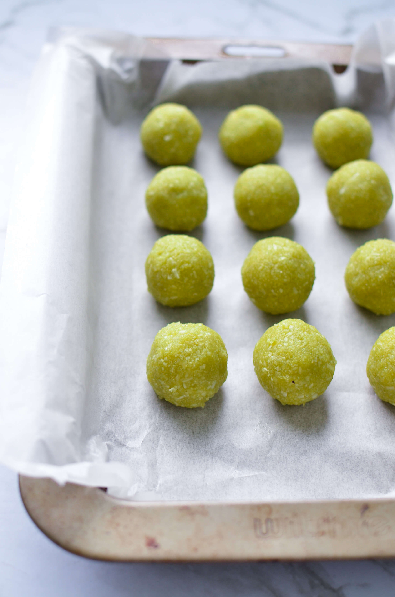
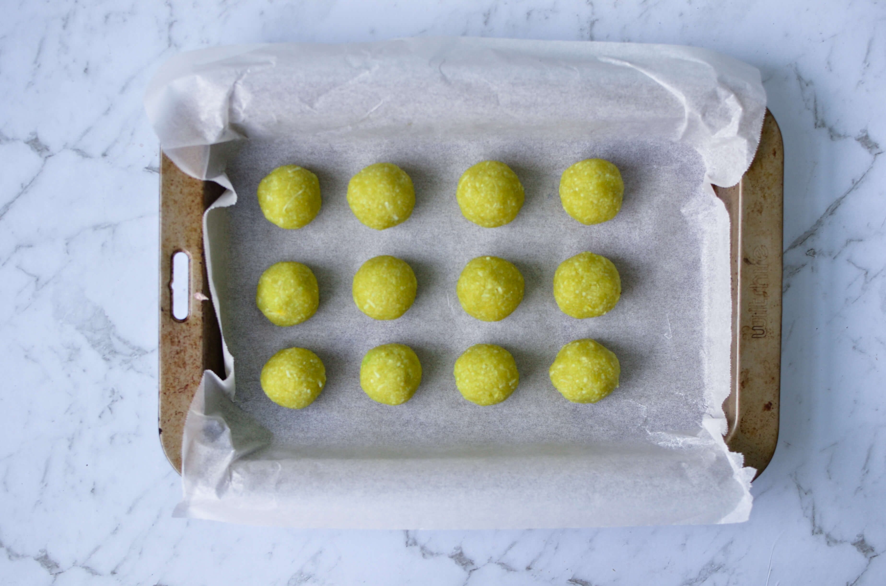
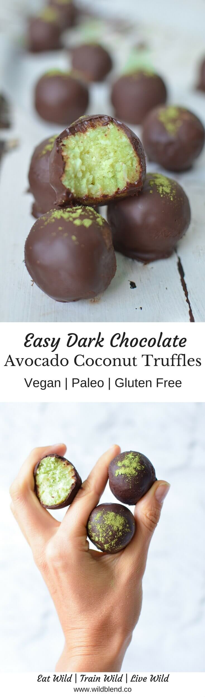

With Easter looming around the corner I've been looking for healthy, clean-eating alternatives to sugar-laden chocolate bunnies and pralines. Even organic chocolate eggs promoted at my local health food store are not up to my standard of a guilt-free treat.

Don't get me wrong, I LOVE chocolate but I don't want the corn syrup, lecithin, Soy and milk solid it usually comes with. So, these Avocado Coconut truffles coated in raw chocolate are my healthy Easter basket alternative.

\[thrive\_leads id='1525'\]

Each ingredient in these no-bake truffles bring their own set of **nutritional benefits**. Raw cacao packs 40 times the **antioxidants** of blueberries and is the highest plant-based source of iron. Avocado provides a dose of **healthy fats**, while coconut nourishes you with energy to get you through the day.

I know you'll fall in love with this simple recipe, just like I did. It ticks all the boxes:

- lunch box friendly
- nut free
- friendly fats
- minimal ingredients
- paleo
- vegan
- YUMMY

I can't wait for you to try these. If you love homemade truffles, you might also like my [Cherry Bomb Truffles](https://www.wildblend.co/cherry-bomb-truffles/).

\[tasty-recipe id="980"\]
