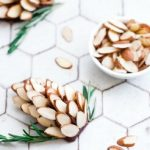

Christmas in Australia (where it's usually around 35°C outside) calls for traditions that don't require turning on the oven and melting into a puddle of sweat. No-bake cookies are the answer to scorching hot Christmas. These adorable fudge pinecones keep things festive whilst keeping the kitchen cool and preventing you from a heatstroke in the middle of summer. You can thank me later!

Traditional fudge is usually loaded with tons of sugar, condensed milk and butter. This healthy version comes together with only 6 nutritious ingredients and is fun to decorate together with friends and family. You can make these fudge pinecones with whichever nut butter you prefer. I used homemade almond butter (with the skin on). My next batch will be with cashew butter to achieve a lighter colour and more of a caramel flavor.

\[thrive_leads id='1525'\]

Smooth, creamy and sinfully nutritious, this healthy fudge is also:

- naturally gluten free
- quick & easy
- super pretty to look at
- vegan
- dairy-free
- refined sugar-free
- kid-friendly
- no-bake

Are you a fudge lover? You might also like my no-bake [Fudge Brownies](https://www.wildblend.co/black-bean-fudge-brownies/).

[Print](http://localhost:10003/fudge-pinecones/print/1433/)

## Healthy Christmas Fudge Pinecones

Make Christmas fun with these creative and beautiful fudge pinecones.

- **Author:** Zoe
- **Prep Time:** 15 mins
- **Cook Time:** 20 mins
- **Total Time:** 35 mins
- **Yield:** 8\-10 pinecones 1x

### Ingredients

Scale 1x2x3x

For the fudge:

- 1 cup nut butter (I used almond butter)
- 1 cup chickpeas (cooked & drained)
- 2 Tbsp maple syrup
- 1 tsp natural vanilla essence
- ¼ tsp cinnamon
- Pinch of sea salt

For decoration:

- Natural almond slices ([thicker with skin on](https://www.woolworths.com.au/shop/productdetails/369808/lucky-almonds-sliced))

### Instructions

1. Place all ingredients together in a food processor and process until well combined and the mixture comes together to form a ball.
2. Divide into 8-10 pieces and form into pine-shaped ovals
3. Decorate with natural almond slices.
4. Store in the fridge.

### Did you make this recipe?

Share a photo and tag us — we can't wait to see what you've made!

