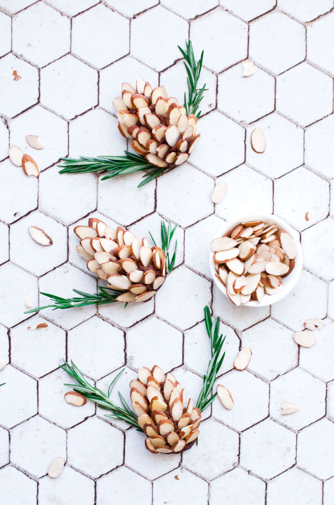
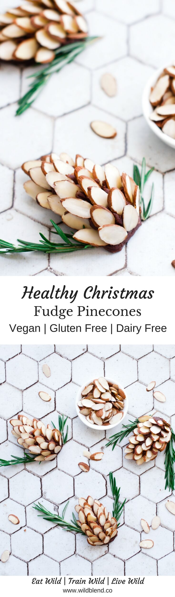

Christmas in Australia (where it's usually around 35°C outside) calls for traditions that don't require turning on the oven and melting into a puddle of sweat. No-bake cookies are the answer to scorching hot Christmas. These adorable fudge pinecones keep things festive whilst keeping the kitchen cool and preventing you from a heatstroke in the middle of summer. You can thank me later!

Traditional fudge is usually loaded with tons of sugar, condensed milk and butter. This healthy version comes together with only 6 nutritious ingredients and is fun to decorate together with friends and family. You can make these fudge pinecones with whichever nut butter you prefer. I used homemade almond butter (with the skin on). My next batch will be with cashew butter to achieve a lighter colour and more of a caramel flavor.

\[thrive\_leads id='1525'\]

Smooth, creamy and sinfully nutritious, this healthy fudge is also:

- naturally gluten free
- quick & easy
- super pretty to look at
- vegan
- dairy-free
- refined sugar-free
- kid-friendly
- no-bake

Are you a fudge lover? You might also like my no-bake [Fudge Brownies](https://www.wildblend.co/black-bean-fudge-brownies/).

\[tasty-recipe id="1433"\]
