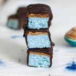

You probably already know that I'm obsessed with magical food trends. Glitter, sparkles and pastels generally put a smile on everyone's face. So, I couldn't help but make these **ocean-coloured** Mermaid chocolate bars. If you want to create some magic yourself, be sure to get your hands on some [Blue Majik](https://www.e3live.com.au/All-Products/Blue-Majik-FP-80-Powder.aspx) aka blue algae with superpowers.

Now, you don't have to throw a Mermaid party to get excited about these Ariel-inspired treats. As if homemade, **guilt-free** Bounty Bars weren't already good enough, these are also topped with magical blue moon dust aka **edible glitter**. Be sure to have your phone ready to take a picture and post it on Instagram (#mermaidfood).

\[thrive_leads id='1525'\]

Life might not be all rainbows and unicorns once you put these in your mouth but it's a pretty sparkling experience to eat them. Better make a double batch because everyone will want to be part of this Mermaid party. Who would have thought healthy can look so darn beautiful, huh?!

These are full of love, sparkles and also good for ya. Here's proof:

- vegan
- paleo
- dairy free
- refined sugar free
- sparkling
- gluten free
- no bake
- magical

Love homemade bounty bars? You might also like my [Unicorn Bounty Bars](https://www.wildblend.co/unicorn-bounty-bars/).

[Print](http://localhost:10003/mermaid-bounty-bars/print/824/)

## Ariel-Approved Mermaid Bounty Bars

Even Ariel herself would approve of these ocean-coloured magical Mermaid bars.

- **Author:** Zoe
- **Yield:** 10 1x

### Ingredients

Scale 1x2x3x

For the mermaid bars:

- 1 cup coconut cream
- 3 Tbsp maple syrup
- 4 Tbsp coconut butter
- 1/4 tsp vanilla essence
- 2 cups desiccated coconut
- 1/4 tsp blue majik powder (I got mine [here](https://www.e3live.com.au/All-Products/Blue-Majik-FP-80-Powder.aspx))
- 1/2 cup nut butter
- Optional: blue edible glitter

For the chocolate coating

- ½ cup melted coconut oil
- 3/4 cup raw cacao powder
- 1/4 cup maple syrup

### Instructions

1. _For the bars, combine coconut cream, coconut butter, and maple syrup in a large mixing bowl. Mix well until everything is combined._
2. _Once combined, add blue spirulina powder and fold in desiccated coconut._
3. _Once combined, press mixture down into a square baking tin lined with parchment paper._
4. _Spread an even layer of nut butter on top of the coconut base._
5. _Place in freezer to set for 2-3 hours._
6. _For the chocolate coating, whisk the ingredients together in a bowl until smooth._
7. _Once set, cut into bars and individually coat each bar with the melted chocolate (Tip: Decorate with edible glitter before chocolate sets)._
8. _Place in the fridge for 30 minutes to allow the chocolate to set_
9. _Enjoy!_

### Did you make this recipe?

Share a photo and tag us — we can't wait to see what you've made!

