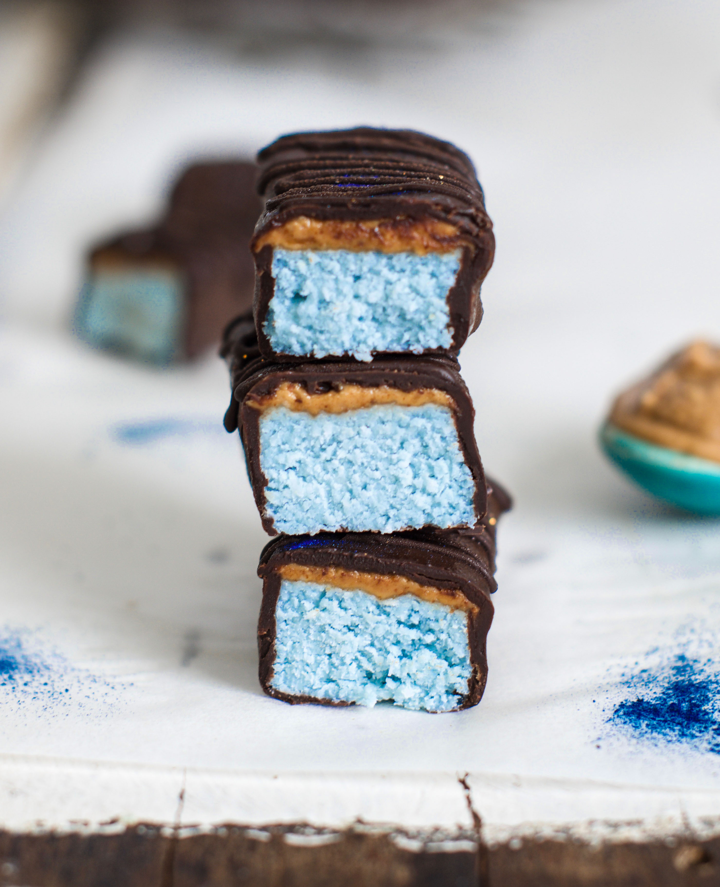
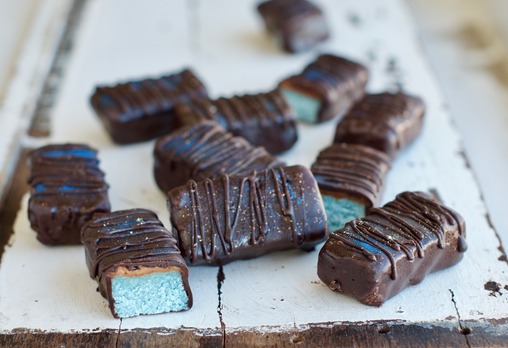
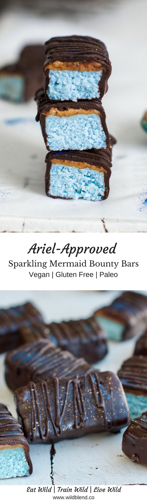

You probably already know that I'm obsessed with magical food trends. Glitter, sparkles and pastels generally put a smile on everyone's face. So, I couldn't help but make these **ocean-coloured** Mermaid chocolate bars. If you want to create some magic yourself, be sure to get your hands on some [Blue Majik](https://www.e3live.com.au/All-Products/Blue-Majik-FP-80-Powder.aspx) aka blue algae with superpowers.

Now, you don't have to throw a Mermaid party to get excited about these Ariel-inspired treats. As if homemade, **guilt-free** Bounty Bars weren't already good enough, these are also topped with magical blue moon dust aka **edible glitter**. Be sure to have your phone ready to take a picture and post it on Instagram (#mermaidfood).

\[thrive\_leads id='1525'\]

Life might not be all rainbows and unicorns once you put these in your mouth but it's a pretty sparkling experience to eat them. Better make a double batch because everyone will want to be part of this Mermaid party. Who would have thought healthy can look so darn beautiful, huh?!

These are full of love, sparkles and also good for ya. Here's proof:

- vegan
- paleo
- dairy free
- refined sugar free
- sparkling
- gluten free
- no bake
- magical

Love homemade bounty bars? You might also like my [Unicorn Bounty Bars](https://www.wildblend.co/unicorn-bounty-bars/).

\[tasty-recipe id="824"\]
