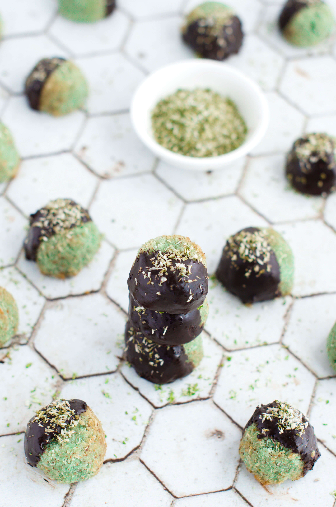
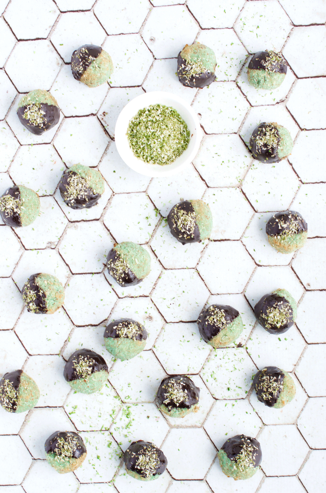
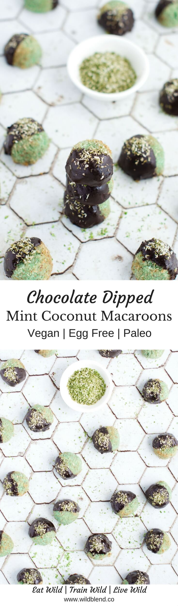

When I think of Christmas, I think of my grandmother's sticky coconut macaroons. She made them every year and I always ate them until there was nothing but crumbs left in her cookie jar. These mint coconut macaroons are a healthy spin on my childhood favourite. Dark chocolate mixed with cool mint flavor makes for an irresistible dessert combination.

Traditional coconut macaroons are made with egg whites, sugar (LOTS of sugar), and dried coconut. This healthy vegan version is made with coconut cream and almond flour in place of egg whites, which makes them perfectly vegan-friendly (yay!). Most vegan coconut macaroon recipes use aquafaba (chickpea brine) in place of whipped egg whites but I only had a hand mixer at home and wanted a simpler recipe.

\[thrive\_leads id='1525'\]

The cool mint flavour in this Mint Coconut Macaroons stems from food-grade peppermint drops and liquid chlorophyll which naturally tastes quite minty. If you can't find liquid chlorophyll at your local health food store or you don't want to buy it for a single recipe, you can use Matcha or spirulina powder as a substitute. Just whisk it in with the coconut cream and maple syrup and make sure it's fully incorporated before you add the dried coconut.

Oh and before I go, don't confuse coconut _macaroons_ with French _macarons_, which are the meringue-based cookies filled with buttercream that you can usually buy in lots of different colours and flavours. Some people take the difference between macaroon and macaron very seriously, so I've heard (lol).

\[tasty-recipe id="1409"\]
