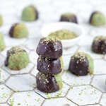

When I think of Christmas, I think of my grandmother's sticky coconut macaroons. She made them every year and I always ate them until there was nothing but crumbs left in her cookie jar. These mint coconut macaroons are a healthy spin on my childhood favourite. Dark chocolate mixed with cool mint flavor makes for an irresistible dessert combination.

Traditional coconut macaroons are made with egg whites, sugar (LOTS of sugar), and dried coconut. This healthy vegan version is made with coconut cream and almond flour in place of egg whites, which makes them perfectly vegan-friendly (yay!). Most vegan coconut macaroon recipes use aquafaba (chickpea brine) in place of whipped egg whites but I only had a hand mixer at home and wanted a simpler recipe.

\[thrive_leads id='1525'\]

The cool mint flavour in this Mint Coconut Macaroons stems from food-grade peppermint drops and liquid chlorophyll which naturally tastes quite minty. If you can't find liquid chlorophyll at your local health food store or you don't want to buy it for a single recipe, you can use Matcha or spirulina powder as a substitute. Just whisk it in with the coconut cream and maple syrup and make sure it's fully incorporated before you add the dried coconut.

Oh and before I go, don't confuse coconut _macaroons_ with French _macarons_, which are the meringue-based cookies filled with buttercream that you can usually buy in lots of different colours and flavours. Some people take the difference between macaroon and macaron very seriously, so I've heard (lol).

[Print](http://localhost:10003/mint-coconut-macaroons/print/1409/)

## Mint Coconut Macaroons Dipped in Dark Chocolate (Vegan, Paleo)

Think mint-flavored and chocolate-dipped chewy coconut macaroon minus egg whites and refined sugar.

- **Author:** Zoe
- **Prep Time:** 15 mins
- **Cook Time:** 15 - 18 mins
- **Total Time:** 30 - 33 mins
- **Yield:** 23 macaroons 1x

### Ingredients

Scale 1x2x3x

For the macaroons:

- 1.5 cups dried coconut
- 1 cup coconut cream (canned, full-fat)
- 2 Tbsp maple syrup
- 1/4 tsp food-grade peppermint essence
- 4 drops of liquid chlorophyll (I got mine [here](https://au.iherb.com/pr/Now-Foods-Liquid-Chlorophyll-Mint-Flavor-16-fl-oz-473-ml/5028))
- 1/2 cup almond flour

For the chocolate:

- 1/3 cup raw cacao powder
- ½ cup coconut oil (melted)
- ¼ cup maple syrup

### Instructions

1. Preheat the oven to 175°C. Line a baking sheet with parchment paper.
2. In a saucepan, combine the coconut cream, maple, peppermint essence and chlorophyll. Bring to a low simmer and whisk the ingredients together for 2 minutes. (Don’t bring to boil!)
3. Add the dreid coconut and almond flour to a mixing bowl. Pour the liquid from the saucepan into the mixing bowl and stir to combine.
4. Use a tablespoon to scoop the batter out of the bowl. Shape each cookie into a mound and place on the prepared baking sheet.
5. Bake for 15-18 minutes or until the edges of the cookies begin to brown.
6. Remove the cookies from the oven and immediately transfer the entire baking sheet to the freezer for 30 minutes.
7. In a bowl, whisk chocolate ingredients together until well incorporated.
8. Dip each cookie halfway into the chocolate and place it back on the baking sheet.
9. Place the cookies back in the freezer for about 10 minutes to set.
10. Enjoy.

### Notes

Note: If you don’t have access to [liquid chlorophyll](https://au.iherb.com/pr/Now-Foods-Liquid-Chlorophyll-Mint-Flavor-16-fl-oz-473-ml/5028) a similar green colour can be achieved by adding a 1/4 teaspoon Matcha, spirulina or chlorella powder. Feel free to experiment.

### Did you make this recipe?

Share a photo and tag us — we can't wait to see what you've made!

