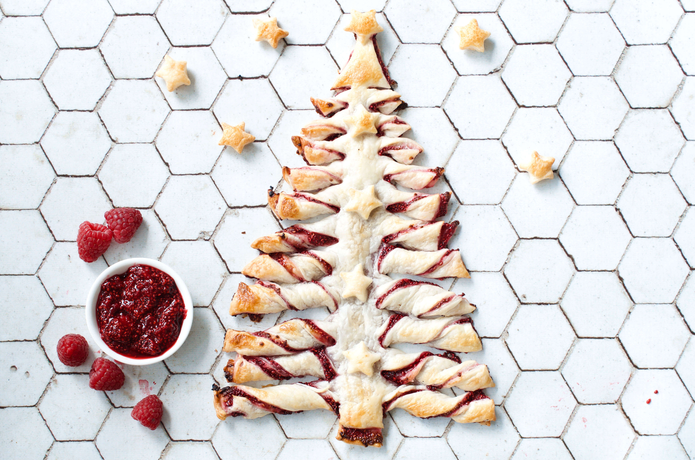
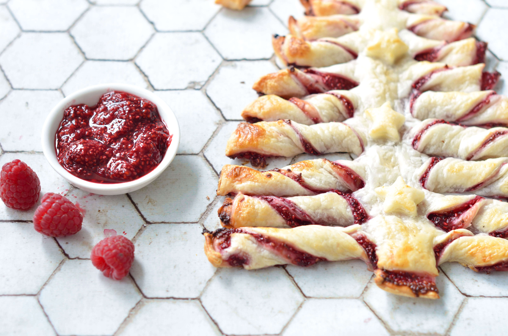
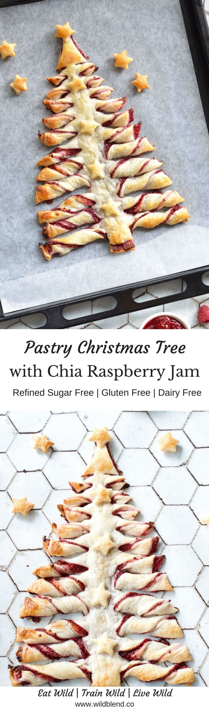

Santa Clause is coming to town and I wanted to surprise him with a treat that I've recently discovered on Pinterest. My version of the iconic pastry Christmas tree is filled with a healthy 4-ingredient raspberry chia jam instead of sugar-laden Nutella. The jam comes together really quickly and doesn't need copious amounts of sugar or gelatin—which makes it diabetes- and vegan-friendly and much healthier than store-bought jams.

As elaborated as this pastry tree looks it's really not difficult to make. Even if you are not an experienced baker you'll be able to whip it up and make it look cute. This [video tutorial](http://allrecipes.com/recipe/256100/nutella-pastry-christmas-tree/?utm_source=facebook&utm_medium=social&utm_campaign=alr_201712109697_ar_dailycontent) will teach you how to make it. I suggest getting [gluten-free](https://www.woolworths.com.au/shop/productdetails/763094/simply-wize-pastry-puff-gluten-free) or [vegan](https://www.woolworths.com.au/shop/productdetails/173040/borg-s-traditional-puff-pastry) puff pastry sheets—whichever you prefer.

This pastry Christmas tree is perfect for holiday parties and family festivities. You could fill it with whatever jam flavour you like. I chose raspberry but cherry or apricots would be quite nice too. You could also fill it with cheese and chives for a savoury variation. The best part is, everyone will want to gather around it and share the goodness. \[thrive\_leads id='1525'\]

The raspberry chia jam is sandwiched between two layers of gluten-free puff pasty, which is sliced into strips and then twisted to form tree branches. I decorated mine with little puff pastry stars that I cut out using a cookie cutter and attached to the tree with vegan 'egg wash'. I used an almond milk/maple mixture that mimics the effects of a regular egg wash.

If you love Christmas treats, you'll also like my Christmassy Healthy [Fudge Pinecones](https://www.wildblend.co/fudge-pinecones/).

\[tasty-recipe id="1508"\]
