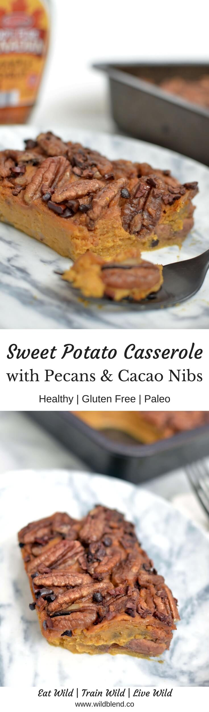
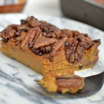

Staying healthy during the holidays is not easy. Most **Thanksgiving** dishes are packed with hidden calories and unhealthy fats. But just because it's a holiday, doesn't mean it can't be healthy. Today I'm going to show you how you can enjoy Sweet Potato Casserole without going overboard on the unhealthy stuff.

If you're looking for more **healthy** Thanksgiving side dishes, look no further. This recipe uses just a little bit of maple syrup instead of tons of brown sugar, butter, and marshmallows. In fact, I only used half a cup of maple syrup for the whole dish. Cinnamon-infused **pecans** and **cacao nibs** add a crunchy topping to the creamy sweet potato base. This Sweet Potato Casserole gets its creaminess from **coconut milk** instead of butter and cream.

\[thrive_leads id='1525'\]

I promise this healthier side dish won't disappoint—packed with **good-for-you-ingredients**—it's about to become a family favourite. Most importantly, it tastes just as amazing as traditional casseroles. It’s:

- creamy
- nutty
- naturally sweet
- cinnamony
- crunchy
- Paleo-friendly
- crunchy

This non-dairy holiday classic is **Paleo friendly**. But don't mention the Paleo part to your guests. I promise, they won’t miss the brown sugar or marshmallows.

[Print](http://localhost:10003/sweet-potato-casserole/print/1170/)

## Healthy Sweet Potato Casserole With Pecans and Cacao Nibs

This healthy twist on the classic Thanksgiving side dish swaps sugary marshmallows for crunchy pecan nuts and cacao nibs and is entirely gluten-free, dairy-free & refined sugar free.

- **Author:** Zoe
- **Prep Time:** 5 mins
- **Cook Time:** 30 mins
- **Total Time:** 35 mins
- **Yield:** 6 1x

### Ingredients

Scale 1x2x3x

For the base

- 4 cups sweet potatoes (peeled and cubed)
- 2 organic eggs
- ½ cup full fat coconut milk
- ¼ cup pure maple syrup
- ½ teaspoon ground cinnamon

For the topping

- 1 cup raw pecans
- ¼ cup raw cacao nibs
- ¼ cup pure maple syrup
- ½ teaspoon vanilla extract (preferably alcohol-free)
- ½ teaspoon ground cinnamon
- Pinch of sea salt

### Instructions

1. Preheat oven to 175°C (350°F)
2. Place sweet potatoes in a medium saucepan, cover with water and bring to a boil. Cook until soft.
3. Transfer sweet potatoes to a high-speed blender, add eggs, coconut milk, cinnamon, and maple syrup. Blend until
4. smooth.
5. Grease a 20 x 20 cm (8 x 8 inch) square pan with coconut oil.
6. Transfer sweet potato mixture into square pan.
7. In a small mixing bowl, combine pecans, cacao nibs, maple syrup, cinnamon, vanilla and sea salt until evenly coated. Pour mixture on top of sweet potato mixture.
8. Bake for 30 minutes or until topping is golden.
9. Serve while hot. Drizzle with extra maple syrup if desired.

### Notes

Tip: Store leftovers in an airtight container in the fridge for up to one week.

### Did you make this recipe?

Share a photo and tag us — we can't wait to see what you've made!

