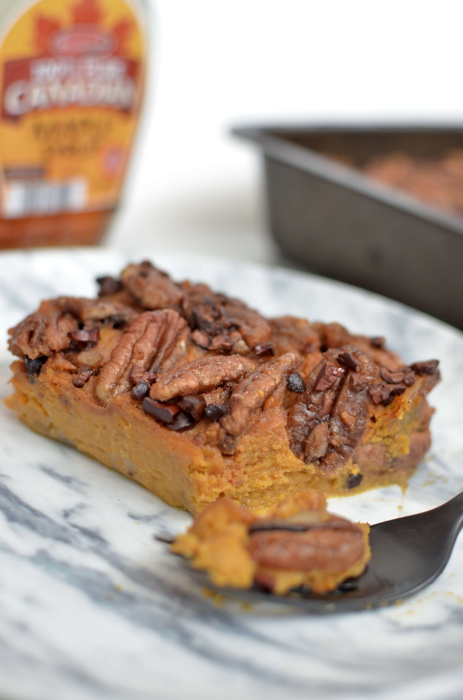

Staying healthy during the holidays is not easy. Most **Thanksgiving** dishes are packed with hidden calories and unhealthy fats. But just because it's a holiday, doesn't mean it can't be healthy. Today I'm going to show you how you can enjoy Sweet Potato Casserole without going overboard on the unhealthy stuff.

If you're looking for more **healthy** Thanksgiving side dishes, look no further. This recipe uses just a little bit of maple syrup instead of tons of brown sugar, butter, and marshmallows. In fact, I only used half a cup of maple syrup for the whole dish. Cinnamon-infused **pecans** and **cacao nibs** add a crunchy topping to the creamy sweet potato base. This Sweet Potato Casserole gets its creaminess from **coconut milk** instead of butter and cream.

\[thrive\_leads id='1525'\]

I promise this healthier side dish won't disappoint—packed with **good-for-you-ingredients**—it's about to become a family favourite. Most importantly, it tastes just as amazing as traditional casseroles. It’s:

- creamy
- nutty
- naturally sweet
- cinnamony
- crunchy
- Paleo-friendly
- crunchy

This non-dairy holiday classic is **Paleo friendly**. But don't mention the Paleo part to your guests. I promise, they won’t miss the brown sugar or marshmallows.

\[tasty-recipe id="1170"\]
