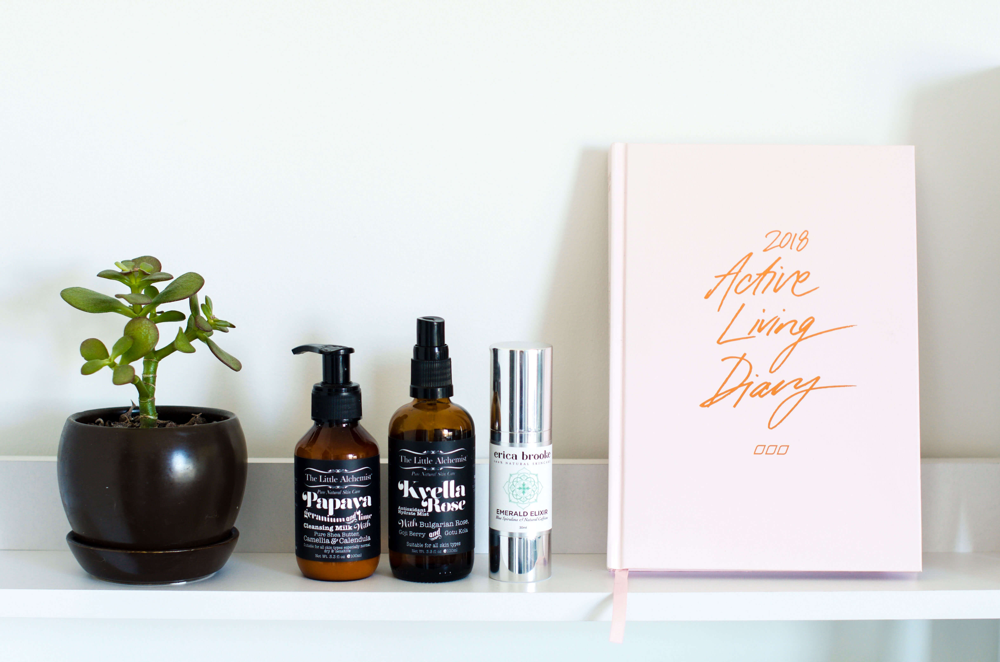
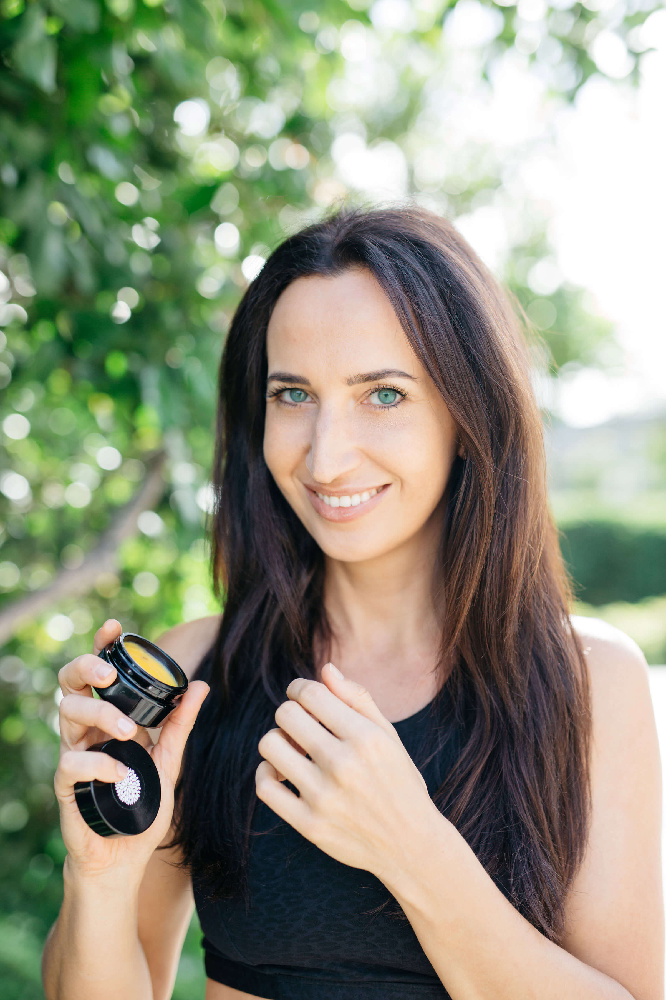
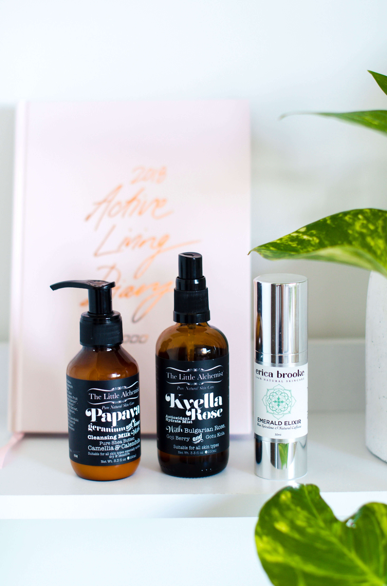

Here's the thing: Once you've cleaned out your pantry the next logical step is to detox your beauty cabinet. As soon as you discover all the chemical ingredients hiding in your favourite cereal, I guarantee you'll turn into an self-proclaimed investigator just like Vani Hari (the [Food Babe](https://foodbabe.com/)). It's only natural! You will want to break up with toxic skincare, just like I did.

## Why did I break up with toxic skincare?

Curious by nature I soon turned into a detective and scrutinized every item in my apartment. Once I had removed all the "Frankenfoods" from my kitchen, I immediately turned to my bathroom. What I found was not only shocking but also detrimental for my health. I started looking up all the ingredients I couldn't pronounce. I found an endless list of synthetics and chemicals that can be harmful to you and your skin: Parabens, [Sulfates](http://journals.sagepub.com/doi/abs/10.3109/10915818309142005), [Oxybenzone](https://www.ewg.org/sunscreen/report/do-sunscreens-prevent-skin-damage/), Triclosan, Propylene Glycol, Benzoyl Peroxide, Phthalates, Mineral Oil, Talc and Titanium Dioxide. Research shows that some of these ingredients can cause premature aging, lead to more wrinkles, as well as being [considered endocrine (hormone) disruptors](https://www.dermstore.com/blog/9-commonly-used-beauty-ingredients-that-could-be-disrupting-your-hormones/) and may even cause cancer.

## Do we want to put these unsafe chemicals on our skin?

Of course not, most of us use skincare products to look younger and fresher. The problem is, that most personal care items are not adequately tested for safety. In fact, the cosmetic industry would have to issue consumer warnings for more than 99 percent of beauty products on the market if cosmetic ingredients needed the FDA's tick of approval ([1](https://www.dermstore.com/blog/9-commonly-used-beauty-ingredients-that-could-be-disrupting-your-hormones/)).

## Where do I find natural alternatives?

Fortunately there are quite a few companies who start paying closer attention to toxicity levels in products. I was lucky enough to meet Natalie from [Kindred Toxin Free](https://www.kindredtoxinfreefacials.com.au/) who introduced me to her toxin-free treatments and the beauty products she carefully curates for her own practice.

## What does my natural skincare routine look like?

I'm the opposite of a beauty blogger who hordes hundreds of products (on top of all the chemicals I'd be worried of expiry dates). Once I had experienced one of Natalie's life-changing glow-rituals (Organic facial + Illuminate Microdermabrasion), I asked her to suggest 2-3 products for my skin that would cover all my needs. The last thing I wanted was an arsenal of products cluttering my bathroom.

She suggested the following:

- [Rose Mist](https://www.kindredtoxinfreefacials.com.au/collections/mists) and [Emerald Elixir](https://www.kindredtoxinfreefacials.com.au/collections/serums/products/e-e) in the morning
- Rose Mist and [Gold Beauty Balm](https://www.kindredtoxinfreefacials.com.au/collections/moisturisers/products/everlasting-24kt-gold-beauty-balm-concentrate-vegan-lightweight-anti-inflammitory-collagen-stimulating) in the evening

Those three products have become my absolute favourite go-to skincare. They're vegan, organic, and 100% toxin-free - and have transformed how my skin looks and feels.

I don't use anything else apart from this [konjac sponge](https://au.iherb.com/pr/EcoTools-Pure-Complexion-Facial-Sponge-Sensitive-Skin-1-Sponge/55070) to wash my face and take off makeup. Konjac sponges are amazing cause they're 100% organic, naturally clean your pores, and exfoliate. And I also use a [Bamboo face cloth](https://www.kindredtoxinfreefacials.com.au/collections/accessories/products/bamboo-muslin-face-cloths) to clean and dry my face cause they're super gentle and contain antibacterial properties. That's my super simple natural skincare routine. While these products are on the more expensive side, they've lasted me for 5 months now - and I'm still using them. A little goes a long way, especially with the Gold Balm.

I've written about Natalie's amazing toxin-free facials before ([here](http://www.wildblend.co/toxin-free-facial/)) and only recommend products to you that I personally love and use.

The best part, I have a sneaky discount code for you.

Put '**WILDBLEND20**' in the comment section and receive **$20 OFF** your first facial, micro or treatment!

Use '**WB10off**' to get 10% off any purchase of $100 or more in Natalie's online shop.

Book in at [www.kindredtoxinfreefacials.com.au](https://www.kindredtoxinfreefacials.com.au/)
