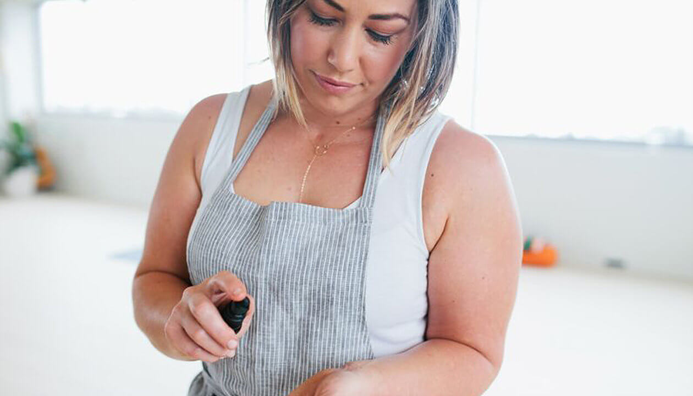
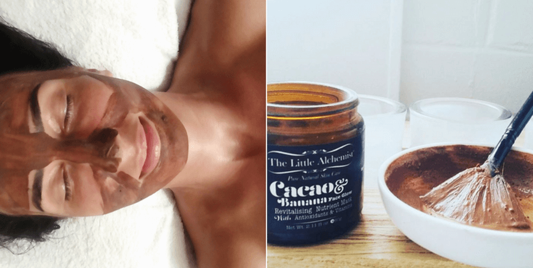
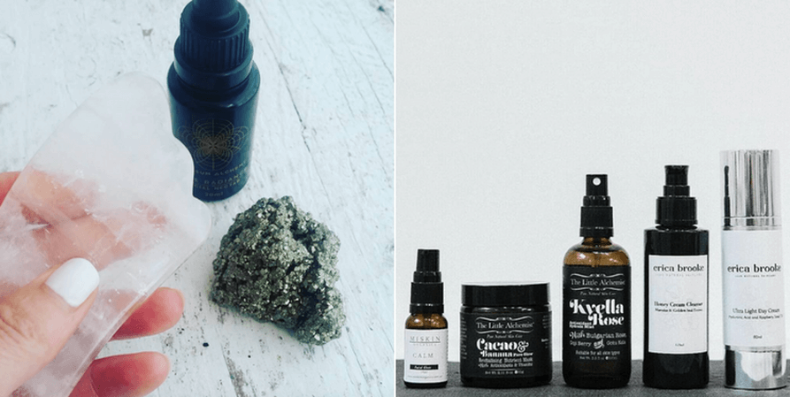

But do you also check the ingredients of your skincare? And even if you do, can you make sense of the information contained on a cosmetic ingredient list? Deciphering an ingredient list isn’t easy, especially if you don’t have a background in cosmetic science.

## Which nasties are hiding in your beauty products?

I was oblivious to the toxic ingredients that were hiding in my skincare products up until a couple years ago, when I started cleaning up my diet. My ‘clean eating’ journey lead me to discovering other aspects of health. I quickly learnt that true and complete health is achieved my finding balance in all aspects of our lives. I started researching about clean skincare and ended up throwing 90% of my beauty and makeup products in the bin.

## What does my personal toxin-free skin routine look like?

Since then, I’m trying to leave my skin alone – for the most part – and pamper it when necessary with nourishing oils, hydrating mists and natural essences. When I discovered Natalie, I was immediately fascinated by her natural approach to skincare and extensive knowledge about all things toxin free. [KINDRED TOXIN FREE](https://www.kindredtoxinfreefacials.com.au/) takes facials to the next level. Natalie has created rituals that go beyond traditional beauty.

## What is a toxin-free facial?

Natalie's 60-minutes glow rituals include:

\+ either diamond head microdermabrasion or enzyme therapy + rose quartz facial massage + grounding meditation + energy clearing and crystal mist + smudging + arm, hand, face, shoulder and scalp massage + superfood chocolate and kombucha shot in the end + time to de-stress and re-focus

You’ll walk out of Natalie’s studio with glowing skin and a radiant heart.

I’m not surprised, that STYLE Magazine voted Kindred Toxin Free as one of the [best facials in Brisbane](http://stylemagazines.com.au/beauty/brisbanes-best-facials/).

From the Cacao & Banana face glow mask (that you can literally eat) to the cooling and calming rose quartz facial wand and the handmade [LOCO LOVE](http://www.locolovechocolate.com/) chocolates to compliment your pamper session – IT’S PURE BLISS!

Be kind to yourself and book yourself some TLC with Nat. I’ve got a sneaky discount code for you.

PUT ‘**WILDBLEND20**' in the comment section when you order and receive $20 off your first treatment (micro or facial)!!

Use '**WB10off**' for any purchase of $100 or more in Natalie's online shop. My personal favourites are this [Emerald Elixier](https://www.kindredtoxinfreefacials.com.au/products/e-e) and this vegan organic [24k Gold Beauty Balm](https://www.kindredtoxinfreefacials.com.au/products/everlasting-24kt-gold-beauty-balm-concentrate-vegan-lightweight-anti-inflammitory-collagen-stimulating). You can read more about these products [here](http://www.wildblend.co/toxic-skincare/).

Book in at [www.kindredtoxinfreefacials.com.au](https://www.kindredtoxinfreefacials.com.au/)
