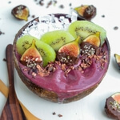

Purple yam - also called ube (oo-beh) - has taken Instagram by storm with its mesmerizing and oh-so-photogenic dark purple colour. Ube is widely used in Filipino desserts such as ice cream, cheesecake, and flans. It adds a subtly sweet and nutty flavour to this smoothie bowl and pairs perfectly with the tart Açai berry.

Collagen is one of my favourite ways to give my body a protein boost in the morning. The fine powder mixes easily into anything, hot or cold, from coffee, to smoothies, to juices, or tea. The best part, not only does collagen boost your metabolism, repair muscles and joints but it also helps to improve dull skin, thinning hair and brittle nails. It's my secret beauty weapon and I can especially recommend it to women over 30 whose collagen production has slowed down (#thanksbutnothanks).

\[thrive_leads id='1525'\]

This smoothie bowl will satisfy your breakfast belly and nourish your soul. It's full of berry-licious flavours ticks all the feel-good boxes:

- collagen rich
- full of antioxidants
- loaded with vitamin E, C & A
- boosts energy
- detoxifying
- improves digestion
- good for anti-aging
- boosts immune system

Açai bowls are hands down one of my favourite fruity treats that taste amazing chilled, are refreshing in summer and delicious as both breakfast and dessert.

[Print](http://localhost:10003/ube-acai-bowl/print/1001/)

## Ube Açai Bowl with Collagen for Glowing Skin

This nourishing Ube Açai bowl is made with purple yam and chock-full with antioxidants and skin-healthy collagen.

- **Author:** Zoe
- **Prep Time:** 15 mins
- **Total Time:** 15 minutes
- **Yield:** 1 1x

### Ingredients

Scale 1x2x3x

- 1 frozen banana
- 1 ube (cooked & frozen)
- 1 packet frozen Açai pulp (I used [Sambazon](https://www.sambazon.com/superfruit-packs/))
- 1/2 cup coconut water
- 1 Tbsp collagen powder (I used [Vital Proteins](https://www.vitalproteins.com/products/vanilla-collagen-peptides))

### Instructions

1. Add all ingredients to a high-speed blender and blend until smooth and creamy.
2. Transfer smoothie to a bowl and top with frozen kiwi, chia seeds, figs, cacao nibs and coconut flakes.
3. Enjoy immediately.

### Did you make this recipe?

Share a photo and tag us — we can't wait to see what you've made!

