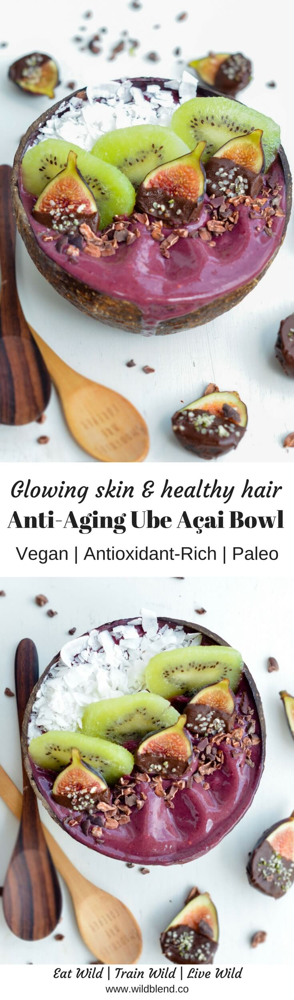

Purple yam - also called ube (oo-beh) - has taken Instagram by storm with its mesmerizing and oh-so-photogenic dark purple colour. Ube is widely used in Filipino desserts such as ice cream, cheesecake, and flans. It adds a subtly sweet and nutty flavour to this smoothie bowl and pairs perfectly with the tart Açai berry.

Collagen is one of my favourite ways to give my body a protein boost in the morning. The fine powder mixes easily into anything, hot or cold, from coffee, to smoothies, to juices, or tea. The best part, not only does collagen boost your metabolism, repair muscles and joints but it also helps to improve dull skin, thinning hair and brittle nails. It's my secret beauty weapon and I can especially recommend it to women over 30 whose collagen production has slowed down (#thanksbutnothanks).

\[thrive\_leads id='1525'\]

This smoothie bowl will satisfy your breakfast belly and nourish your soul. It's full of berry-licious flavours ticks all the feel-good boxes:

- collagen rich
- full of antioxidants
- loaded with vitamin E, C & A
- boosts energy
- detoxifying
- improves digestion
- good for anti-aging
- boosts immune system

Açai bowls are hands down one of my favourite fruity treats that taste amazing chilled, are refreshing in summer and delicious as both breakfast and dessert.

\[tasty-recipe id="1001"\]
