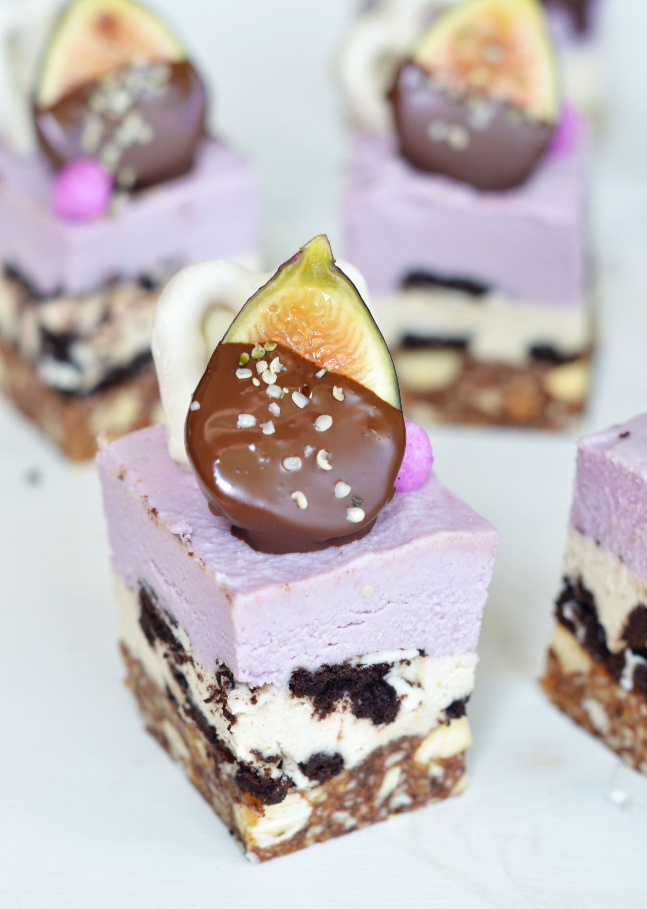
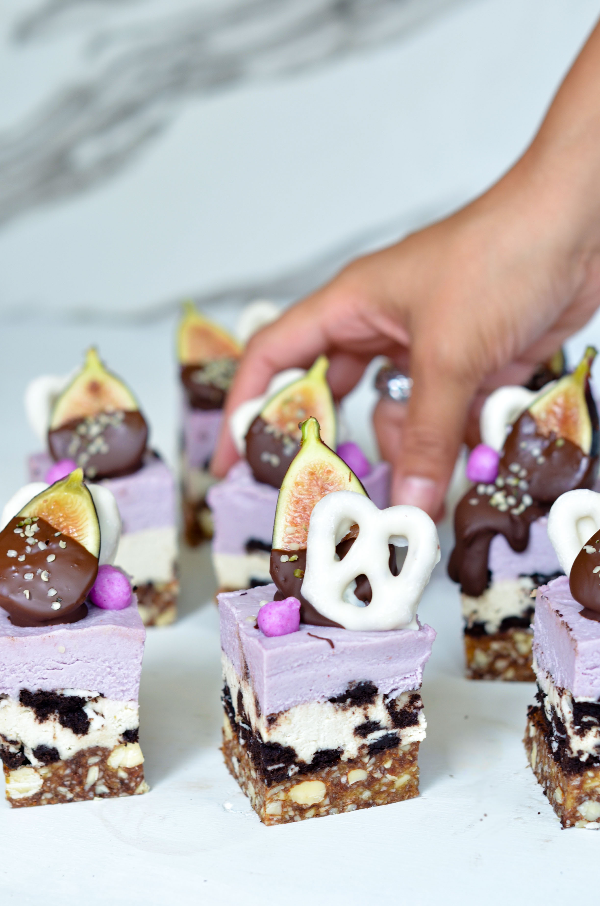
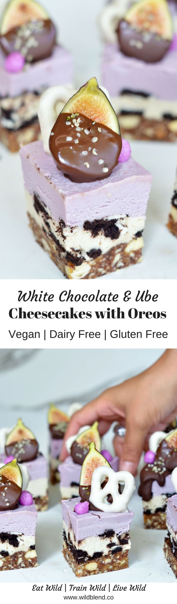
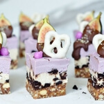

A few months back, I was first introduced to ube desserts in the United States and was immediately fascinated. The colour and texture of these sweet treats was too good to be "natural". Can donuts and ice creams made of a starchy tuber really be this good? I was determined to get my hands on this intriguing vegetable and try for myself. The result are these whimsical white chocolate and ube cheesecakes bites. Take a bite, they will definitely not disappoint.

## What is Ube?

Let's talk about ube (oo-beh) - also known as purple yam. The starchy root vegetable often used in Filipino cuisine has recently gained popularity on Instagram. Talk about a photogenic tuber! Ube has a sublime deep purple colour and tastes pretty much like sweet potato. It's **sweet nutty flavour** with a hint of vanilla makes it ideal for dessert and the purple hue adds fantastic colour to anything.

\[thrive_leads id='1525'\]

In the Philippines ube is most commonly used to make everything from ice cream, to cheesecakes, to donuts, to flan and filled cream puffs. It can be difficult to find fresh (depending where you live, mostly at Asian supermarkets) but can also be bought in dehydrated powder form online ([here](https://www.ebay.com.au/i/152781315751?chn=ps)). I prefer fresh ube but powder can sometimes be easier to add to desserts.

If you follow me on Instagram, you might already know that I'm obsessed with colourful food. So it's not really a surprise that ube has taken my heart by storm: I'm sure once you've tried it, you'll love t as much as I do.

These starchy little tubers are full of goodness:

- antioxidant-rich
- vitamin C
- vitamin A
- vitamin E
- potassium
- lots of fiber
- hazelnutty vanilla flavour

I love adding natural colour to my desserts and ube has definitely caught my attention. So stay tuned, there is a ton of other ube recipes to come.

If you love no-bake cheesecakes, you might also like my creamy [Avocado Lime Cheesecake](https://www.wildblend.co/avocado-lime-cheesecake/) recipe.

[Print](http://localhost:10003/ube-cheesecake-bites/print/903/)

## White Chocolate Ube Cheesecake Bites with Oreos

[

★★★★★

5 from 1 reviews

](#respond)

These white chocolate and ube mini cheesecakes add fun and colour to your dessert while keeping it deliciously dairy and gluten-free.

- **Author:** Zoe
- **Yield:** 8 1x

### Ingredients

Scale 1x2x3x

For the base

- 2 cups raw almonds
- 12 Medjool dates
- 1/4 cup raw cacao powder

For the white chocolate layer

- 1.5 cups raw cashews (soaked)
- 1/3 cup full-fat coconut milk (canned)
- 2 Tbsp maple syrup
- 2 Tbsp cacao butter (melted)
- 1 tsp lucuma powder
- 3 gluten-free Oreos (broken into chunks)\*

For the Ube layer

- 1.5 cups raw cashews (soaked)
- 1/2 cup full-fat coconut milk (canned)
- 1/3 cup boiled ube (peeled)
- 2 Tbsp maple syrup
- 2 Tbsp cacao butter (melted)
- 3 gluten-free Oreos (broken into chunks)

### Instructions

1. For the base add all ingredients to a food processor and blend until a sticky cookies dough forms.
2. Press base into a square lined baking dish and set aside.
3. For the white chocolate layer add all ingredients (except the Oreo chunks) to a high speed blender and blend until creamy and smooth.
4. Once blended, add the Oreo pieces to the cream and mix well.
5. Pour the white chocolate layer onto base, spread evenly and set aside.
6. For the ube layer add all ingredients (except the Oreo chunks) to a high speed blender and blend until creamy and smooth.
7. Once blended, add the Oreo pieces to the cream and mix well.
8. Pour the ube layer onto base and spread evenly.
9. Cover and place in the freezer for 6 hours or overnight.
10. Slice and decorate once frozen and thaw for 30 minutes before serving.

### Notes

Tip: I was able to find gluten- and high fructose corn syrup-free Oreos in the United States but am aware that they might not be available everywhere. If you cannot find them, feel free to leave them out or replace them with a gluten-free cookie of your choice.

### Did you make this recipe?

Share a photo and tag us — we can't wait to see what you've made!

