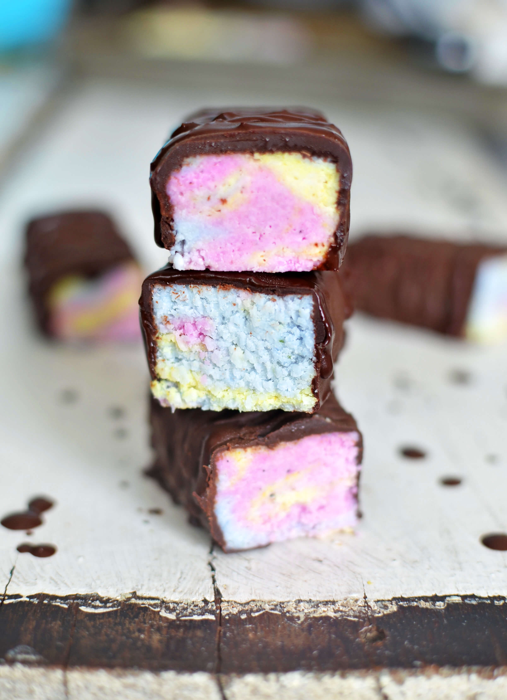
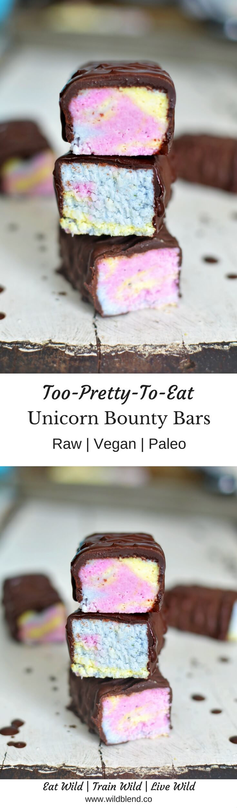

These Unicorn Bounty Bars add **sparkle** and **magic** to your life while keeping it naturally healthy—sans refined sugar or artificial colouring and flavoring!

You won't magically turn into a unicorn after eating these but you'll feel pretty sparkly and special. Not only are **homemade** Bounty Bars absolutely delicious but these are also (almost) too pretty to eat (Insta-alert)! So, before your boyfriend eats them all at once, make sure to take a picture and post it to Instagram (**#unicornfood**).

I don't know about you but I happily jump on board of the unicorn food trend and will ride it all the way to the end of the rainbow because these bars are awesome. They're are as beautiful as they are tasty.

- vegan
- paleo
- dairy free
- refined sugar free
- gluten free
- raw
- magical

\[thrive\_leads id='1525'\]

Most unicorn foods you see on Instagram are created with artificial colouring and flavoring. These colourful bounties get their pastel colour from naturally nourishing sources including turmeric, pitaya powder and butterfly pea powder—they'll definitely help generate some serious double tapping action.

Love homemade bounty bars? You'll also love my [Magical Mermaid Bounty Bars](https://www.wildblend.co/mermaid-bounty-bars/).

\[tasty-recipe id="970"\]
