I have gotten a lot of positive responses to the behind-the-scenes videos that I share on Instagram stories. You guys obviously like seeing how I create my food images and what my setup looks like. The number one question I get all the time is "Where do you get your backdrops from?". I wrote this post to give you a little insight into the food photography backdrops I'm using and where you can find them.

## Vinyl Backdrops

I discovered [Svpply Co](https://svpplyco.com/?ref=70) last year when I was preparing for my trip to the United States. I had to bring all my photography equipment with me to be able to work on the road while I was overseas. Needless to say, that I wasn't able to pack any of my wooden boards. Luckily, I found these vinyl faux wood and faux marble backdrops just in time and ordered a whole bunch of different styles to take with me. I love them because:

- they are light-weight
- you can roll them up and travel with them
- they are spill-proof ( YAY cause I love to get messy)

Full disclosure: This is not a sponsored posts and I'm not sharing any affiliate links. However, you can get a **10% discount** using the code **Wildblend10** at checkout.

Let me show you my absolute favourites from their big selection (it's soooo hard to choose). This [Hexagon Tile Floor](https://svpplyco.com/backdrops/hexagon-tile-floor-background/?ref=70) vinyl (see below) is one of my absolute favourites and I use it all the time for my flatlay shots.

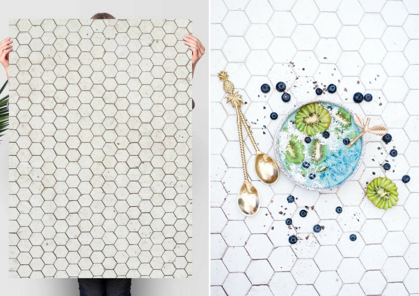

Another favourite is this [Not So Plain Wooden](https://svpplyco.com/backdrops/not-plain-wooden/?ref=70) backdrop which adds beautiful texture to food pictures. It legit looks like a shabby vintage painted table top and I use it a lot for my photos on my [Instagram](https://www.instagram.com/wildblend/).

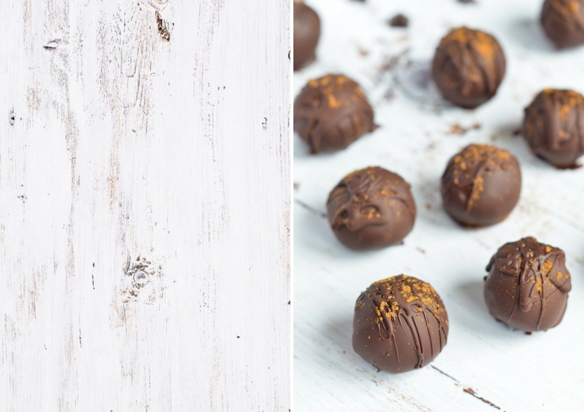

This [Grey Marble Backdrop](https://svpplyco.com/backdrops/grey-marble-backdrop-90-60/?ref=70) has basically replaced my marble slab that I used to use for all my elegant flatlay photos. This backdrop looks just like real marble but is light, easy-to-transport and you can easily clean up any spillage (which happens A LOT when I take pictures).

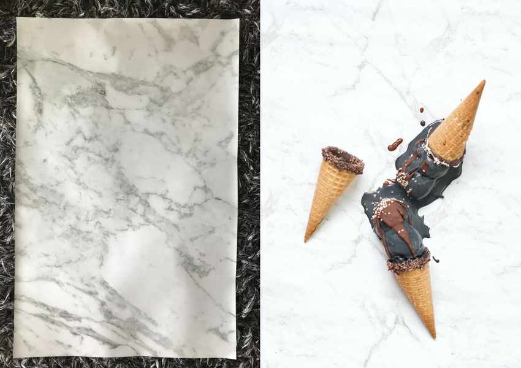

I also have a [Dark Marble backdrop](https://svpplyco.com/backdrops/dark-marble-texture/?ref=70) which I absolutely adore for dark food photography. If you you've seen my Instagram, you'll know that it's quite white and bright, that's why I'm not using this dark backdrop as often as I'd like to.

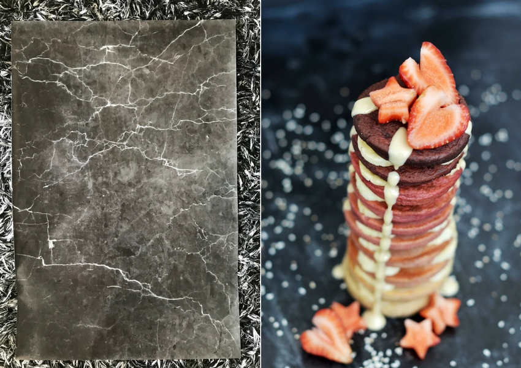

Lastly, I have this simple White Wooden Floor Texture backdrop, which is also great for flatlays and basically any photo where you are going for a plain, white, neutral look. To get a 10% discount at [Svpply Co](https://svpplyco.com/?ref=70) don't forget to use the code _Wildblend10_ at checkout.

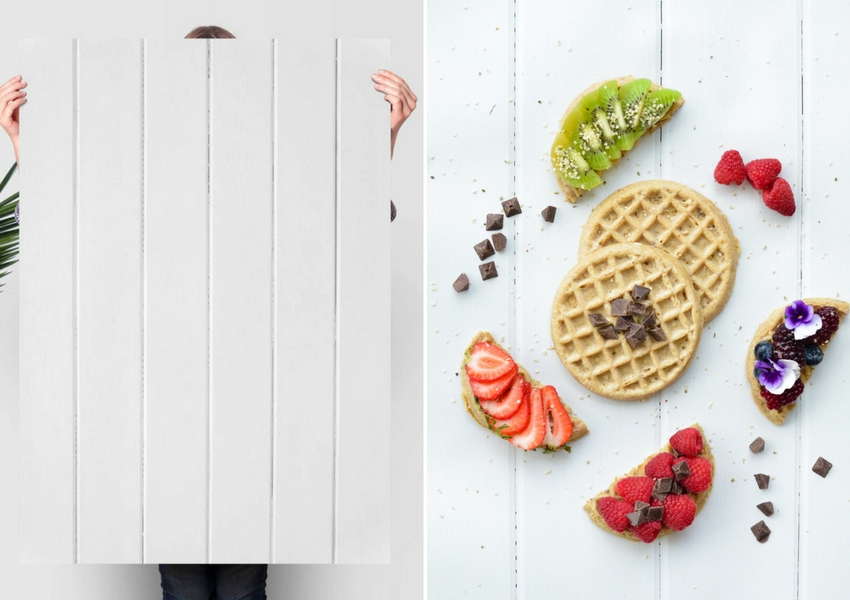

## Marble Slabs

Marble looks super elegant and makes the perfect backdrop for beautiful flatlays. Its grey and white streaks add depth and atmosphere to any image. As much as I love the look, I must admit that I haven't touched my marble surface since I've bought my [faux marble](https://svpplyco.com/backdrop-type/marble-backdrops/). Marble slabs are not only expensive but also extremely heavy—which makes them impractical if you're travelling or moving your equipment around. I'm also always worried that I might drop mine one day and it will shatter my toe (Ouch!).

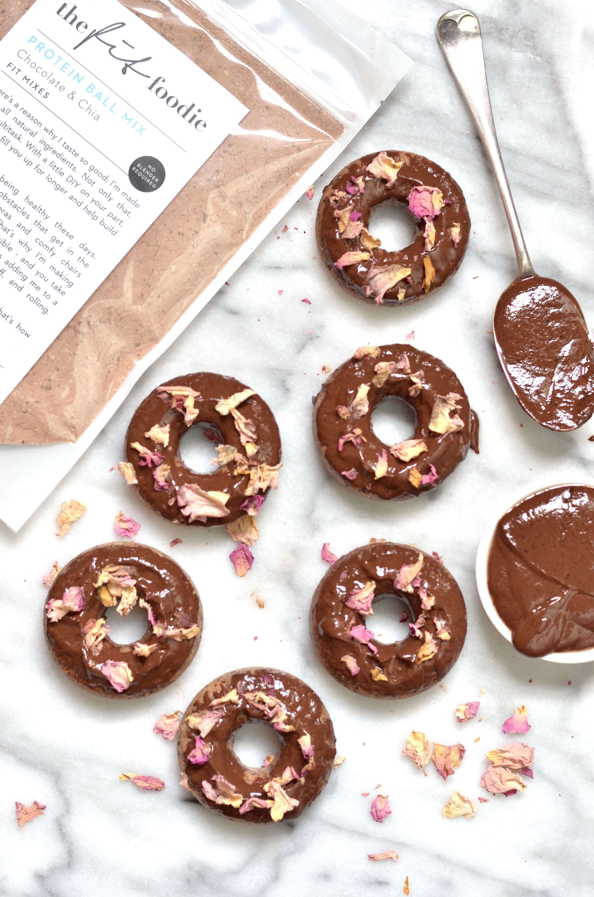

## Distressed Wood

Distressed wood is one of my all time favourite backdrops and easier to find that one might think. [Demolition](https://www.gabbademos.com.au/) and [recycling stores](http://www.reversegarbageqld.com.au/) usually have a bounty of cheap timber that has _food photography backdrop_ written all over it. There is nothing more fun than sifting through old materials on the hunt for a great backdrop. Look for something rustic and vintage that will make for a nice contrast in your photos.

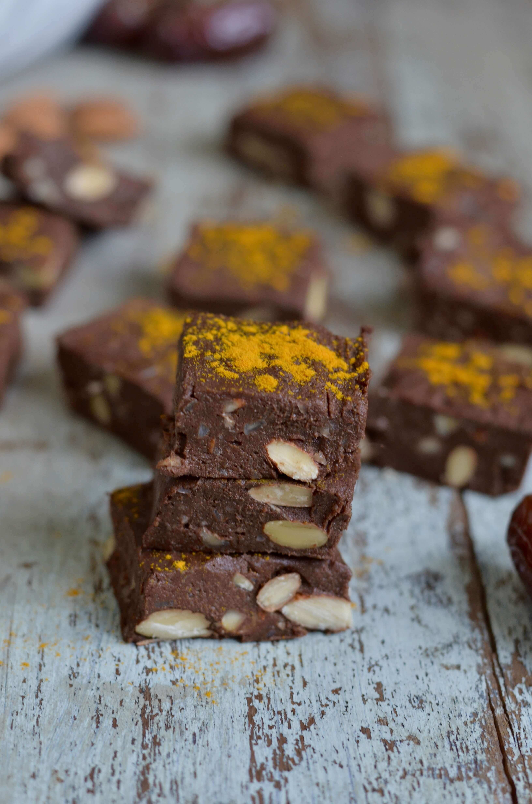

## Baking Paper

Baking paper can be extremely helpful for food photography, because it is a super cheap and easy way of adding texture to your photographs. I like to crumple it up a bit before I use it to give it even _more_ texture. You can use white (pictured below) or natural brown parchment paper to add some extra contrast to your photos. Alternatively, you could use brown paper grocery bags for a similar look.

## 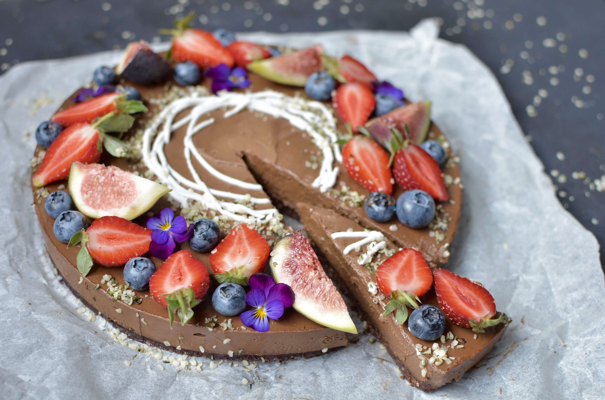

## Wooden Chopping Boards / Cheese Boards

Rugged-looking boards that you can find at your grandma's basement, garage sales and thrift shops are perfect for food photography. I collect them in all sizes, shapes, and colors. I actually like new ones too. In other words, you can never have too many chopping boards.

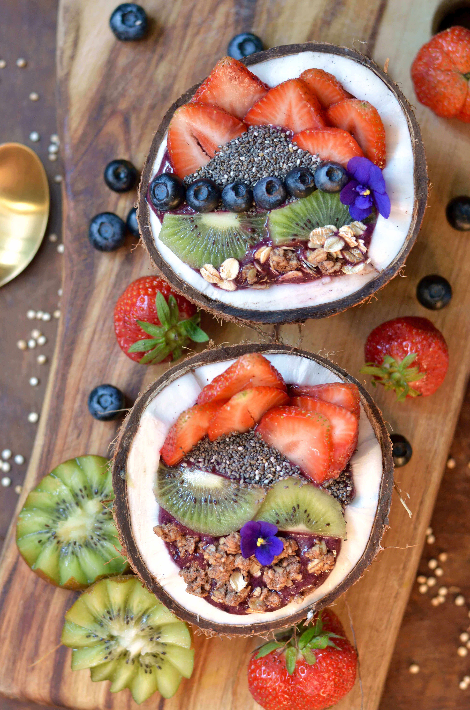

## Tea Towels / Cloth Napkins

Needless to say, tea towels and cloth napkins are excellent food photography backdrops. I bet you already have a great selection of cloth napkins at home. You can lay them out and place them on a surface as part of a photograph (pictured below) or scrunch them up a bit and place them in the background. I recommend choosing cloths that are relatively neutral and can be used for as many different photos as possible.

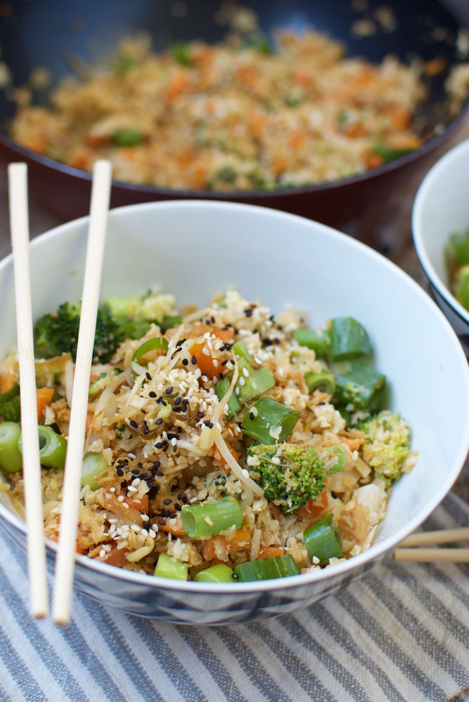

## Wire Cooling Racks

Cooling racks can be used for baking in the kitchen and double as aesthetically pleasing backdrops for food photos. Antique wire cooling racks look the best but I've also seen [fancy copper](https://www.theblockshop.com.au/store/single/cool-luxe) ones that look absolutely stunning in photographs. They make for great food photography backdrops placed against a lighter backdrop and a nice contrast to drool-worthy desserts.

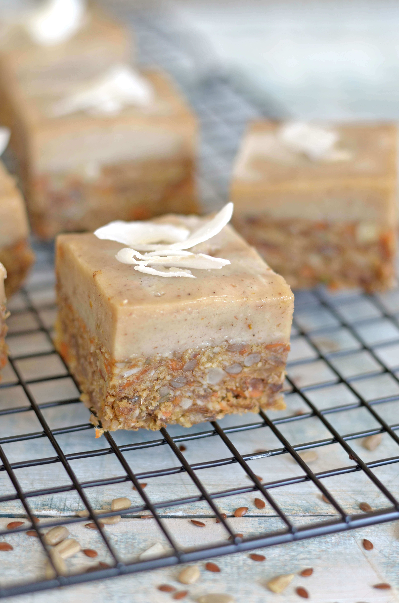

## Serving Trays

Serving trays are like chopping boards—one can never have enough. Look for them at op shops, garage sales or kitchen stores if you want a brand new one. New or vintage trays—both make for a great food photography backdrops and will add character and texture to your picture.

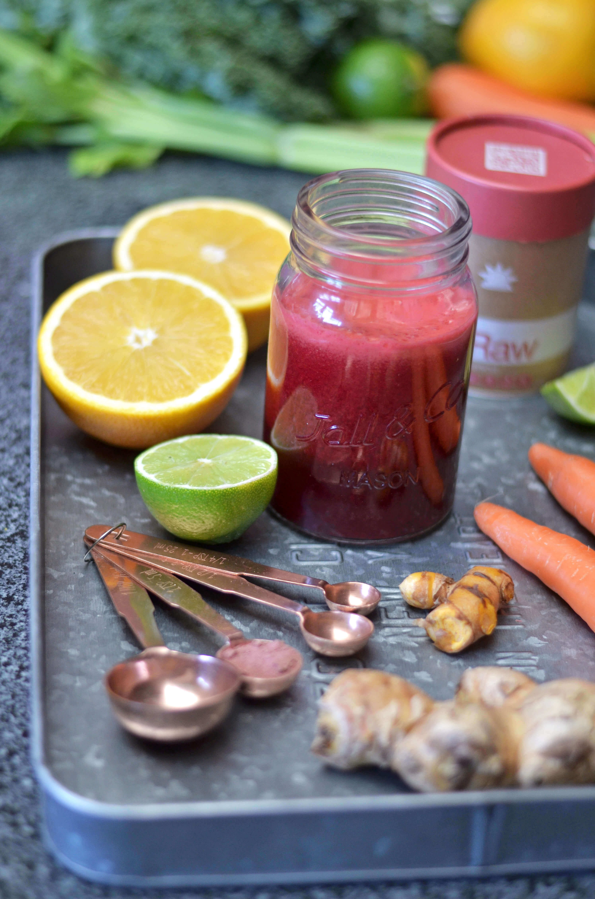

## Vintage Sheet / Baking Pans

These are best to find at thrift stores, flee markets and garage sales. You want to find sheet pans or cookie sheets that are distressed as much as possible. I picked mine up at an op shop and didn't do anything to make it look this way. I love how the shabby look creates a beautiful contrast with the bright and colourful pavlovas (see photo below).

Note: Don't put old sheet pans in the dishwasher, or rub and clean them with harsh chemicals as it may destroy their vintage look.

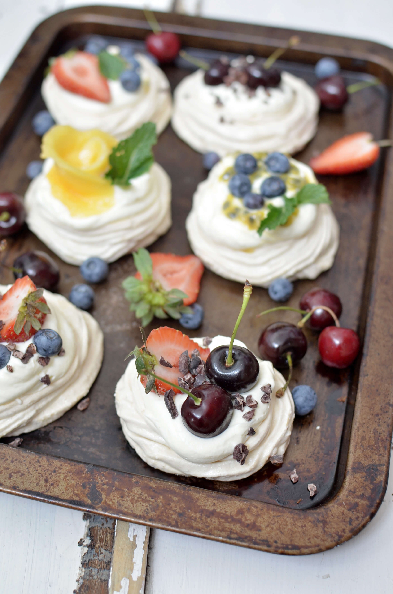

## Some more backdrop ideas:

- Natural jute or burlap fabric
- Linen table cloth
- White bed sheets
- Floor tiles
- Slate
- Chalkboard

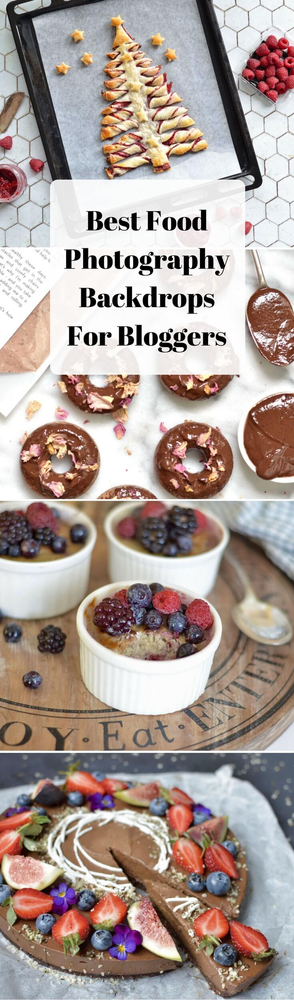

* * *

This post contains affiliate links, meaning, at no additional cost to you, if you click through and make a purchase, I may receive a commission.
