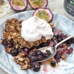

When you think of summer, you'll probably think of ice cream, cobblers and crumble. This Vegan Blueberry Cobbler is the perfect plant-based, gluten-free summer dessert! Crunchy oat muesli creates a cinnamon-y, crunchy layer over a bed of sweet blueberries. Use frozen fruit and a few simple ingredients to make this droolworthy healthier dessert in less than 30 minutes.

It only takes a few ingredients to make this light gluten-free version of a classic dessert. Coconut oil and gluten-free muesli take the place of flour, baking powder, milk and butter. Vanilla, **cinnamon** and **nutmeg** give this recipe a unique warmth and depth of flavour. I sweetened the crumble with two tablespoons of maple syrup. You could replace the sweetener with honey or rice malt syrup (whichever liquid sweetener you prefer).

\[thrive_leads id='1525'\]

Speaking of alternatives, you can swap the blueberries for raspberries, cherries, nectarines or peaches. I personally love stone fruit—tangy peaches perfectly complement sweet maple-infused nuts. Whatever you decide, don't forget the coconut yoghurt because it brings all the flavours together.

Eat your blueberry cobbler warmed in the oven for dessert or in the morning for breakfast—it's delicious hot or cold. Serve it topped with fresh mint and coconut yoghurt or plant based ice cream (if you want to be fancy).  This would make the perfect dessert for hosting or bringing along to summer parties.

[Print](http://localhost:10003/blueberry-cobbler/print/1761/)

## Crunchy Blueberry Cobbler with Coconut Yoghurt

Vegan, gluten-free and crunchy—This Blueberry Cobbler with Coconut Yoghurt can be enjoyed as both indulgent breakfast or healthy dessert.

- **Author:** Zoe
- **Prep Time:** 10 mins
- **Cook Time:** 25 mins
- **Total Time:** 35 mins
- **Yield:** 6 serves 1x

### Ingredients

Scale 1x2x3x

For the base:

- 500g organic frozen blueberries
- Juice of 1 lemon

For the crumble:

- 2 cups gluten free oats or mixed muesli
- 1 cup chopped almonds
- 2 Tbsp virgin coconut oil
- 2 Tbsp maple syrup
- ½ tsp cinnamon
- ½ tsp vanilla
- Pinch of nutmeg
- Pinch of sea salt

### Instructions

1. Preheat the oven to 175°C degrees and grease a 20cm square baking dish.
2. In a small bowl, toss the blueberries with the lemon juice. Spread evenly on the base of your baking dish.
3. Using the same bowl, mix together the remaining ingredients until combined. Spoon the crumble over the blueberries.
4. Bake at 175°C for 20-25 minutes, or until golden and crunchy.
5. Let cool slightly before serving.
6. Serve with coconut yoghurt and fresh mint.

### Did you make this recipe?

Share a photo and tag us — we can't wait to see what you've made!

[Print](http://localhost:10003/blueberry-cobbler/print/1762/)

## Crunchy Blueberry Cobbler with Coconut Yoghurt

Vegan, gluten-free and crunchy—This Blueberry Cobbler with Coconut Yoghurt can be enjoyed as both indulgent breakfast or healthy dessert.

- **Author:** Zoe
- **Prep Time:** 10 mins
- **Cook Time:** 25 mins
- **Total Time:** 35 mins
- **Yield:** 6 serves 1x

### Ingredients

Scale 1x2x3x

For the base:

- 500g organic frozen blueberries
- Juice of 1 lemon

For the crumble:

- 2 cups gluten free oats or mixed muesli
- 1 cup chopped almonds
- 2 Tbsp virgin coconut oil
- 2 Tbsp maple syrup
- ½ tsp cinnamon
- ½ tsp vanilla
- Pinch of nutmeg
- Pinch of sea salt

### Instructions

1. Preheat the oven to 175°C degrees and grease a 20cm square baking dish.
2. In a small bowl, toss the blueberries with the lemon juice. Spread evenly on the base of your baking dish.
3. Using the same bowl, mix together the remaining ingredients until combined. Spoon the crumble over the blueberries.
4. Bake at 175°C for 20-25 minutes, or until golden and crunchy.
5. Let cool slightly before serving.
6. Serve with coconut yoghurt and fresh mint.

### Did you make this recipe?

Share a photo and tag us — we can't wait to see what you've made!

