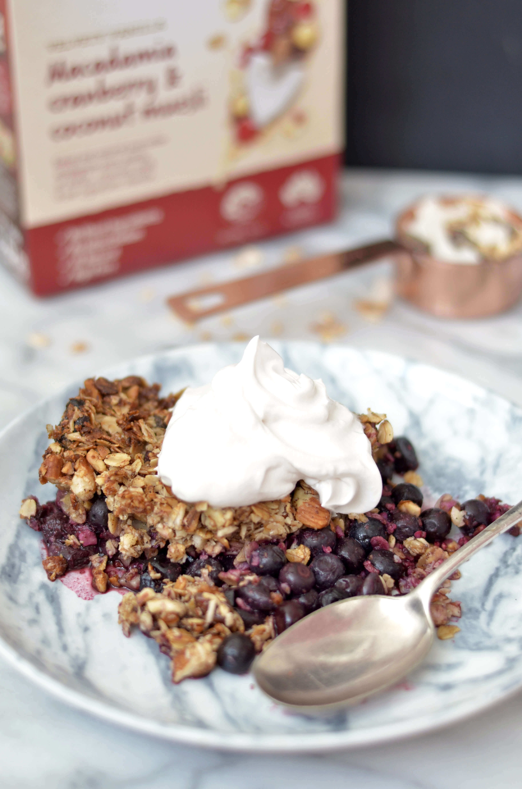
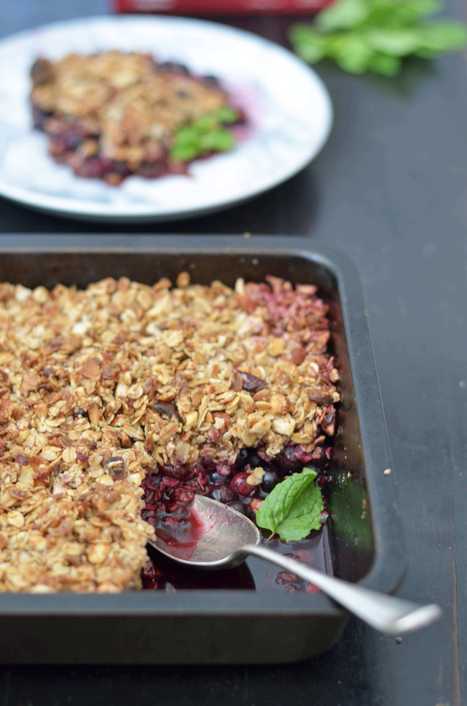
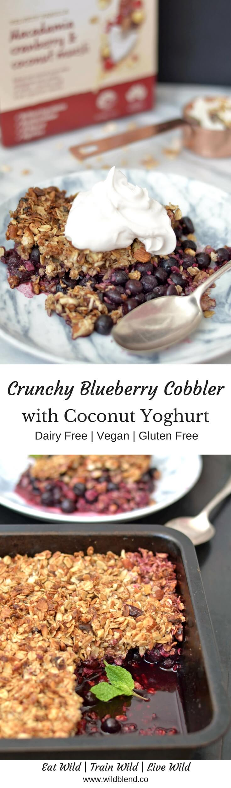

When you think of summer, you'll probably think of ice cream, cobblers and crumble. This Vegan Blueberry Cobbler is the perfect plant-based, gluten-free summer dessert! Crunchy oat muesli creates a cinnamon-y, crunchy layer over a bed of sweet blueberries. Use frozen fruit and a few simple ingredients to make this droolworthy healthier dessert in less than 30 minutes.

It only takes a few ingredients to make this light gluten-free version of a classic dessert. Coconut oil and gluten-free muesli take the place of flour, baking powder, milk and butter. Vanilla, **cinnamon** and **nutmeg** give this recipe a unique warmth and depth of flavour. I sweetened the crumble with two tablespoons of maple syrup. You could replace the sweetener with honey or rice malt syrup (whichever liquid sweetener you prefer).

\[thrive\_leads id='1525'\]

Speaking of alternatives, you can swap the blueberries for raspberries, cherries, nectarines or peaches. I personally love stone fruit—tangy peaches perfectly complement sweet maple-infused nuts. Whatever you decide, don't forget the coconut yoghurt because it brings all the flavours together.

Eat your blueberry cobbler warmed in the oven for dessert or in the morning for breakfast—it's delicious hot or cold. Serve it topped with fresh mint and coconut yoghurt or plant based ice cream (if you want to be fancy).  This would make the perfect dessert for hosting or bringing along to summer parties.

\[tasty-recipe id="1761"\]

\[tasty-recipe id="1762"\]
