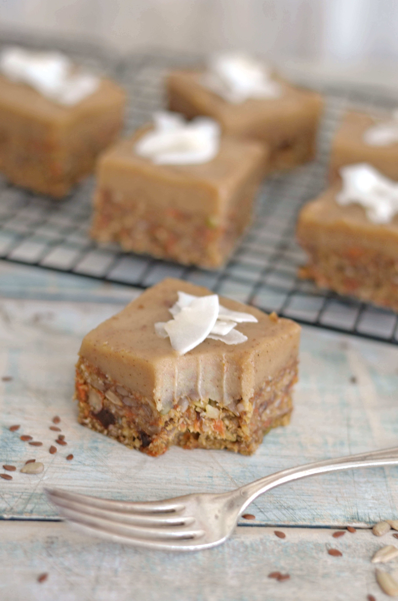

Layered cashew cream, and spiced carrot cake is a winner. No oven required! No dairy, gluten or refined sugar—so you actually can indulge and not feel guilty! It's a no-bake recipe but still bursting with traditional carrot cake flavor and texture!

A little word of warning before you start "baking". This raw slice won't last very long in your fridge! It's super dense and delicious and will soon become your favourite raw treat. Good news is, I didn't use any extra sweeteners. No agave, honey, coconut syrup or stevia are hiding inside this slice. A huge bonus point if you ask me. Let's just say it ticks all the boxes.

- Paleo
- Vegan
- gluten free
- dairy free
- no sweeteners

\[thrive\_leads id='1525'\]

Carrot cake is definitely one of my favourite cakes because of its density and richness - plus I really like adding vegetables to desserts. Sweet potato brownies and pumpkin chocolate muffins are also super delicious combinations. Feel free to add different spices to this recipe to give it a different twist.

If you love carrot cake, you might also like my [Carrot Coconut Loaf with Cashew Icing](https://www.wildblend.co/spiced-coconut-carrot-cake/).

\[tasty-recipe id="1740"\]
