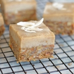

Layered cashew cream, and spiced carrot cake is a winner. No oven required! No dairy, gluten or refined sugar—so you actually can indulge and not feel guilty! It's a no-bake recipe but still bursting with traditional carrot cake flavor and texture!

A little word of warning before you start "baking". This raw slice won't last very long in your fridge! It's super dense and delicious and will soon become your favourite raw treat. Good news is, I didn't use any extra sweeteners. No agave, honey, coconut syrup or stevia are hiding inside this slice. A huge bonus point if you ask me. Let's just say it ticks all the boxes.

- Paleo
- Vegan
- gluten free
- dairy free
- no sweeteners

\[thrive_leads id='1525'\]

Carrot cake is definitely one of my favourite cakes because of its density and richness - plus I really like adding vegetables to desserts. Sweet potato brownies and pumpkin chocolate muffins are also super delicious combinations. Feel free to add different spices to this recipe to give it a different twist.

If you love carrot cake, you might also like my [Carrot Coconut Loaf with Cashew Icing](https://www.wildblend.co/spiced-coconut-carrot-cake/).

[Print](http://localhost:10003/carrot-cake-protein-slice/print/1740/)

## No-Bake Carrot Cake Protein Slice

This delicious and flavorful no-bake carrot cake slice is infused with cinnamon and vanilla spice and topped with a creamy cashew icing.

- **Author:** Zoe
- **Yield:** 8 slices 1x

### Ingredients

Scale 1x2x3x

**Carrot base**

- 2 large carrots, peeled & grated
- 1 cup Medjool dates, pitted & soaked for 1/2 hour in filtered water\*
- 1 cup nuts & seed mix (I used a mix of sunflower seeds, pepitas, almonds, raisins and walnuts)
- 1.5 cups desiccated coconut
- 1/2 tsp vanilla powder
- 1 tsp cinnamon
- 2 Tbsp vanilla protein (I used [Amazonia Raw](http://www.amazonia.com.au/amazonia-raw-paleo-fermented-vanilla-and-lucuma))

**Cashew Icing**

- 2 cups raw cashews, soaked overnight in filtered water
- 6 Tbsp cold-pressed coconut oil
- 3 medjool dates, pitted & soaked for 1/2 hour in filtered water\*

### Instructions

1. For the base, combine all ingredients in a food processor or Vitamix and process until a sticky “cookie-dough” ball forms.
2. Line a medium-sized loaf pan (25.5 x 13.2 x 6.5cm) with non-toxic baking paper.
3. Press the base firmly into the loaf pan and set aside.
4. For the cashew icing combine all ingredients in a food processor or high-speed blender and process until smooth and silky.
5. Pour the cashew icing on top of the base and spread evenly.
6. Freeze overnight or at least 4 hours.
7. Once defrosted and sliced into pieces, store in an airtight container in the fridge.

### Notes

Tip: \*Medjool dates are naturally quite gooey and soft. If you use dried dates instead you might want to soak them a wee bit longer.

### Did you make this recipe?

Share a photo and tag us — we can't wait to see what you've made!

