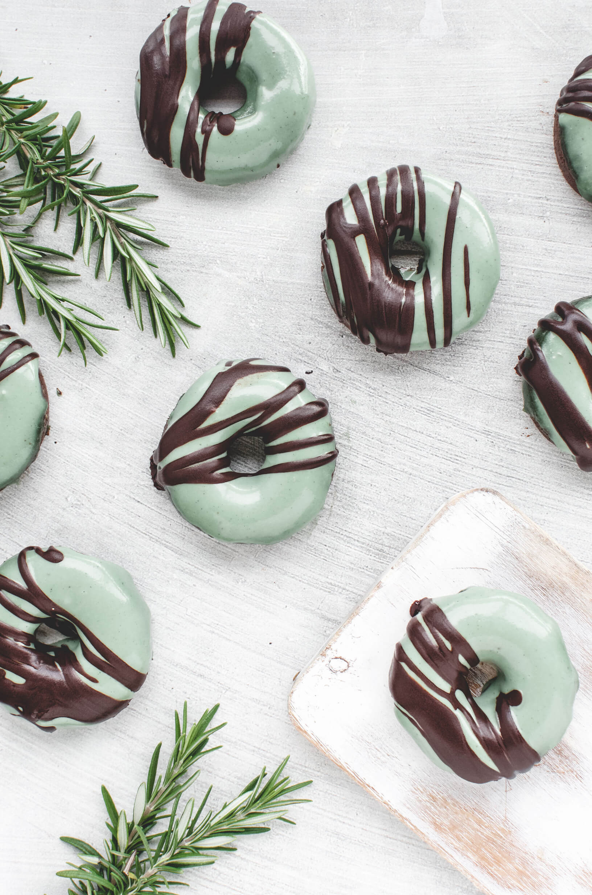
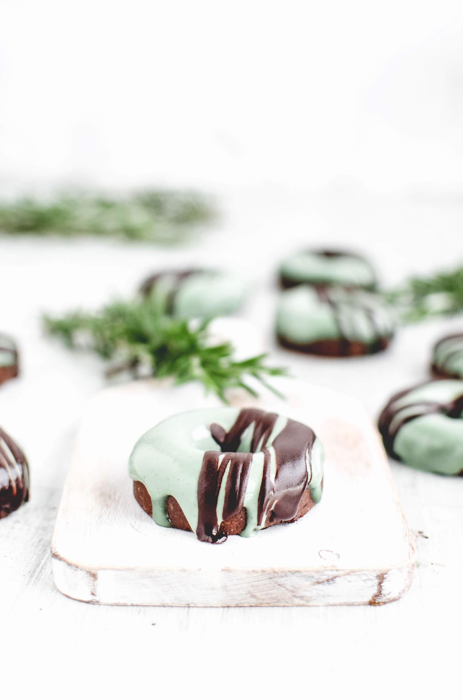
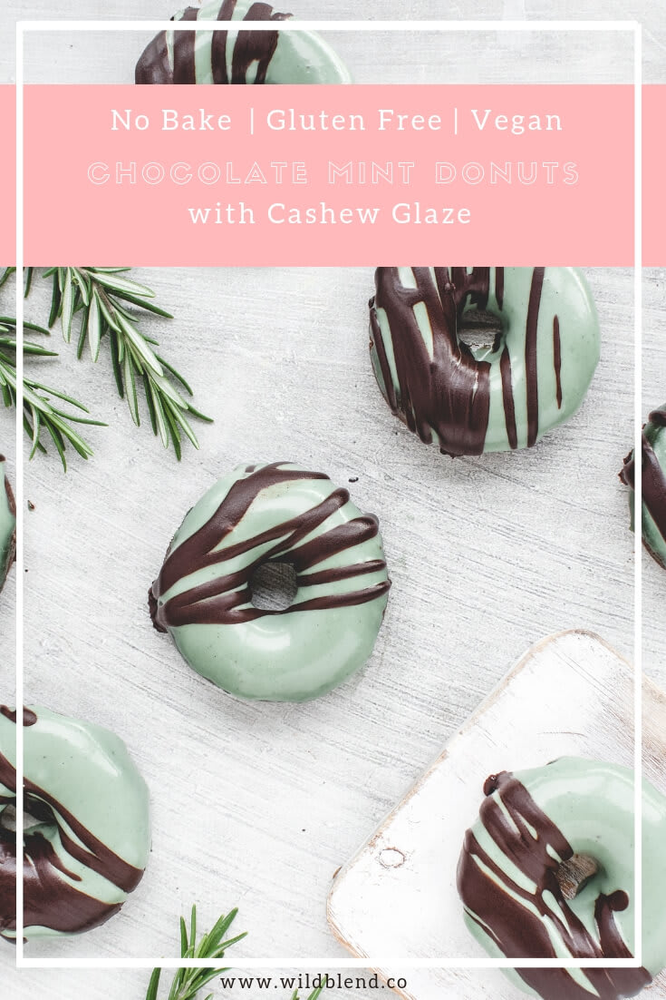

Craving donuts but want a healthy fix? By making a few tasty real food swaps, you can enjoy this healthy, Vegan-friendly version. These wholesome no-bake chocolate mint donuts are made with gluten-free oats, almonds, antioxidant-rich cacao and Medjool dates. They are just as nutritious as they are delicious and will satisfy any sweet craving.

These chocolate mint donuts take just as long to make as a trip to the doughnut shop, and prove far more nutritious. All you need is a [silicone donut mould](https://amzn.to/2Cxd09v) and a food processor, and you’re on your way. Start by combining all the dry ingredients in a food processor and pulse until evenly mixed. Then add the dates, vanilla, and peppermint essence and blend until you get a moist, thick dough that holds its shape. It should resemble a sticky cookie dough.

\[thrive_leads id='1525'\]

Once processed, press the dough into a silicone donut mould and place in the refrigerator to chill for 1 hour until set. In the meantime, prepare the glaze by blending all ingredients in a high-speed blender until smooth and glossy. If the glaze is too thin (runny), place it in the fridge for 30 minutes or until thickened before you start dipping the donuts.

These donuts are delicious enough to eat without frosting, but I recommend adding the glaze because it adds such a lovely splash of colour and additional mint flavour to the donuts. If you’re in a rush or prepping your donuts ahead of time, store the glaze and donuts in the refrigerator in separate containers. When you’re ready to indulge, dip the donuts in the glaze and decorate with (optional) melted chocolate. Store them in an airtight container in the fridge and enjoy with a cup of coffee or Matcha latte.

Love chocolate mint flavour? You might also like my [Chocolate Mint Protein Donut](https://www.wildblend.co/chocolate-mint-protein-donuts/) recipe.

[Print](http://localhost:10003/chocolate-mint-donuts/print/2311/)

## No-Bake Chocolate Mint Donuts with Cashew Glaze

These chocolate mint donuts get dipped in a dairy-free cashew glaze for a delicious no-bake treat.

- **Author:** Zoe Lyons
- **Yield:** 14 donuts 1x

### Ingredients

Scale 1x2x3x

**For the donuts:**

- 3/4 cup almonds
- 3/4 cup gluten-free oats
- 12 Medjool dates, pitted
- 4 Tbsp cacao powder
- 1/8 tsp sea salt
- 2 Tbsp protein powder (optional)
- ¼ [food-grade peppermint essence](https://amzn.to/2RBNFFP)
- ½ tsp vanilla bean powder (or essence)

**For the mint glaze:**

- ½ cup coconut cream
- ¾ cup soaked cashew nuts
- 2 Tbsp coconut oil
- ¼ cup maple syrup
- ¼ tsp food-grade peppermint essence
- 1/8 tsp vanilla powder
- 1/8 tsp [liquid chlorophyll](https://amzn.to/2Rz5iWZ) (or spirulina powder, optional for colour)

### Instructions

1. To make the donuts, grind the oats and almonds into flour in a food processor, add the cacao, protein powder, and salt and blend for a second so they’re evenly mixed.
2. Add the dates, vanilla, and peppermint essence and blend until you get a moist, thick dough that holds its shape.
3. Press the dough into a donut mould and place in the freezer until solid.
4. To make the frosting, blend all ingredients (except the chlorophyll) in a high-speed blender until smooth
5. Slowly add the chlorophyll (if using) to the mixture until you get the colour you want.
6. Leave it in the fridge to thicken before you dip the donuts.
7. Decorate as you please and store them in an airtight container in the fridge or freezer.
8. Enjoy!

### Did you make this recipe?

Share a photo and tag us — we can't wait to see what you've made!

---

This post contains affiliate links, meaning, at no additional cost to you, if you click through and make a purchase, I may receive a commission.
