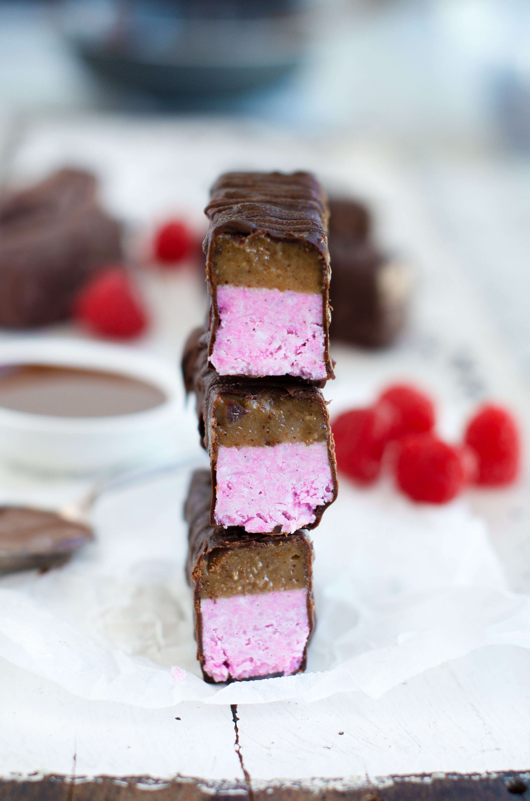
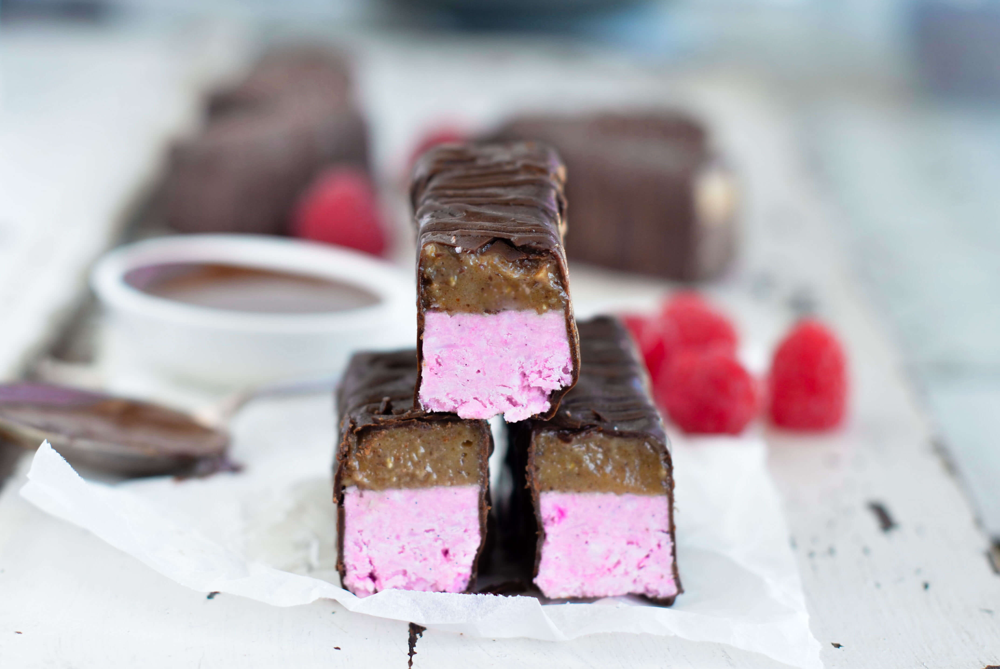
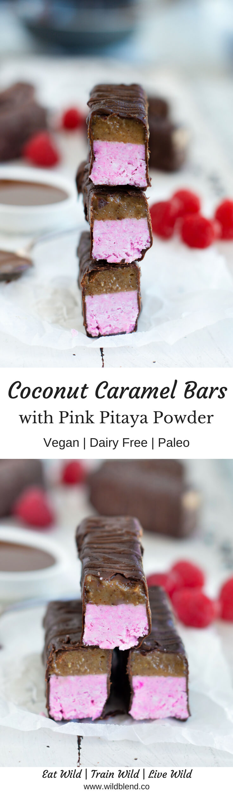
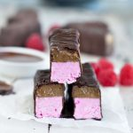

Inspired by my favourite childhood treat, these coconut caramel bars are a pink version of my blue Mermaid Bounty Bars. If you're following me on [Instagram](https://www.instagram.com/wildblend/), you'll know that I have a thing for [unicorn-coloured Bounty Bars](https://www.wildblend.co/unicorn-bounty-bars/). Like I said, Bounty was hands down my favourite candy growing up and these knock-off bars prove that chocolate and coconut are meant to go together.

To keep things healthy, I skipped condensed milk and tons of sugar and swapped it for better-for-you ingredients. To make the coconut filling, combine coconut cream, maple syrup, coconut butter, desiccated coconut and vanilla. The pink colour is achieved by adding a teaspoon of pink pitaya powder (I got mine [here](https://www.unicornsuperfoods.com/collections/superfood-collection/products/100-freeze-dried-pink-pitaya-powder)). Pitaya powder is 100% natural and a chemical-free alternative to conventional food colours.

The thick and gooey carmel layer comes together with almond butter, dates and almond milk. To finish it off, sweet coconut flakes and caramel get engulfed in rich dark chocolate. These are guaranteed to be a hit. Here's why:

- vegan
- gluten free
- dairy free
- naturally coloured
- antioxidant-rich
- paleo
- no bake

\[thrive_leads id='1525'\]

These pink coconut caramel bars are a great way to add some sweetness to your life while keeping it naturally healthy. Conventional candy bars are full of artificial ingredients that most of us can't even pronounce. Alternatively, you can DIY your favourite sweets and turn them into better-for-you  treats that are guaranteed to satisfy all your cravings. Tip: Store your bars in an airtight-container in the freezer and enjoy them anytime you need a sweet treat!

[Print](http://localhost:10003/coconut-caramel-bars/print/2033/)

## Pink Coconut Caramel Bars

If you like treats loaded with coconut and chocolate, you’ll love this copycat bounty bar recipe.

- **Author:** Zoe
- **Yield:** 14 1x

### Ingredients

Scale 1x2x3x

For the pink coconut layer:

- 1 cup coconut cream
- 3 Tbsp maple syrup
- 4 Tbsp coconut butter
- 1 tsp vanilla essence
- 2 cups desiccated coconut
- 1 tsp pink pitaya powder (I used [Unicorn Superfoods](https://www.unicornsuperfoods.com/collections/superfood-collection/products/100-freeze-dried-pink-pitaya-powder))

For the caramel layer:

- 1 cup dates (or 12 Medjool dates), soaked and pitted
- 1/3 cup almond milk
- 1/3 cup raw almond butter

For the chocolate coating

- ½ cup melted coconut oil
- 3/4 cup raw cacao powder
- 1/4 cup maple syrup

### Instructions

1. For the coconut base, process all ingredients in a food processor. Be sure that the pink colour is incorporated
2. Once combined, press mixture down into a square baking tin lined with parchment paper.
3. For the caramel, process all ingredients in a processor or blender.
4. Spread an even layer of caramel on top of the coconut base.
5. Place in freezer to set for 2-3 hours.
6. For the chocolate coating, whisk the ingredients together in a bowl until smooth.
7. Once set, cut into bars and individually coat each bar with melted chocolate.
8. Place in the fridge for 30 minutes to allow the chocolate to set
9. Enjoy!

### Did you make this recipe?

Share a photo and tag us — we can't wait to see what you've made!

