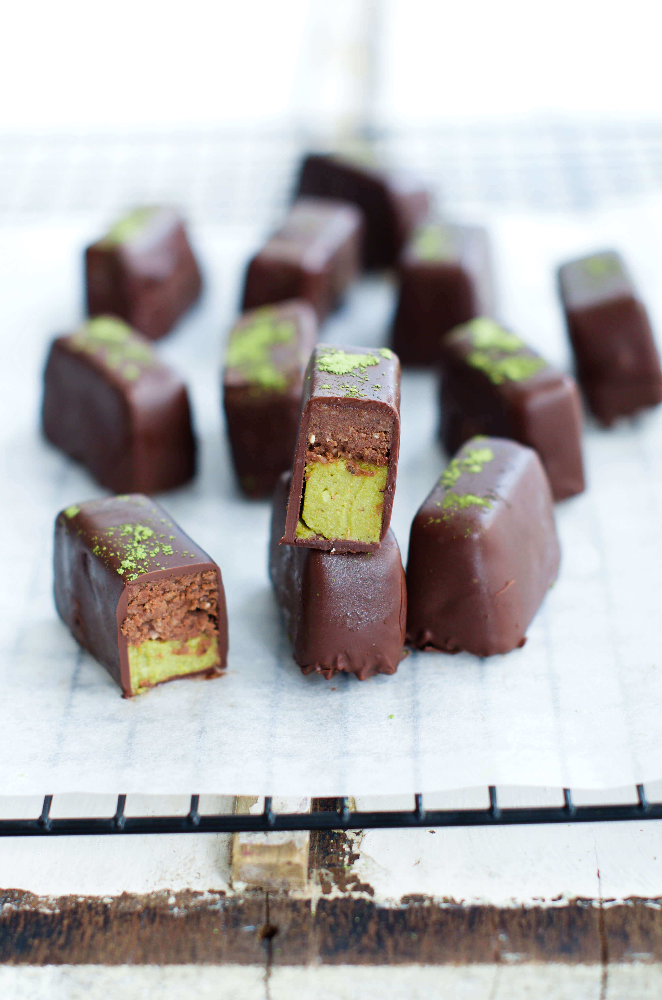
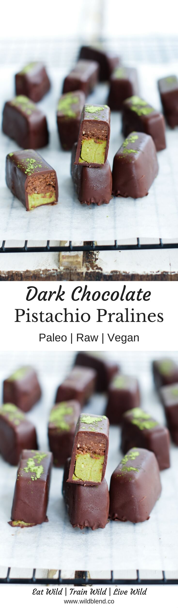
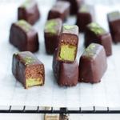

If you love pistachios then this recipe will quickly become a new favourite. I'm not exaggerating when I say that these Dark Chocolate Pistachio Pralines are absolutely divine—they are hands down better than any store-bought pralines I've ever tried. The best part? They’re made with a handful of simple, wholesome ingredients with no processed junk in sight.

While they’re inspired by the decadent chocolate pralines you see in shops, I nixed all the stabilizers, processed sugars, corn syrup and emulsifiers found in the store-bought version. These are essentially made with only five main ingredients and [Fit Mixes Chocolate Chia Protein Ball Mix](https://www.fit-mixes.com/products/chocolate-chia-protein-ball-mix) for the chocolate layer. A soft pistachio cream serves as a base to a  fluffy chocolate layer, then the whole thing gets drizzled in antioxidant-rich dark chocolate.

\[thrive_leads id='1525'\]

It's ok to indulge every once in a while as long as you nourish your body with essential nutrients you need to thrive. These Dark Chocolate Pistachio Pralines make for a delicious sweet afternoon treat ord great homemade gifts for those who cherish all natural ingredients. Enjoy all of the good but none of the bad stuff. These are:

- raw
- vegan
- paleo
- creamy
- addictive
- guilt-free
- divine

If you love dark chocolate pralines, you might also like my [Dark Chocolate Cherry Bomb Truffles](https://www.wildblend.co/cherry-bomb-truffles/).

[Print](http://localhost:10003/dark-chocolate-pistachio-pralines/print/1790/)

## Dark Chocolate Pistachio Pralines

These dark chocolate pistachio pralines are seriously addictive—you can’t just have one!

- **Author:** Zoe
- **Prep Time:** 30 mins
- **Cook Time:** 4-6 hours to set
- **Total Time:** 4 -6 hours and 30 mins
- **Yield:** 14 pralines 1x

### Ingredients

Scale 1x2x3x

For the chocolate layer:

- 1 packet [chocolate protein mix](https://www.fit-mixes.com/products/chocolate-chia-protein-ball-mix)
- 3 Tbsp coconut oil
- 3 Tbsp water
- 2 Tbsp maple syrup

For the pistachio layer:

- 2 cups soaked pistachios (soaked in water for 4–6 hours or overnight)
- 1/3 cup coconut milk
- 1 Tbsp coconut oil
- 1 Tbsp maple syrup
- 1/4 tsp vanilla bean essence

For the coating:

- 1 cup dairy-free dark chocolate
- 1 Tbsp cacao butter

### Instructions

1. For the chocolate layer, mix all ingredients together until a sticky dough forms.
2. Press into small lined baking dish (15cm/or 6″ square).
3. For the pistachio layer, add all ingredients to a high speed blender and blend until smooth and creamy.
4. Evenly spread the pistachio layer on top of the chocolate base and place in freezer to set for 4-6 hours.
5. Once frozen, remove from tray and cut into small bite-sized slices.
6. For the chocolate coating, melt chocolate over double boiler.
7. Once meted, add in cacao butter and stir until fully melted.
8. Move the melted chocolate away from the stove and let it cool down for 10 minutes.
9. Once it’s cooled down, dip each chocolate bar into the chocolate and place on a cooling rack to set.
10. Once set, transfer to an airtight container and store in fridge.

### Notes

**Tip:** You can also make these pralines without the chocolate layer and just enjoy the soft pistachio cream coated in dark chocolate.

### Did you make this recipe?

Share a photo and tag us — we can't wait to see what you've made!

