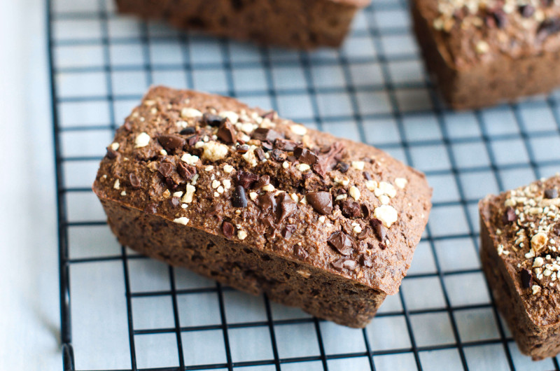
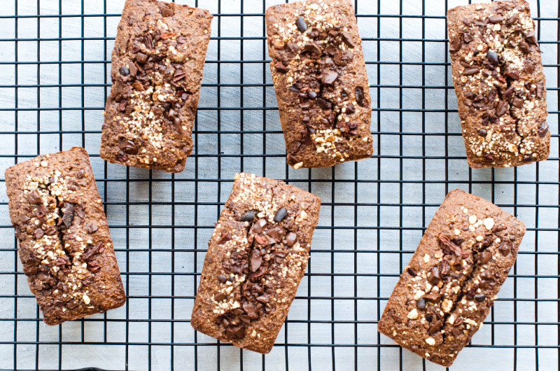
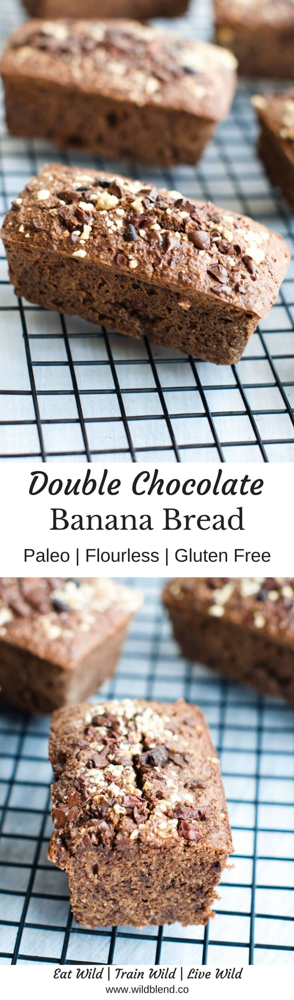
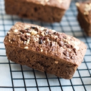

This soft and moist banana bread will satisfy ALL your chocolate cake cravings while keeping it much healthier! Made with tigernut flour, raw cacao powder and dairy-free chocolate chips, it’s Paleo, nut-free, gluten-free, dairy-free and packed with lots of healthy fiber. Plus, I’ve always been a big fan of all-things chocolate and banana. So, this double chocolate banana bread is definitely the answer to my afternoon cravings.

The way I see it is, you have two options... You can use overripe bananas in a smoothie or you turn them into delicious banana bread. I definitely prefer option two as I'm constantly rummaging through the house for a healthy snack. Once it's past 3pm it's always good to have fiber-rich treats packed with healthy fats on hand. I literally have zero regrets when I nibble on a slice of this chocolate banana bread.

\[thrive_leads id='1525'\]

This recipe is a variation of my all-time-favourite Paleo almond flour banana bread. Tigernuts have become increasingly popular in the Paleo community and are a great alternative for anyone who is allergic to nuts. The name _tigernut_ is deceptive because they aren't actually nuts but small root vegetables from the tuber family. Tigernut flour is a great allergen-free alternative to gluten and nut floursplus it's packed with prebiotics which can improve insulin sensitivity, reduce inflammation in the colon and help treat IBS.

Making banana bread in a healthy way doesn’t make it any less easy to make. Just blend together some bananas, mix in some eggs and few more ingredients, and bake! So grab a bunch of overripe bananas and use them to make this double chocolate banana bread recipe. You’ll be so glad you did!

[Print](http://localhost:10003/double-chocolate-banana-bread/print/1857/)

## Double Chocolate Banana Bread

This moist, crunchy, and healthy double chocolate banana bread tastes just as good as chocolate cake! The best part, it’s gluten-free, dairy-free, and Paleo-approved.

- **Author:** Zoe
- **Prep Time:** 10 mins
- **Cook Time:** 30 mins
- **Total Time:** 40 mins
- **Yield:** 1 loaf 1x

### Ingredients

Scale 1x2x3x

For the bread:

- 2 large bananas (spotty, ripe ones will work better)
- 3 eggs
- 2 Tbsp coconut oil
- 2 cups Tigernut flour (I used [Terrafirma](https://www.terrafirmafoods.com.au/product/tigernut-flour/))
- 1 tsp aluminium-free baking powder
- 1 tsp cinnamon
- 1/2 cup dairy-free choc chips
- 1/4 cup raw cacao powder

Toppings:

- 1/4 cup cacao nibs
- 1/4 cup diced Tigernuts (I used [TerraFirma](https://www.terrafirmafoods.com.au/product/180g-diced-tigernuts/))
- 1/4 cup dairy-free choc chips

### Instructions

1. Preheat your oven to 175°C and line a rectangular baking dish.
2. Put all wet ingredients (bananas, eggs, chocolate chips, coconut oil) in a high-speed food processor or blender and process until smooth.
3. Add tigernut flour, cacao, baking powder and cinnamon and blend until smooth.
4. Pour mix into a lined rectangular baking dish.
5. Smooth the surface with a spatula and drizzle with cacao nibs, diced tigernuts and choc chips.
6. Bake at 175°C for 30-35 minutes. If you prefer moist banana bread, keep an eye on the heat and don’t over-bake it.
7. Let cool completely before you remove it from the baking dish.

### Notes

Note: You can bake this in a rectangular baking dish to create one big loaf or use a silicon mould that creates 6 smaller, individual cakes like me.

### Did you make this recipe?

Share a photo and tag us — we can't wait to see what you've made!

