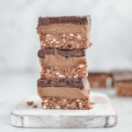

This chocolate caramel slice is a three layer nutty, caramel-y, chocolatey dessert and it’s going to rock your taste buds. Nothing has made me pace around the fridge like these caramel slices. It's safe to say that I'm addicted and I'm happy to admit that I've eaten more than one (or two). They are perfect for the holiday season but are just as delicious any other time of the year.

I'm a huge fan of no-bake dessert. For one because Australia is godforsaken hot in summer and it's unthinkable to turn on the oven. Two, I find raw treats much more predictable and easier to make—you can't forget and burn things in the freezer (lol), right?! All you need is a freezer and a little bit of patience. I guarantee this decadent treat is worth the wait.

\[thrive_leads id='1525'\]

The caramel made from gooey dates, soaked cashews and almond butter—is much healthier and easier to make than conventional caramel. It's sandwiched between a antioxidant-rich 3-ingredient chocolate layer and a crunchy almond and coconut base. Feel free to add some chocolate or vanilla protein to the base to further upgrade these slices. You could also add a sprinkle of sea salt to the caramel if you love salted-caramel flavour.

Caramel, chocolate and nuts are a truly delicious combination. It reminds me of Christmas, my Grandma's caramel bonbons, and salted choc caramel pralines all at the same time. This homemade version of a childhood classic is much better for you than conventional candy. Enjoy this chocolate caramel slice without an ounce of guilt because it is:

- vegan
- Paleo
- refined sugar free
- gluten free
- no bake
- nutty

Medjool dates have a rich, almost caramel-like taste and a soft, chewy texture. They are bigger, softer and gooier than regular dried dates. If you can’t get them, use dried dates, but be sure to soak them in water to soften them before blending. This date caramel is so silky, rich, and sweet (everything you’d ever expect from caramel), that you’d never know it’s vegan, dairy-free, and Paleo, with zero added sugar! I recommend using raw organic cacao powder (over baking cacao) for the chocolate layer to reap the full benefits of it. Raw cacao has more calcium than cow’s milk, over 40 times the antioxidants of blueberries, and is the highest plant-based source of iron. In other words, it’s a true superfood perfect for Vegans.

Love no-bake desserts? You might also like my [No-Bake Black Bean Fudge](https://www.wildblend.co/black-bean-fudge-brownies/) [Brownies](https://www.wildblend.co/black-bean-fudge-brownies/).

[Print](http://localhost:10003/healthy-chocolate-caramel-slice/print/1939/)

## Healthy No-Bake Chocolate Caramel Slice

[

★★★

3 from 2 reviews

](#respond)

Think sticky caramel sandwiched between a healthy chocolate and gluten-free biscuit layers.

- **Author:** Zoe
- **Yield:** 12 squares 1x

### Ingredients

Scale 1x2x3x

**Base Layer**

- 1 cup raw almonds
- ½ cup shredded coconut
- 1 cup Medjool dates, soaked and pitted (equals 12 dates)
- 1–2 Tbsp raw cacao powder
- 1 Tbsp maple syrup
- 1 Tbsp water (optional)

**Caramel Layer**

- 1 cup Medjool dates, soaked & pitted (equals 12 dates)
- ½ cup cashews, soaked
- 1 Tbsp maple syrup
- 4 Tbsp almond butter (or tahini)
- 4 Tbsp coconut milk
- 1 tsp vanilla extract
- ½ tsp lucuma powder (optional)

**Chocolate Layer**

- ½ cup raw cacao powder
- ½ cup coconut oil
- ¼ cup maple syrup

### Instructions

**Method:**

1. For the base, add all ingredients to a high-speed blender and blend until a sticky cookie dough forms. Add one tablespoon of water if mixture is too dry.
2. Press base into a lined (20 x 20cm) slice pan until firmly packed.
3. For the caramel add all ingredients to a high-speed blender and blend until creamy and smooth.
4. Spread the caramel evenly onto the base and put aside into freezer to set.
5. For the chocolate top, whisk together the ingredients until smooth.
6. Spread the chocolate sauce evenly on top of the caramel layer. (Make sure the caramel is set before you do this step!)
7. Pop it back into the freezer for two hours or overnight.
8. Remove it from the pan, carefully slice into squares with a hot knife and store in an airtight container in the fridge.

### Notes

Tip: Thaw for 20 minutes before cutting it into slices or the chocolate layer will crack. I like to run a really sharp knife under hot water before I cut them. This also helps to slice them clean and evenly. The thicker the chocolate layer the harder it will be to cut them.

### Did you make this recipe?

Share a photo and tag us — we can't wait to see what you've made!

