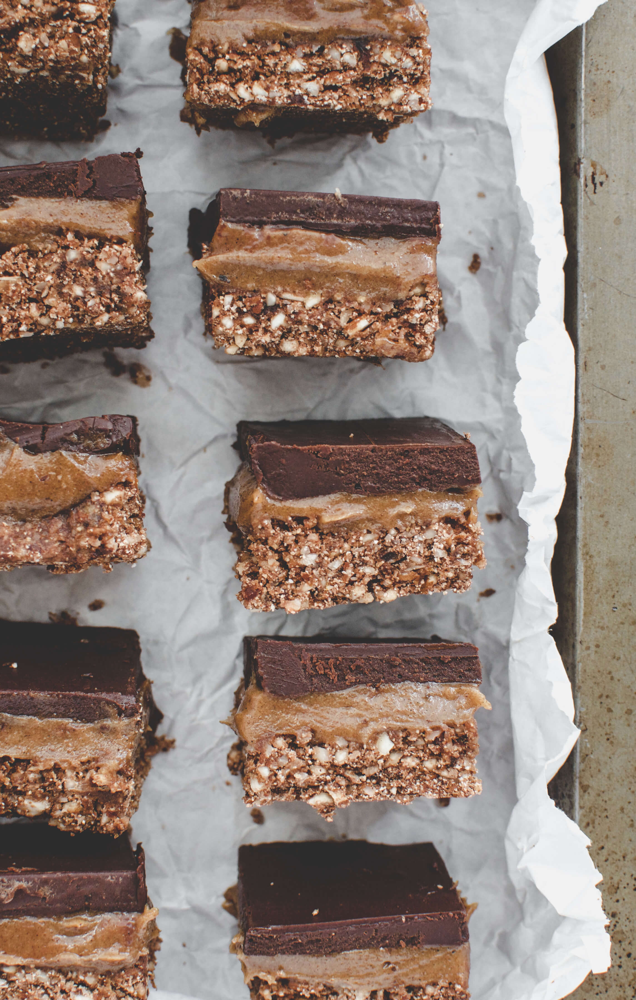

This chocolate caramel slice is a three layer nutty, caramel-y, chocolatey dessert and it’s going to rock your taste buds. Nothing has made me pace around the fridge like these caramel slices. It's safe to say that I'm addicted and I'm happy to admit that I've eaten more than one (or two). They are perfect for the holiday season but are just as delicious any other time of the year.

I'm a huge fan of no-bake dessert. For one because Australia is godforsaken hot in summer and it's unthinkable to turn on the oven. Two, I find raw treats much more predictable and easier to make—you can't forget and burn things in the freezer (lol), right?! All you need is a freezer and a little bit of patience. I guarantee this decadent treat is worth the wait.

\[thrive\_leads id='1525'\]

The caramel made from gooey dates, soaked cashews and almond butter—is much healthier and easier to make than conventional caramel. It's sandwiched between a antioxidant-rich 3-ingredient chocolate layer and a crunchy almond and coconut base. Feel free to add some chocolate or vanilla protein to the base to further upgrade these slices. You could also add a sprinkle of sea salt to the caramel if you love salted-caramel flavour.

Caramel, chocolate and nuts are a truly delicious combination. It reminds me of Christmas, my Grandma's caramel bonbons, and salted choc caramel pralines all at the same time. This homemade version of a childhood classic is much better for you than conventional candy. Enjoy this chocolate caramel slice without an ounce of guilt because it is:

- vegan
- Paleo
- refined sugar free
- gluten free
- no bake
- nutty

Medjool dates have a rich, almost caramel-like taste and a soft, chewy texture. They are bigger, softer and gooier than regular dried dates. If you can’t get them, use dried dates, but be sure to soak them in water to soften them before blending. This date caramel is so silky, rich, and sweet (everything you’d ever expect from caramel), that you’d never know it’s vegan, dairy-free, and Paleo, with zero added sugar! I recommend using raw organic cacao powder (over baking cacao) for the chocolate layer to reap the full benefits of it. Raw cacao has more calcium than cow’s milk, over 40 times the antioxidants of blueberries, and is the highest plant-based source of iron. In other words, it’s a true superfood perfect for Vegans.

Love no-bake desserts? You might also like my [No-Bake Black Bean Fudge](https://www.wildblend.co/black-bean-fudge-brownies/) [Brownies](https://www.wildblend.co/black-bean-fudge-brownies/).

\[tasty-recipe id="1939"\]
