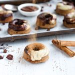

When you think of Easter, you probably think of Hot Cross Buns, right? While I love a good gluten-free Hot Cross Bun around the holidays, occasionally I'm tempted to experiment a little. This recipe combines all the traditional Hot Cross Bun flavours with a decadent twist. Grab a [silicone donut mould](https://amzn.to/2CI3ekZ) and make yourself some Hot Cross Bun Donuts because everything tastes better as a donut (fact!).

Trust me, you dough-nut want to miss out on these cinnamon spiced donuts with decadent cashew orange chocolate glaze. They seriously tick all the addictions in one mouthful. I honestly think they legit taste like marzipan and truthfully I was addicted to marzipan as a child. So, this recipe makes me reminisce about my childhood when I was munching on marzipan Easter eggs for days.

\[thrive_leads id='1525'\]

Don't have a donut mould? Can’t do the hot cross without the bun? No problem! Just make the dough, shape traditional Hot Cross Buns and put them in the oven like you normally would. This recipe works for both donuts as well as buns—whichever you prefer. If you are making the donuts, be prepared for mess and super sticky fingers. It's not exactly easy to press the gooey dough into the mould. Wash your hands with cold water or wear gloves to make this procedure a little less sticky.

This Paleo-friendly hot cross bun donut recipe swaps castor sugar, butter, milk and wheat flour for coconut oil, almond flour and maple syrup. It's still a little bit naughty but overall much better-for-you than store-bought buns. Feel free to add dark chocolate chips, currants or sultanas to the mix. If you (or your kids) don't like raisins all together, leave them out completely.The glaze is a mix of soaked cashews, coconut oil, maple and spices. Feel free to either pipe the glaze on as crosses or glaze the whole donut like I did. Whatever you choose make fun the main ingredient.

If you love Easter recipes, you might also like my [Spiced Coconut Carrot Cake with Cashew Icing](https://www.wildblend.co/spiced-coconut-carrot-cake/).

[Print](http://localhost:10003/hot-cross-bun-donuts/print/1986/)

## Hot Cross Bun Donuts with Cashew Orange Glaze

Get into the Easter spirit with these these cinnamon spiced hot cross bun donuts with a decadent cashew orange chocolate glaze. Best part, they are gluten-free and Paleo too.

- **Author:** Zoe
- **Prep Time:** 20 mins
- **Cook Time:** 20 mins
- **Total Time:** 40 mins
- **Yield:** 13 donuts 1x

### Ingredients

Scale 1x2x3x

**For the hot cross bun donuts:**

- 3 cups blanched almond meal
- Pinch sea salt
- 1/2 t bicarb soda
- 1/4 cup coconut oil
- 2 T organic maple syrup
- Zest of 1 organic orange
- 1 t vanilla extract
- 2 free range organic eggs
- 1.5 t cinnamon,
- ½ t nutmeg
- ½ t ground ginger
- Pinch of ground cloves
- 1/3 cup raisins

**For the cashew orange glaze:**

- 1 cup soaked and drained cashews
- 2 T organic coconut oil
- 1 T maple syrup
- 1/3 cup orange juice
- ½ t vanilla
- Pinch of cinnamon
- Zest of 1/2 orange
- 1/3 cup dark choc chips, melted (optional for marble effect)

### Instructions

1. Preheat oven to 160°C and grease a silicone donut mould with coconut oil.
2. For the donuts, mix all dry ingredients in a large bowl.
3. Once well combined add the wet ingredients and the raisins, mixing until a sticky dough forms.
4. Scoop even portions of mixture into a silicone mould and smooth them with a spatula.
5. Bake for 20 minutes or until golden.
6. Remove from oven and set aside to cool while you make the glaze.
7. For the glaze, add all ingredients (except the choc chips) to a high-speed blender and process until smooth.
8. Divide the mixture evenly between two bowls.
9. Melt the choc chips over a double boiler and add the melted chocolate to one of the bowls with the cashew glaze. Stir until well combined.
10. Now add the choc cashew glaze to the plain cashew glaze without stirring them through.
11. Slowly dip each donut into the glaze and twist it 180° to create the ‘marble’ effect.
12. Place donuts in fridge for the glaze to set.
13. Happy Easter!

### Did you make this recipe?

Share a photo and tag us — we can't wait to see what you've made!

---

This post contains affiliate links, meaning, at no additional cost to you, if you click through and make a purchase, I may receive a commission.
