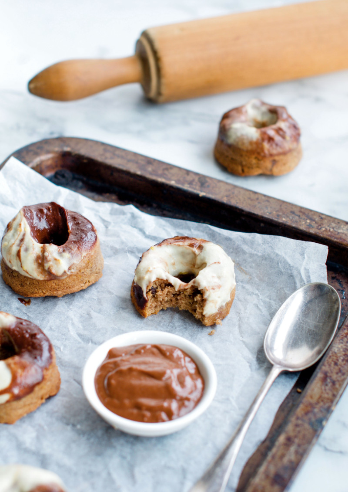
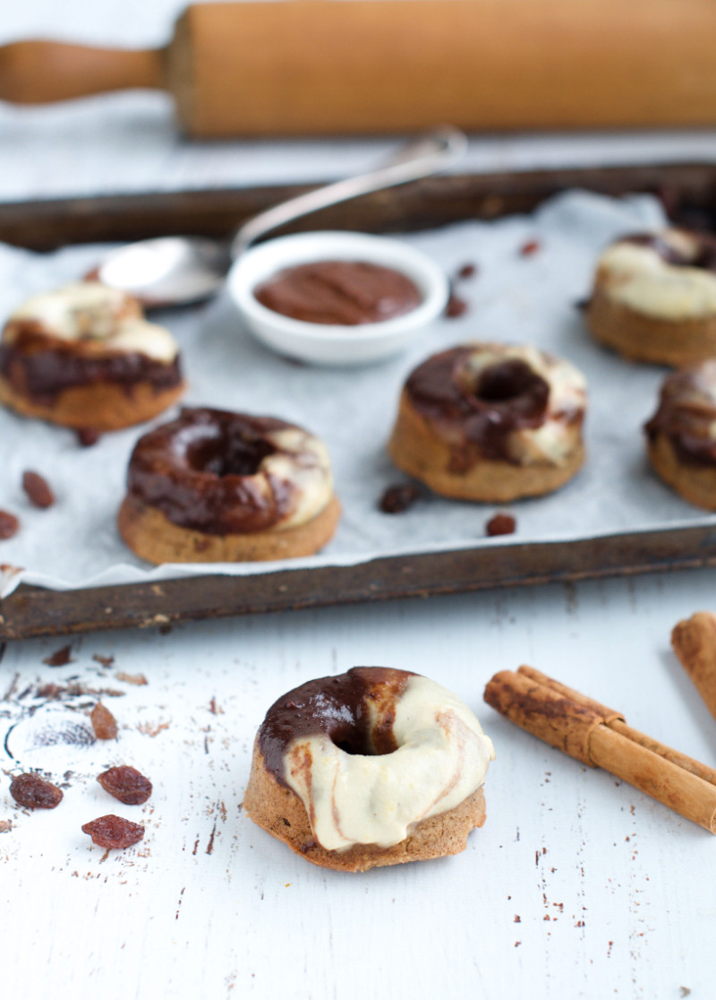

When you think of Easter, you probably think of Hot Cross Buns, right? While I love a good gluten-free Hot Cross Bun around the holidays, occasionally I'm tempted to experiment a little. This recipe combines all the traditional Hot Cross Bun flavours with a decadent twist. Grab a [silicone donut mould](https://amzn.to/2CI3ekZ) and make yourself some Hot Cross Bun Donuts because everything tastes better as a donut (fact!).

Trust me, you dough-nut want to miss out on these cinnamon spiced donuts with decadent cashew orange chocolate glaze. They seriously tick all the addictions in one mouthful. I honestly think they legit taste like marzipan and truthfully I was addicted to marzipan as a child. So, this recipe makes me reminisce about my childhood when I was munching on marzipan Easter eggs for days.

\[thrive\_leads id='1525'\]

Don't have a donut mould? Can’t do the hot cross without the bun? No problem! Just make the dough, shape traditional Hot Cross Buns and put them in the oven like you normally would. This recipe works for both donuts as well as buns—whichever you prefer. If you are making the donuts, be prepared for mess and super sticky fingers. It's not exactly easy to press the gooey dough into the mould. Wash your hands with cold water or wear gloves to make this procedure a little less sticky.

This Paleo-friendly hot cross bun donut recipe swaps castor sugar, butter, milk and wheat flour for coconut oil, almond flour and maple syrup. It's still a little bit naughty but overall much better-for-you than store-bought buns. Feel free to add dark chocolate chips, currants or sultanas to the mix. If you (or your kids) don't like raisins all together, leave them out completely.The glaze is a mix of soaked cashews, coconut oil, maple and spices. Feel free to either pipe the glaze on as crosses or glaze the whole donut like I did. Whatever you choose make fun the main ingredient.

If you love Easter recipes, you might also like my [Spiced Coconut Carrot Cake with Cashew Icing](https://www.wildblend.co/spiced-coconut-carrot-cake/).

\[tasty-recipe id="1986"\]

* * *

This post contains affiliate links, meaning, at no additional cost to you, if you click through and make a purchase, I may receive a commission.
