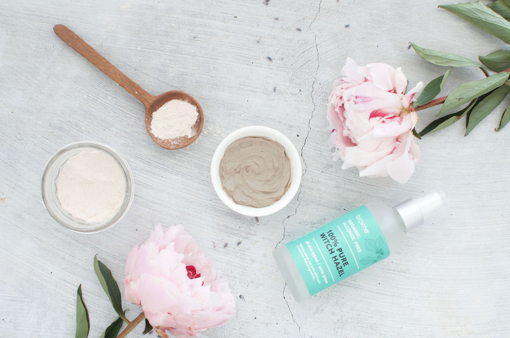
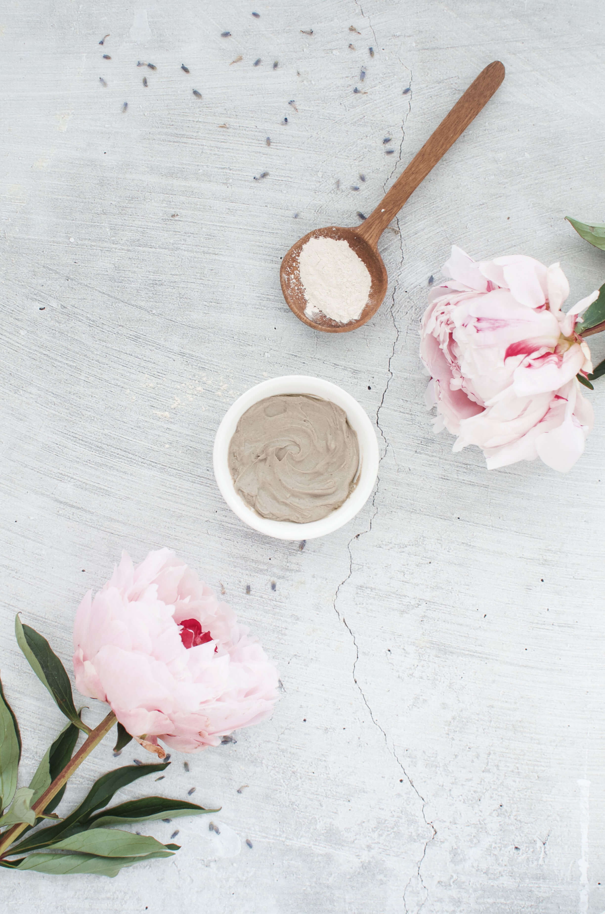
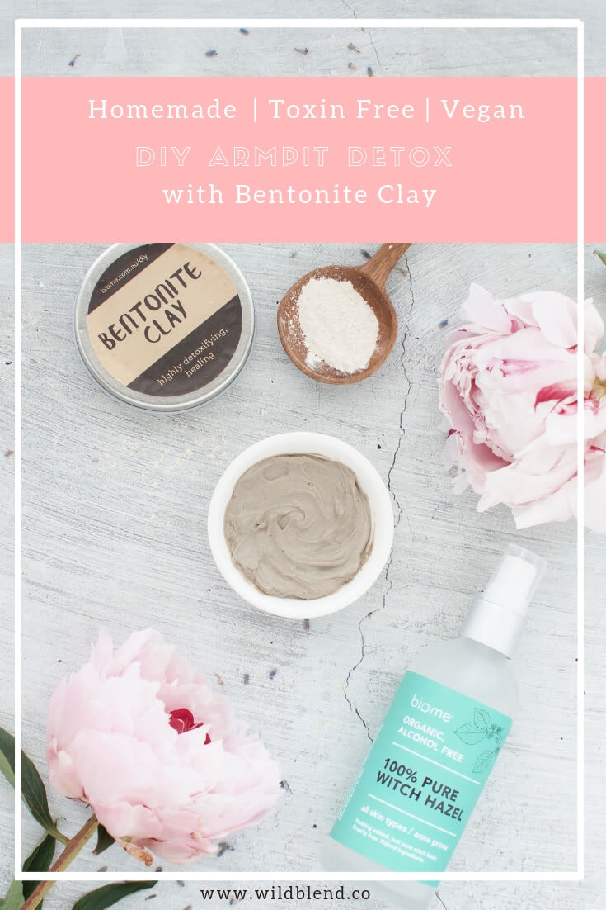

Have you recently ditched conventional deodorant and are struggling with the transition? Do your pits stink more than usual? This DIY armpit detox will help you detox your armpits by drawing out toxins and heavy metals, and correcting the bacterial imbalances in your armpits. It will leave your pits feeling clean, fresh and moisturized!

## What is an Armpit Detox?

Think juice cleanse but for your armpits. While most people have tried some form of detox such as a juice cleanse or a coffee detox, very few have thought of giving their armpits a break and helping them dispel all the chemicals (from toxic deodorant) that have built up in the skin. Conventional deodorants, especially anti-transpirants, clog the pores and prevent your body to naturally detox by releasing sweat. Sweat itself doesn’t cause body odor — it's the bacteria that builds up in the armpits that does. Body odor that you may experience upon changing deodorant is caused by existing bacteria created by chemicals.

## Why You Should Ditch Conventional Deodorant

If you haven't switched to natural deodorant yet, take a look at the ingredients of the deo you're currently using. I bet it contains some not-so-great ingredients such as parabens, phthalates, propylene glycol, aluminum and so on. Over time and with consistent use, these substances are known to be [endocrine disruptors](https://www.niehs.nih.gov/health/topics/agents/endocrine/index.cfm) which can lead to issues with the reproductive, neurological, and immune systems. Research has shown that excess estrogen has the ability to promote the growth of breast cancer cells. Some [studies](https://www.ncbi.nlm.nih.gov/pmc/articles/PMC2797685/) have suggested that the aluminum-based compounds in antiperspirants may contribute to the development of breast cancer.

## Do You Need an Armpit Detox?

When you transition to an all-natural deodorant your body chemistry is shifting. During the transition period you might experience unusual sweat or odor. Armpit detoxification can help the body rid itself of the toxins that have built up in the skin. It may also help to reduce the capacity of sweat glands and the amount of odor they produce. Moreover, research indicates armpit detox can boost the immune system and decrease cancer risk.

\[thrive_leads id='1525'\]

## How Does it Work?

First, stop using deodorants (conventional and natural) altogether. Then, prepare the [bentonite clay](https://t.cfjump.com/52650/t/14846?Url=https%3a%2f%2fwww.biome.com.au%2fdiy-skin-care%2f16939-bentonite-clay-in-jar-60g.html%3fsearch_query%3dclay%26fast_search%3dfs) mixture by mixing it with apple cider vinegar and [witch hazel](https://t.cfjump.com/52650/t/14846?Url=https%3a%2f%2fwww.biome.com.au%2ffacial-toners-mists%2f20078-biome-luxe-witch-hazel-organic-100g.html%3fsearch_query%3dwitch%2520hazel%26fast_search%3dfs) and apply it to your pits. I prefer using my fingers but feel free to use a small brush to apply it. Leave it on for 5 to 15 minutes and then rinse it off with warm water. Ideally, you’ll want to do the detox right before a shower so you can wash it off thoroughly. Repeat for two to six weeks or until your armpits feel clean and fresh. The duration of the detox will depend on how much you sweat and can take up to six weeks. The goal is to remove strong odor and to decrease overall sweating. Tip: Use a wooden or bamboo spoon instead of a [metal spoon](https://www.quora.com/If-bentonite-clay-absorbs-metal-why-doesnt-a-metal-mixing-spoon-dissolve) and consider using a glass or ceramic bowl to mix your ingredients.

**Important**: Do NOT apply any deodorant or antiperspirant during the time of the cleanse.

[Print](http://localhost:10003/how-to-armpit-detox/print/2179/)

## DIY Armpit Detox Paste

This DIY armpit detox will help you detox your armpits by drawing out toxins and heavy metals, and correcting the bacterial imbalances in your armpits. It will leave your pits feeling clean, fresh and moisturized!

- **Author:** Zoe Lyons
- **Prep Time:** 5
- **Cook Time:** 25
- **Total Time:** 30

### Ingredients

Scale 1x2x3x

- 2 Tbsp of [bentonite clay](https://t.cfjump.com/52650/t/14846?Url=https%3a%2f%2fwww.biome.com.au%2fdiy-skin-care%2f16939-bentonite-clay-in-jar-60g.html%3fsearch_query%3dclay%26fast_search%3dfs)
- 1/2 tsp of apple cider vinegar (omit the vinegar if you have sensitive skin)
- 1–2 Tbsp of [witch hazel](https://t.cfjump.com/52650/t/14846?Url=https%3a%2f%2fwww.biome.com.au%2ffacial-toners-mists%2f20078-biome-luxe-witch-hazel-organic-100g.html%3fsearch_query%3dwitch%2520hazel%26fast_search%3dfs) (adjust to create a creamy paste, not too runny, not too dry)

### Instructions

1. In a glass bowl, stir together the clay, witch hazel and vinegar. Use a wooden or bamboo spoon to mix your ingredients.
2. Add more witch hazel if mixture is too dry and more clay if it’s too runny.
3. Use your finger to apply the paste in an even, thin layer over each armpit, and let it sit for five to fifteen minutes. (Wash off it it burns or irritates your skin.)
4. Thoroughly rinse off with warm water.
5. Dry your armpits and enjoy the fresh & clean feeling!

### Notes

Tip 1: You can add 2 drops of essential oil to the mixture (rosemary or lavender).

Tip 2: Add a 1/2 teaspoon of activated coconut charcoal to your clay mixture to supercharge the detoxification properties.

### Did you make this recipe?

Share a photo and tag us — we can't wait to see what you've made!

---

This post contains affiliate links, meaning, at no additional cost to you, if you click through and make a purchase, I may receive a commission.
