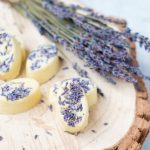

Can't sleep? Sore muscles? Dry skin? These Magnesium Lotion Bars are a cure-all. Nourishing cacao butter, shea, and jojoba oil moisturize and pamper your skin while magnesium chloride relaxes your tired muscles. Massage your aching muscles before bedtime for a restful sleep. These bars will literally melt on your skin and leave your skin feeling hydrated and smooth.

These Magnesium Lotion Bars are a **triple treat**, they:

- soften and moisturize thirsty skin
- help you fall asleep
- replenish tired muscles with magnesium

**Tip:** Add one bar to your bath water (they'll melt) for an extra nourishing and relaxing treat in the evening. Or you can give them to friends and family as a gift (everyone loves homemade gifts). I keep mine on my bedside table to rub on hands and feet before bed.

These natural lotion bars are chemical-free and can be made in different scents with whatever your go-to essential oil preference is. I personally love rose geranium, lemongrass and sweet orange essential oil. Adding dried lavender isn’t necessary but it is a fun way to make your bars look pretty.

\[thrive_leads id='1525'\]

## Lavender and Magnesium Lotion Bars Benefits

**Magnesium** helps release muscle tension, replenish magnesium storage, improve sleep and make you feel relaxed.

**Lavender** improves sleep, reduces stress, and relieves pain.

**Beeswax** binds all the ingredients together and makes sure they stick to your skin, so the oils and butters soak in.

**Cocoa Butter** softens and soothes skin, heals dry and damaged skin and prevents dryness and irritation.

**Shea Oil** contains Vitamin E, moisturizes dry and flaky skin**,** prevents cracked heals, and reduces inflammation.

**Jojoba Oil** promotes skin health, promotes healing and balances sebum production.

You can get all DIY skincare ingredients online ([here](https://t.cfjump.com/52650/t/14846?Url=https%3a%2f%2fwww.biome.com.au%2f992-diy-skin-care)) or in store at Biome Australia.

These Magnesium Lotion Bars are perfect as massage bars before bedtime or after a strenuous workout. Your muscles will thank you. I like to rub them into my damp skin straight after a long hot shower for further relaxation. They also work wonders on itchy and dry patches on your elbows and knees for some extra TLC. I suggest storing them in an airtight container (mason jar) in the fridge.

If you love DIY skincare, you might also like my [All Natural Whipped Body Butter Recipe](https://www.wildblend.co/whipped-body-butter/).

[Print](http://localhost:10003/magnesium-lotion-bars/print/2006/)

## Sleepytime Lavender and Magnesium Lotion Bars

These Lavender and Magnesium Lotion Bars are the answer to dry skin, aching muscles, and sleepless nights.

- **Author:** Zoe
- **Prep Time:** 5 mins
- **Cook Time:** 20 mins
- **Total Time:** 25 mins
- **Yield:** 10 small bars 1x

### Ingredients

Scale 1x2x3x

- 1/4 cup [beeswax beads](https://t.cfjump.com/52650/t/14846?Url=https%3a%2f%2fwww.biome.com.au%2fdiy-skin-care%2f17066-beeswax-beads-in-glass-jar.html)
- 1/4 cup organic [cacao butter](https://t.cfjump.com/52650/t/14846?Url=https%3a%2f%2fwww.biome.com.au%2fdiy-skin-care%2f16945-cocoa-butter-in-jar-50g.html)
- 1/4 cup [Shea oil](https://t.cfjump.com/52650/t/14846?Url=https%3a%2f%2fwww.biome.com.au%2fliquids-oils-butters-wax%2f19334-shea-oil-certified-organic-in-glass-bottle-80g.html)
- 2 T [Jojoba oil](https://t.cfjump.com/52650/t/14846?Url=https%3a%2f%2fwww.biome.com.au%2fliquids-oils-butters-wax%2f19333-jojoba-oil-in-glass-bottle-80g.html)
- ¼ cup [Magnesium Chloride Flakes](https://t.cfjump.com/52650/t/14846?Url=https%3a%2f%2fwww.biome.com.au%2fdiy-skin-care%2f17064-magnesium-chloride-flakes-in-glass-jar.html)
- 2 T boiling water
- 15 drops [Lavender essential oil](https://t.cfjump.com/52650/t/14846?Url=https%3a%2f%2fwww.biome.com.au%2fessential-oils%2f17294-mt-retour-essential-oil-lavender--9324525090010.html)
- 2 T dried [Lavender flower petals](https://t.cfjump.com/52650/t/14846?Url=https%3a%2f%2fwww.biome.com.au%2fnatural-beautiful%2f17165-lavender-organic-glass-jar-15g.html) (optional, for decoration)

### Instructions

1. Melt the beeswax, cocoa butter, and Shea oil over a double boiler. Keep stirring until fully dissolved.
2. In the meantime, melt magnesium flakes in a separate bowl with 2 T boiling water. Stir until fully dissolved.
3. Once the cacao butter-oil mixture is fully dissolved, remove from the heat, and add jojoba and essential oil.
4. Pour the oil mixture into a high-speed blender (I used a Vitamix), add the melted magnesium water and blend on high until a creamy (light-coloured) emulsion forms.\*
5. Add ¼ teaspoon of dried lavender petals to each mould and pour mixture into moulds.
6. Smooth the surface and put it in the fridge to set.
7. Once set, remove the massage bars from the moulds.
8. Store in a glass mason jar in a cool place out of direct sunlight.

### Notes

\*Note: The blending step is really important to combine and emulsify all ingredients. If you don’t blend long enough, you won’t reach the right consistency to make bars.

Tip: You can add rose geranium, sweet orange or lemongrass essential oil to these bars to make them even more dreamy.

### Did you make this recipe?

Share a photo and tag us — we can't wait to see what you've made!

---

This post contains affiliate links, meaning, at no additional cost to you, if you click through and make a purchase, I may receive a commission.
